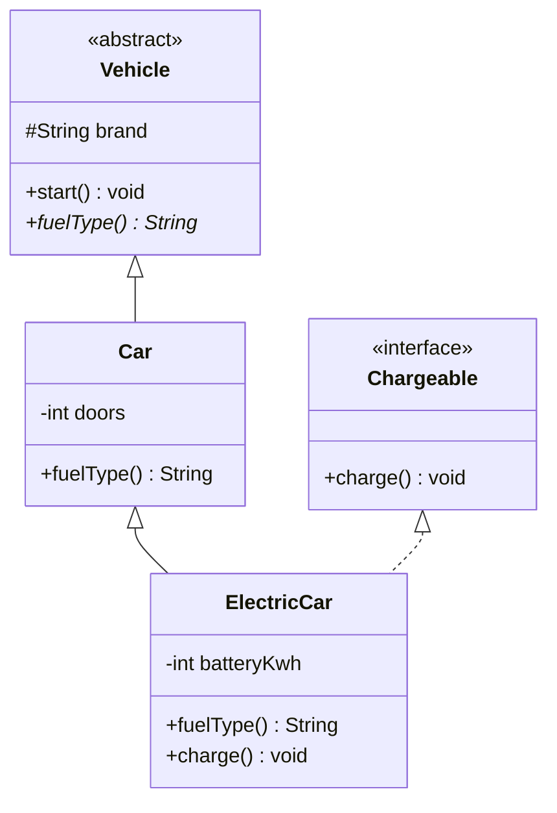

# OOP in Java

> **TL;DR:** A class is a blueprint and an object is a heap instance of it. The four pillars are encapsulation (hide state), inheritance (reuse via is-a), polymorphism (one call, many behaviours) and abstraction (expose what, hide how).
> Interviews probe the edges: overloading vs overriding rules, abstract class vs interface, `static`/`final`, constructor chaining, and composition over inheritance.

## Class vs Object

| | Class | Object |
|---|---|---|
| What | Blueprint / template (fields + methods) | Concrete instance of a class |
| Memory | Class metadata loaded once into Metaspace | Allocated on the heap per `new` |
| Created by | `class` declaration | `new`, reflection, `clone()`, deserialization |
| How many | One per class loader | Any number |

```java
class Car {                  // blueprint
    String model;            // state (instance field)
    void drive() { }         // behaviour
}
Car c = new Car();           // object lives on heap; reference c lives on the stack
```

## Constructors

- Same name as the class, **no return type** (not even `void`). Not inherited; cannot be `static`, `final` or `abstract`.
- No constructor written: the compiler adds a no-arg **default constructor**. Write any constructor and that default disappears.
- The first statement is always `this(...)` or `super(...)`. If you write neither, the compiler inserts `super()`.
- Can be `private` (singletons, static factories, utility classes).

```java
class Employee {
    private final String name;
    private final int salary;

    Employee() { this("Unknown"); }                  // chains to 1-arg
    Employee(String name) { this(name, 30_000); }    // chains to 2-arg
    Employee(String name, int salary) {              // the one that does the work
        this.name = name;                            // this.x disambiguates field vs param
        this.salary = salary;
    }
}

class Manager extends Employee {
    Manager(String name) {
        super(name, 90_000);   // must be first; parent has no no-arg ctor, so this is mandatory
    }
}
```

**Initialization order** for `new Manager("A")`:

1. Static fields/blocks: parent, then child (only once, at class initialization).
2. Parent instance field initializers and instance blocks, then the parent constructor body.
3. Child instance field initializers and instance blocks, then the child constructor body.

Gotcha: calling an overridable method from a constructor runs the subclass override **before** subclass fields are initialized (you see `null`/`0`).

## The 4 pillars

### 1. Encapsulation

Bundle data with the methods that operate on it and hide the data behind a controlled API. It protects invariants.

```java
public class BankAccount {
    private double balance;                       // hidden state

    public double getBalance() { return balance; }

    public void deposit(double amt) {
        if (amt <= 0) throw new IllegalArgumentException("amount must be > 0");
        balance += amt;                           // invariant enforced in one place
    }
}
```

### 2. Inheritance

`extends` gives an **is-a** relationship: the subclass reuses and specializes the parent. Java allows **single class inheritance** but **multiple interface inheritance**.



```java
abstract class Vehicle {
    protected String brand;
    void start() { System.out.println(brand + " starting"); }
    abstract String fuelType();
}
class Car extends Vehicle {
    String fuelType() { return "Petrol"; }
}
class ElectricCar extends Car implements Chargeable {
    @Override String fuelType() { return "Electric"; }   // overrides Car's version
    public void charge() { }
}
```

Types: single, multilevel (A to B to C), hierarchical (B and C extend A). Multiple and hybrid only through interfaces. Constructors and `private` members are not inherited.

### 3. Polymorphism

One interface, many forms. **Compile-time** (static) via overloading and **runtime** (dynamic) via overriding.

```java
class Printer {
    void print(int x)    { }        // overloading: same name, different params
    void print(String s) { }
    void print(int x, int y) { }
}

class Animal { String sound() { return "..."; } }
class Dog extends Animal { @Override String sound() { return "Woof"; } }

Animal a = new Dog();   // reference type Animal, object type Dog
a.sound();              // "Woof": JVM dispatches on the actual object (virtual call)
```

| Aspect | Overloading (compile-time) | Overriding (runtime) |
|---|---|---|
| Where | Same class (or inherited + new overload) | Subclass redefines parent method |
| Signature | Name same, **parameter list must differ** | Name and parameters identical |
| Return type | Anything | Same or **covariant** (a subtype) |
| Access modifier | Anything | Same or **wider** (cannot reduce) |
| Checked exceptions | Anything | Same, narrower or none; no new/broader checked |
| Resolved by | Compiler, using static (reference) types of args | JVM, using the runtime object type |
| `static` / `private` / `final` | Can be overloaded | Cannot be overridden (`static` = method hiding) |
| Annotation | None | `@Override` (catches typos at compile time) |

Overload resolution order: **exact match, then widening, then boxing, then varargs**.

```java
void f(long x)    { System.out.println("long"); }
void f(Integer x) { System.out.println("Integer"); }
f(5);   // "long": widening int to long beats boxing to Integer
```

Fields and static methods are **not** polymorphic: they bind to the reference type.

```java
class P { String name = "P"; static String s() { return "P"; } }
class C extends P { String name = "C"; static String s() { return "C"; } }
P p = new C();
p.name;   // "P" (field hiding)
p.s();    // "P" (static method hiding)
```

### 4. Abstraction

Expose **what** an object does, hide **how**. Achieved with abstract classes (0 to 100% abstract) and interfaces.

```java
interface PaymentGateway {                 // the "what"
    boolean pay(double amount);
}
class StripeGateway implements PaymentGateway {
    public boolean pay(double amount) {    // the "how", hidden from callers
        return true;
    }
}
PaymentGateway g = new StripeGateway();    // callers depend only on the abstraction
```

## Abstract class vs Interface

| Feature | Abstract class | Interface |
|---|---|---|
| Methods | Abstract and concrete | Abstract; `default` and `static` (Java 8); `private` and `private static` (Java 9) |
| Fields | Any kind (instance, static, any access) | Only `public static final` constants |
| Constructors | Yes (run via `super()`) | No |
| Instance state | Yes | No |
| Inheritance | A class `extends` only one | A class `implements` many; an interface `extends` many |
| Method access | Any modifier | Implicitly `public` (except `private` helpers) |
| Use when | Shared state/code across closely related types (template method) | A capability/contract across unrelated types (`Comparable`, `Runnable`) |
| Instantiable | No | No (but anonymous classes / lambdas can implement) |

```java
interface Greeter {
    String name();                                        // abstract
    default String greet() { return prefix() + name(); }  // Java 8: inherited implementation
    static Greeter of(String n) { return () -> n; }       // Java 8: called as Greeter.of(..)
    private String prefix() { return "Hello, "; }         // Java 9: helper for defaults
}

// Diamond with default methods: the class must resolve the conflict explicitly
interface A { default void hi() { System.out.println("A"); } }
interface B { default void hi() { System.out.println("B"); } }
class AB implements A, B {
    public void hi() { A.super.hi(); }                    // pick one (or write your own)
}
```

Resolution rules: class methods win over interface defaults; a more specific interface wins over a less specific one; otherwise you must override.

## Access modifiers

| Modifier | Same class | Same package | Subclass (other package) | World |
|---|---|---|---|---|
| `public` | Yes | Yes | Yes | Yes |
| `protected` | Yes | Yes | Yes (through inheritance) | No |
| *default* (package-private) | Yes | Yes | No | No |
| `private` | Yes | No | No | No |

- A top-level class can only be `public` or package-private. Nested classes can use all four.
- `protected` across packages: the subclass can access the member only through its own type (`this.x` or `sub.x`), not through a parent-typed reference.

## `static`

Belongs to the class, not to instances. One copy shared by all objects.

```java
class Counter {
    static int count;                       // static variable: one per class
    static final double PI = 3.14159;       // constant
    final int id;

    static {                                // static block: runs once at class init
        count = 0;
    }
    Counter() { id = ++count; }

    static int getCount() { return count; } // static method: no this, no instance members

    static class Builder { }                // static nested class: no outer instance needed
}
Counter.getCount();                         // call via class name
```

- Static methods cannot use `this`/`super` or access instance members directly.
- Static methods are hidden, not overridden.
- Static blocks run once, in textual order, when the class is initialized (first active use).

## `final`

| Applied to | Meaning |
|---|---|
| Variable | Assigned exactly once. For references, the **reference** is fixed, the object can still mutate |
| Blank final field | Must be assigned in every constructor (or an instance initializer) |
| Parameter | Cannot be reassigned inside the method |
| Method | Cannot be overridden (can still be overloaded) |
| Class | Cannot be extended (`String`, `Integer`, `Math`) |

```java
final List<String> list = new ArrayList<>();
list.add("ok");          // fine: object mutates
// list = new ArrayList<>();  // compile error: reference is final
```

*Effectively final*: a local never reassigned after initialization. Lambdas and anonymous classes may only capture such locals.

## `this` and `super`

| `this` | `super` |
|---|---|
| Refers to the current object | Refers to the parent part of the current object |
| `this.field` resolves field/param shadowing | `super.method()` calls the parent's version of an overridden method |
| `this(...)` calls another constructor of the same class | `super(...)` calls a parent constructor |
| Can be passed/returned (fluent builders: `return this;`) | Cannot be passed around as a value |

Neither is usable in a static context. `this(...)` and `super(...)` cannot both appear in one constructor (both must be first).

## `instanceof` and pattern matching

```java
Object obj = "hello";

// Before Java 16
if (obj instanceof String) {
    String s = (String) obj;          // manual cast
    System.out.println(s.length());
}

// Java 16+: pattern matching binds a typed variable
if (obj instanceof String s && !s.isEmpty()) {
    System.out.println(s.length());   // s in scope only where the match is definitely true
}

null instanceof String;               // always false, never throws
```

## Composition vs Inheritance

| | Inheritance (is-a) | Composition (has-a) |
|---|---|---|
| Coupling | Tight, subclass depends on parent internals | Loose, depends on a public API |
| Binding | Fixed at compile time | Can swap the part at runtime |
| Encapsulation | Can break it ("fragile base class") | Preserved |
| Use when | True is-a and the parent is designed for extension | Default choice; reuse behaviour |

```java
// Bad: Stack IS-A Vector in the JDK, so callers can insert into the middle of a "stack"
// Good: compose and forward only what you need
class Stack<E> {
    private final Deque<E> items = new ArrayDeque<>();   // has-a
    void push(E e) { items.push(e); }
    E pop() { return items.pop(); }
}
```

## Nested, inner, local and anonymous classes

| Kind | Declared | Needs outer instance | Can access |
|---|---|---|---|
| Static nested | `static class` inside a class | No | Only static members of outer |
| Inner (non-static) | `class` inside a class | Yes (`outer.new Inner()`) | All outer members, including `private` |
| Local | Inside a method/block | If in instance method | Outer members + effectively final locals |
| Anonymous | Inline `new Type() { ... }` | If in instance method | Same as local; one-off, no name, no ctor |

```java
class Outer {
    private int x = 10;
    static class Nested { }                    // new Outer.Nested()
    class Inner { int get() { return x; } }    // holds hidden ref Outer.this

    void demo() {
        Inner in = this.new Inner();
        Runnable r = new Runnable() {          // anonymous class
            public void run() { System.out.println(x); }
        };
        Runnable l = () -> System.out.println(x);  // lambda: preferred for functional interfaces
    }
}
```

- Inner classes keep a reference to the outer object, a common memory-leak source (listeners, Android). Prefer `static` nested unless you need the outer instance.
- In an anonymous class `this` is the anonymous object; in a lambda `this` is the enclosing instance.

## `Object` class methods

Every class implicitly extends `java.lang.Object`.

| Method | Purpose / note |
|---|---|
| `equals(Object)` | Logical equality. Default is `==` (identity) |
| `hashCode()` | Bucket hash. Must be consistent with `equals` |
| `toString()` | Default `ClassName@hexHash`; override for readable logs |
| `getClass()` | Runtime `Class` object (final, cannot override) |
| `clone()` | `protected`, shallow copy; requires `Cloneable` or throws `CloneNotSupportedException` |
| `finalize()` | Deprecated (Java 9), for removal (Java 18). Use `try-with-resources` / `Cleaner` |
| `wait()`, `notify()`, `notifyAll()` | Inter-thread signalling on the object's monitor; call while holding its lock |

## SOLID (briefly)

**S: Single Responsibility.** A class should have one reason to change.

```java
class Invoice { double total() { return 0; } }       // business logic only
class InvoicePrinter { void print(Invoice i) { } }   // presentation separated
```

**O: Open/Closed.** Open for extension, closed for modification.

```java
interface Discount { double apply(double price); }
class FestiveDiscount implements Discount { public double apply(double p) { return p * 0.9; } }
// new discount = new class, no edits to the checkout code that uses Discount
```

**L: Liskov Substitution.** Subtypes must be usable wherever the parent is expected, without surprises.

```java
// Violation: Square extends Rectangle and setWidth() also changes height,
// so code expecting area == w * h breaks. Model them as separate Shape types instead.
```

**I: Interface Segregation.** Many small interfaces beat one fat interface.

```java
interface Printer { void print(); }
interface Scanner { void scan(); }
class BasicPrinter implements Printer { public void print() { } }   // not forced to stub scan()
```

**D: Dependency Inversion.** Depend on abstractions; inject them.

```java
class OrderService {
    private final PaymentGateway gateway;                  // abstraction
    OrderService(PaymentGateway gateway) { this.gateway = gateway; }  // constructor injection
}
```

## Top interview questions

**Q1. Can we override a static method?**
No. A static method with the same signature in a subclass **hides** the parent one; the call binds to the reference type at compile time.

**Q2. Can we override a private or final method?**
No. `private` is not visible to the subclass (a same-named method is a new method). `final` prevents overriding at compile time.

**Q3. Can an abstract class have a constructor? Can an interface?**
An abstract class can (it initializes the parent part, called via `super()`). An interface cannot.

**Q4. Can a class be both `abstract` and `final`?**
No. `abstract` requires subclassing, `final` forbids it: compile error.

**Q5. Why does Java not support multiple inheritance of classes?**
To avoid the diamond problem (ambiguous state and method resolution). Multiple interface inheritance is allowed; conflicting defaults must be resolved explicitly with `X.super.m()`.

**Q6. What is a covariant return type?**
An overriding method may return a subtype of the parent's return type, e.g. `Animal create()` overridden by `Dog create()`.

**Q7. What happens if the parent has no no-arg constructor?**
The subclass constructor must call `super(args)` explicitly; otherwise the implicit `super()` fails to compile.

**Q8. Can we overload `main`? Make it `final`?**
Yes to both. The JVM only calls `public static void main(String[] args)` as the classic entry point (instance `main` methods were previewed in Java 21 and finalized in Java 25).

**Q9. Static vs dynamic binding?**
Static binding (overloading, `static`, `private`, `final` methods, fields) is resolved by the compiler. Dynamic binding (overridden instance methods) is resolved at runtime via the vtable of the actual object.

**Q10. What is a marker interface?**
An interface with no methods that tags a class for special handling: `Serializable`, `Cloneable`, `RandomAccess`. Annotations are the modern alternative.

**Q11. Abstract class or interface, how do you choose?**
Interface for a capability shared by unrelated types or when multiple inheritance of type is needed. Abstract class when subclasses share state, constructors or non-public helpers.

**Q12. Can a constructor be private? Why?**
Yes: singletons, static factory methods (`List.of`), utility classes (`Collections`), and builders.

**Q13. Is `super.super.method()` allowed?**
No. You can only reach the immediate parent's version.

**Q14. Why prefer composition over inheritance?**
Looser coupling, preserved encapsulation, behaviour swappable at runtime, and no fragile-base-class problem when the parent changes.

**Q15. Difference between an inner class and a static nested class?**
An inner class is tied to an outer instance and can access its instance members (holding a hidden reference). A static nested class is independent and only accesses the outer class's static members.
