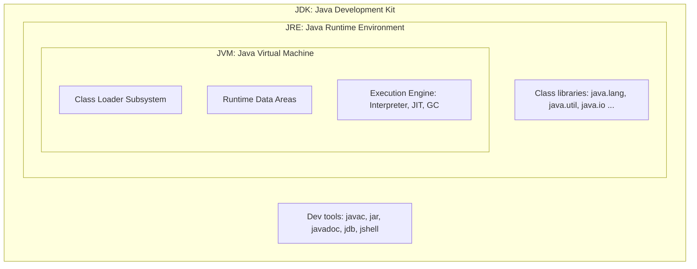
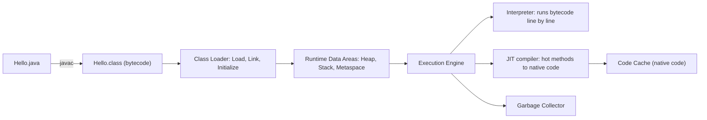
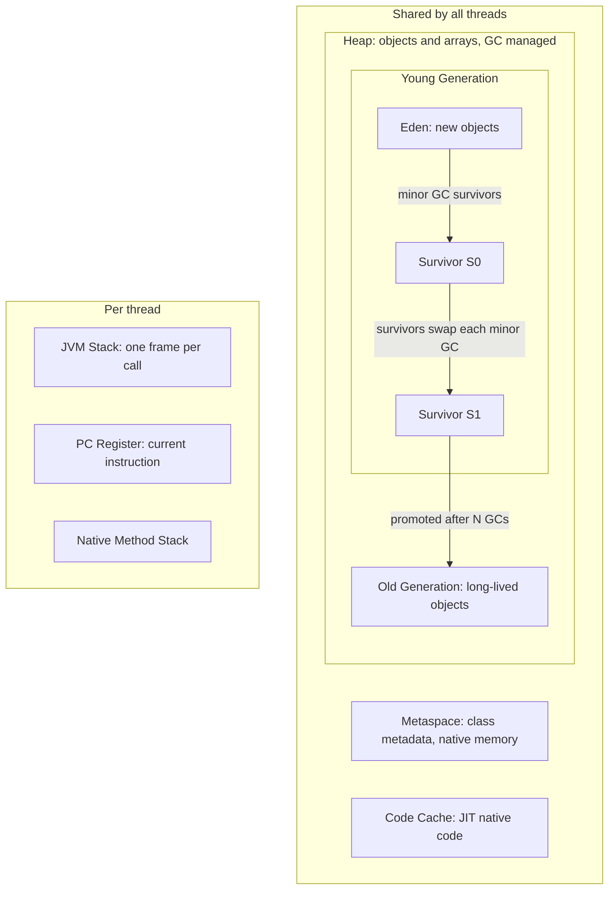

# JVM, Memory & Object Basics

> **TL;DR:** `javac` compiles source to platform-neutral bytecode; the JVM loads, verifies and runs it (interpreter + JIT) and manages memory with a garbage collector.
> Objects live on the heap, locals and references on the thread's stack, class metadata in Metaspace. Java is always pass-by-value, and `equals`/`hashCode` must agree or hash collections break.

## JDK vs JRE vs JVM

| | JVM | JRE | JDK |
|---|---|---|---|
| Is | Abstract machine that runs bytecode | JVM + standard class libraries | JRE + development tools |
| Contains | Class loader, runtime data areas, execution engine | `java.lang`, `java.util`, ... | `javac`, `jar`, `javadoc`, `jdb`, `jshell`, `jlink` |
| Needed to | Execute | Run apps | Develop and run |
| Platform dependent | Yes (implementation) | Yes | Yes |

Bytecode is platform-independent ("write once, run anywhere"); the JVM itself is not. Since Java 11 there is no separate JRE download; `jlink` builds a trimmed runtime.



## From source to execution



**Class loading** has three phases:

1. **Loading**: find the `.class` and create a `Class` object. Loaders: **Bootstrap** (core `java.base`, native), **Platform** (formerly Extension, pre-Java 9), **Application/System** (classpath).
2. **Linking**: *verify* bytecode safety, *prepare* static fields with default values, *resolve* symbolic references.
3. **Initialization**: run static initializers and static blocks, on first active use.

**Parent delegation**: a loader first asks its parent; it loads the class itself only if the parent cannot. This prevents a user class from replacing `java.lang.String`.

**Execution engine**: the interpreter starts fast; the JVM profiles code and the **JIT** (HotSpot tiered: C1 quick compile, C2 optimized) compiles hot methods to native code with inlining, escape analysis and dead-code elimination. This is why Java "warms up".

## JVM memory areas



| Area | Shared? | Stores | Error when full |
|---|---|---|---|
| Heap | All threads | Objects, arrays, String pool (since Java 7), static fields (in the `Class` mirror, Java 8+) | `OutOfMemoryError: Java heap space` |
| Metaspace (Java 8+, replaced PermGen) | All threads | Class metadata, method bytecode, runtime constant pool | `OutOfMemoryError: Metaspace` |
| JVM Stack | Per thread | Frames: local variables, operand stack, return info | `StackOverflowError` |
| PC Register | Per thread | Address of current bytecode instruction | none |
| Native Method Stack | Per thread | Frames for native (JNI) code | `StackOverflowError` |

Tuning flags: `-Xms` / `-Xmx` (initial/max heap), `-Xss` (stack size per thread), `-XX:MaxMetaspaceSize`.

## Stack vs Heap

| Stack | Heap |
|---|---|
| Per thread, so inherently thread-safe | Shared, so needs synchronization for mutable state |
| Primitive locals and **references** | All objects and arrays (and their fields, even primitives) |
| LIFO; frame freed when the method returns | Freed by the GC when unreachable |
| Small, very fast | Large, slower allocation (TLABs make it cheap) |
| `StackOverflowError` | `OutOfMemoryError` |

```java
class Person {
    int age;                  // field: lives inside the object, on the heap
    String name;              // reference field on heap, points to a String on heap
    Person(int age, String name) { this.age = age; this.name = name; }
}

public class Demo {
    static int created = 0;   // static: stored with the Class object (heap), metadata in Metaspace

    public static void main(String[] args) {
        int x = 5;                          // primitive local: stack (main's frame)
        Person p = new Person(30, "Ana");   // p (reference): stack; Person object: heap
                                            // "Ana" literal: String pool (heap)
        int[] arr = new int[3];             // arr ref: stack; array object: heap
        greet(p);                           // new frame pushed for greet
    }                                       // frame popped: x, p, arr gone; objects now unreachable

    static void greet(Person q) {           // q: copy of the reference, in greet's frame
        String msg = "Hi " + q.name;        // msg ref: stack; new String: heap
    }
}
```

Escape analysis may let the JIT allocate non-escaping objects on the stack (scalar replacement), but conceptually objects are on the heap.

## Garbage Collection basics

An object is **eligible for GC when it is unreachable** from any **GC root**: local variables in live stack frames, static fields, active threads, JNI references. Reference cycles are not a problem (unlike ref-counting).

- **Mark and sweep (and compact)**: mark everything reachable from the roots, sweep the rest, optionally compact to fight fragmentation.
- **Generational hypothesis**: most objects die young. New objects go to Eden. A **minor GC** copies survivors to a survivor space; objects surviving enough cycles are **promoted** to Old. A **major/full GC** cleans Old (slower, longer pauses).
- **Stop-the-world**: application threads pause during some phases. Modern collectors minimize this.

| Collector | Notes |
|---|---|
| Serial | Single thread, small heaps / client apps |
| Parallel | Multi-threaded, throughput focus |
| G1 | **Default since Java 9**. Region-based, predictable pause targets |
| ZGC / Shenandoah | Concurrent, sub-millisecond pauses, huge heaps |

```java
Object o = new Object();
o = null;          // now eligible (if no other references)
System.gc();       // only a HINT: the JVM may ignore it (-XX:+DisableExplicitGC)
```

- `finalize()` is deprecated: unpredictable, slow, may never run. Use `try-with-resources` or `java.lang.ref.Cleaner`.
- Memory leaks still happen in Java: objects that stay reachable by mistake (static collections, caches, listeners, `ThreadLocal` in pools, unclosed resources).

| Reference type | Collected when | Use |
|---|---|---|
| Strong (normal) | Never while reachable | Everyday references |
| `SoftReference` | Memory is low | Memory-sensitive caches |
| `WeakReference` | Next GC if only weakly reachable | `WeakHashMap`, canonical maps |
| `PhantomReference` | After finalization, `get()` returns null | Post-mortem cleanup (`Cleaner`) |

## String pool and `intern()`

String literals are stored once in the **String pool** (a table on the heap since Java 7) and shared. `String` is immutable, which makes this safe.

```java
String a = "java";
String b = "java";               // same pooled object as a
String c = new String("java");   // new heap object (pool literal already exists)
String d = c.intern();           // returns the pooled instance

a == b;          // true  (same pool reference)
a == c;          // false (different objects)
a == d;          // true
a.equals(c);     // true  (same content)

String e = "ja" + "va";          // compile-time constant, folded to "java"
a == e;          // true

String part = "ja";
String f = part + "va";          // computed at runtime, new object
a == f;          // false
```

`new String("java")` creates **up to two** objects: the pool literal (if not already present) and the heap copy.

Why is `String` immutable? Pool sharing safety, cached `hashCode` (great `HashMap` key), thread safety, and security (class names, file paths, URLs cannot change after validation). Use `StringBuilder` (not thread-safe, fast) or `StringBuffer` (synchronized) for heavy concatenation in loops.

## Java is always pass-by-value

Java copies the value of the argument. For objects, that value **is a reference**, so the method can mutate the object but cannot make the caller's variable point elsewhere.

```java
class Point { int x; Point(int x) { this.x = x; } }

static void swap(Point p, Point q) {  // swaps the local copies only
    Point t = p; p = q; q = t;
}
static void mutate(Point p) {         // follows the copied reference to the same object
    p.x = 99;
}
static void reassign(Point p) {       // rebinding the local copy has no effect outside
    p = new Point(0);
    p.x = 5;
}

Point a = new Point(1), b = new Point(2);
swap(a, b);      // a.x == 1, b.x == 2  -> unchanged: no pass-by-reference
mutate(a);       // a.x == 99           -> object state changed
reassign(a);     // a.x == 99           -> still the original object
```

Same applies to primitives (`int` copied) and to immutable types like `String`/`Integer` ("changing" them inside creates a new object locally).

## `==` vs `equals()`

| | `==` | `equals()` |
|---|---|---|
| Primitives | Compares values | Not applicable |
| References | Same object (identity) | Logical equality as defined by the class |
| Default in `Object` | Identity | Identity (`this == obj`) |
| Overridden by | Cannot be | `String`, wrappers, collections, records |
| Null-safe | Yes | `a.equals(b)` throws NPE if `a` is null; use `Objects.equals(a, b)` |

## The `equals` / `hashCode` contract

`equals` must be **reflexive** (`x.equals(x)`), **symmetric**, **transitive**, **consistent**, and `x.equals(null)` is `false`.

`hashCode` rules:

1. Consistent across calls while the fields used by `equals` do not change.
2. **If `a.equals(b)` then `a.hashCode() == b.hashCode()`.**
3. Unequal objects *may* share a hash (collision), but fewer collisions means better performance.

```java
public final class Emp {
    private final int id;
    private final String name;

    Emp(int id, String name) { this.id = id; this.name = name; }

    @Override public boolean equals(Object o) {
        if (this == o) return true;                          // fast path
        if (!(o instanceof Emp e)) return false;             // also handles null
        return id == e.id && Objects.equals(name, e.name);
    }
    @Override public int hashCode() {
        return Objects.hash(id, name);                       // same fields as equals
    }
}
```

**How `HashMap.get(key)` works**: compute `hash(key)`, pick the bucket, then within the bucket compare `hash` first and then `==` or `equals`. So both methods matter.

| Violation | What breaks |
|---|---|
| Override `equals` only | Equal keys get different hashes and land in different buckets: `get` returns `null`, `HashSet` holds "duplicates" |
| Override `hashCode` only | Same bucket, but `equals` is identity, so lookups with a new equal key still fail |
| Mutable key changed after `put` | Entry sits in the old bucket: unreachable by `get`, a silent leak |
| `hashCode` returns a constant | Correct but every key collides: O(n) buckets (treeified to O(log n) in Java 8+) |

Tip: `record Emp(int id, String name) {}` generates correct `equals`, `hashCode` and `toString`.

## Immutability

An immutable object's state cannot change after construction: thread-safe without locks, safe as map keys, cacheable.

Recipe:

1. Declare the class `final` (or use a private constructor + factory) so subclasses cannot add mutability.
2. Make all fields `private final`.
3. No setters.
4. Initialize everything in the constructor.
5. **Defensive copy** mutable inputs in the constructor and mutable outputs in getters.
6. Do not leak `this` during construction.

```java
public final class Order {
    private final String id;
    private final List<String> items;
    private final Date createdAt;                 // mutable type, handle carefully

    public Order(String id, List<String> items, Date createdAt) {
        this.id = id;
        this.items = List.copyOf(items);          // defensive, unmodifiable copy
        this.createdAt = new Date(createdAt.getTime());
    }
    public String getId() { return id; }
    public List<String> getItems() { return items; }                // already unmodifiable
    public Date getCreatedAt() { return new Date(createdAt.getTime()); }  // copy out
}
```

Prefer immutable types (`LocalDate`, `Instant`) so copies are unnecessary. Records are **shallowly** immutable: a `List` component can still be mutated unless you copy it in the compact constructor.

## Wrapper classes and autoboxing

| Primitive | Size | Wrapper | Default |
|---|---|---|---|
| `byte` | 1 byte | `Byte` | 0 |
| `short` | 2 bytes | `Short` | 0 |
| `int` | 4 bytes | `Integer` | 0 |
| `long` | 8 bytes | `Long` | 0L |
| `float` | 4 bytes | `Float` | 0.0f |
| `double` | 8 bytes | `Double` | 0.0 |
| `char` | 2 bytes (UTF-16) | `Character` | `'\u0000'` |
| `boolean` | JVM-dependent | `Boolean` | false |

```java
Integer a = 127, b = 127;
a == b;             // true: Integer.valueOf caches -128..127
Integer c = 128, d = 128;
c == d;             // false: different objects, always compare wrappers with equals()

Integer n = null;
int v = n;          // NullPointerException on auto-unboxing

List<Integer> list = new ArrayList<>(List.of(1, 2, 3));
list.remove(1);                    // removes index 1  -> [1, 3]
list.remove(Integer.valueOf(1));   // removes value 1  -> [3]

long sum = 0L;      // use primitive: Long sum boxes on every += (slow)
for (int i = 0; i < 1_000_000; i++) sum += i;
```

Autoboxing calls `Integer.valueOf(int)`; unboxing calls `intValue()`. Wrappers are immutable and needed for generics and collections.

## Shallow vs deep copy and `clone()`

| | Shallow copy | Deep copy |
|---|---|---|
| Top-level object | New | New |
| Nested mutable objects | **Shared** with the original | Recursively copied |
| Default `Object.clone()` | Yes | No, you must implement it |

```java
class Address implements Cloneable {
    String city;
    Address(String city) { this.city = city; }
    @Override protected Address clone() throws CloneNotSupportedException {
        return (Address) super.clone();
    }
}

class User implements Cloneable {       // marker: without it, super.clone() throws
    String name;
    Address address;

    @Override protected User clone() throws CloneNotSupportedException {
        User copy = (User) super.clone();    // shallow: copy.address == this.address
        copy.address = address.clone();      // make it deep for the mutable field
        return copy;
    }
}

// Preferred: a copy constructor (no Cloneable, no checked exception, works with final fields)
User(User other) {
    this.name = other.name;
    this.address = new Address(other.address.city);
}
```

`clone()` pitfalls: `Cloneable` has no methods, `Object.clone()` is `protected`, it bypasses constructors and does not play well with `final` fields. Arrays' `clone()` is shallow for object arrays.

## Interview Q&As

**Q1. Is the JVM platform-independent?**
No. Bytecode is platform-independent; each OS/CPU needs its own JVM implementation.

**Q2. What is the JIT compiler?**
It compiles frequently executed bytecode ("hot spots") into optimized native code at runtime, caching it in the code cache.

**Q3. PermGen vs Metaspace?**
PermGen (up to Java 7) was a fixed-size heap region for class metadata, causing `OutOfMemoryError: PermGen space`. Metaspace (Java 8+) uses native memory and grows automatically (cap with `-XX:MaxMetaspaceSize`).

**Q4. When is an object eligible for GC?**
When no chain of strong references from a GC root reaches it. Setting a reference to `null` helps only if it was the last one.

**Q5. Does `System.gc()` force garbage collection?**
No, it is a request the JVM may ignore.

**Q6. Can a Java program have memory leaks?**
Yes: unintentionally retained references, e.g. static maps that only grow, unremoved listeners, `ThreadLocal` values in thread pools.

**Q7. Is Java pass-by-reference for objects?**
No. It passes a copy of the reference. You can mutate the object but cannot rebind the caller's variable (a swap method cannot work).

**Q8. Why must `hashCode` be overridden with `equals`?**
Hash collections use `hashCode` to find the bucket before calling `equals`. Equal objects with different hashes are effectively invisible to `HashMap`/`HashSet`.

**Q9. How many objects does `new String("abc")` create?**
One or two: a heap `String` always, plus the pooled literal `"abc"` if it was not already in the pool.

**Q10. Why is `String` immutable and `final`?**
Safe pooling, cached hash for map keys, thread safety, and security. `final` stops subclasses from breaking those guarantees.

**Q11. What does `Integer a = 1000, b = 1000; a == b` print?**
`false`. Only -128..127 are cached by default; outside that range `valueOf` creates distinct objects.

**Q12. `StackOverflowError` vs `OutOfMemoryError`?**
The first comes from exhausting a thread's stack (usually unbounded recursion); the second from exhausting heap, Metaspace or native memory.

**Q13. How do you make a class immutable?**
`final` class, `private final` fields, no setters, full construction in the constructor, defensive copies of mutable inputs/outputs.

**Q14. Shallow vs deep copy?**
Shallow copies the top object and shares nested references; deep copies nested mutable objects too. Prefer copy constructors or factories over `clone()`.

**Q15. What is parent delegation in class loading?**
A class loader delegates to its parent before trying itself, so core classes are always loaded by the bootstrap loader and cannot be spoofed.
