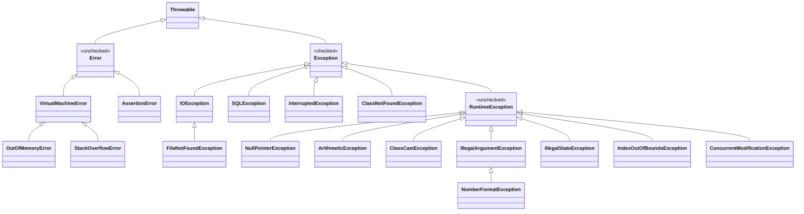
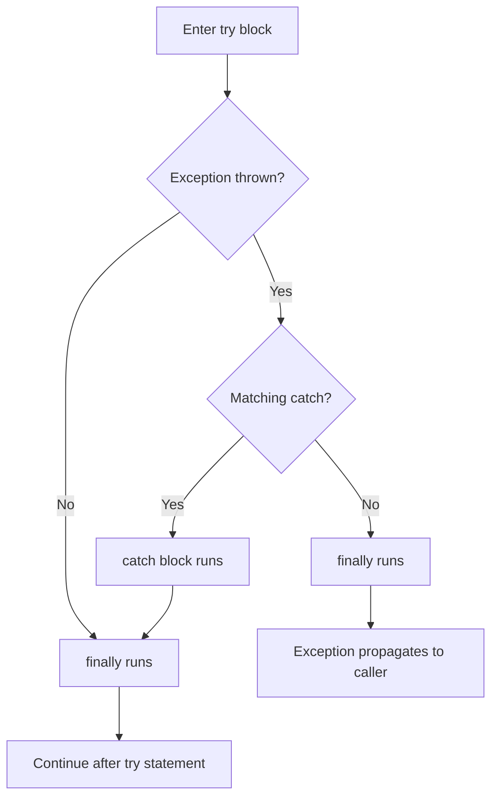

# Generics & Exceptions

> **TL;DR:** Generics give compile-time type safety and remove casts, but they are erased at runtime, which explains every weird restriction (`new T()`, `List<int>`, `instanceof List<String>`). Use PECS for wildcards.
> Exceptions split into checked (must handle or declare) and unchecked (`RuntimeException`, `Error`). Close resources with try-with-resources and never `return` from `finally`.

## Part 1: Generics

### Why generics

```java
List raw = new ArrayList();          // pre-Java 5: raw type
raw.add("a"); raw.add(1);            // anything goes
String s = (String) raw.get(1);      // ClassCastException at RUNTIME

List<String> list = new ArrayList<>();   // diamond operator (Java 7) infers <String>
list.add("a");
// list.add(1);                      // compile error: caught EARLY
String t = list.get(0);              // no cast needed
```

Benefits: type safety at compile time, no casts, reusable type-agnostic algorithms. Common names: `T` type, `E` element, `K`/`V` key/value, `N` number, `R` result.

### Generic classes, interfaces and methods

```java
class Box<T> {                                  // generic class
    private T value;
    void set(T value) { this.value = value; }
    T get() { return value; }
}

interface Repository<T, ID> {                   // generic interface
    Optional<T> findById(ID id);
}

class Pair<K, V> {
    final K key; final V val;
    Pair(K key, V val) { this.key = key; this.val = val; }
}

class Util {
    static <T> void swap(T[] arr, int i, int j) {   // generic method: <T> before return type
        T tmp = arr[i]; arr[i] = arr[j]; arr[j] = tmp;
    }
}

Box<Integer> b = new Box<>();
Util.swap(new String[]{"a", "b"}, 0, 1);   // T inferred as String
Util.<String>swap(new String[]{"a"}, 0, 0);    // explicit type witness (rarely needed)
```

A static method cannot use the class's type parameter (`T` belongs to instances); declare its own `<T>`.

### Bounded type parameters

```java
static <T extends Number> double sum(List<T> nums) {     // upper bound: T is Number or subtype
    double s = 0;
    for (T n : nums) s += n.doubleValue();               // can call Number methods
    return s;
}

// Multiple bounds: class first, then interfaces, joined with &
static <T extends Number & Comparable<T>> T max(T a, T b) {
    return a.compareTo(b) >= 0 ? a : b;
}

// Classic signature: works for types whose compareTo is defined in a supertype
static <T extends Comparable<? super T>> T maxOf(List<T> list) {
    T best = list.get(0);
    for (T x : list) if (x.compareTo(best) > 0) best = x;
    return best;
}
```

Type parameters only support `extends` bounds (`<T super X>` is not legal); `super` exists only for wildcards.

### Invariance: why wildcards exist

```java
List<Integer> ints = new ArrayList<>();
// List<Number> nums = ints;          // compile error: generics are INVARIANT
// otherwise nums.add(3.14) would put a Double into a List<Integer>

Number[] arr = new Integer[2];         // arrays are COVARIANT...
arr[0] = 3.14;                         // ...so this compiles and throws ArrayStoreException
```

### Wildcards and PECS

| Wildcard | Meaning | Read | Write |
|---|---|---|---|
| `List<?>` | List of some unknown type | As `Object` | Only `null` |
| `List<? extends Number>` | `Number` or any subtype (upper bound) | As `Number` | Only `null` |
| `List<? super Integer>` | `Integer` or any supertype (lower bound) | As `Object` | `Integer` and its subtypes |

**PECS: Producer Extends, Consumer Super.** If a parameter *produces* values you read, use `? extends T`. If it *consumes* values you write, use `? super T`. If it does both, use plain `T`.

```java
// JDK's Collections.copy uses exactly this shape
static <T> void copy(List<? super T> dest, List<? extends T> src) {
    for (T item : src)          // src PRODUCES T  -> extends
        dest.add(item);         // dest CONSUMES T -> super
}

List<Integer> src = List.of(1, 2, 3);
List<Number> dest = new ArrayList<>();
copy(dest, src);                // T = Integer: Number is a super, Integer is an extends

double total(Collection<? extends Number> c) {   // producer: accepts List<Integer>, List<Double>
    return c.stream().mapToDouble(Number::doubleValue).sum();
}
void fill(List<? super Integer> out) {           // consumer: accepts List<Integer>, List<Number>, List<Object>
    for (int i = 0; i < 3; i++) out.add(i);
}
```

### Type erasure and its consequences

The compiler checks types, then **erases** them: `T` becomes its bound (`Object` if unbounded), casts are inserted at call sites, and **bridge methods** are generated to keep overriding working. At runtime `List<String>` and `List<Integer>` are both just `List`.

```java
List<String> a = new ArrayList<>();
List<Integer> b = new ArrayList<>();
a.getClass() == b.getClass();          // true: both are ArrayList.class
```

| Not allowed | Why | Workaround |
|---|---|---|
| `new T()` | Type unknown at runtime | Pass a `Supplier<T>` or `Class<T>` |
| `new T[10]` | Array needs a reified component type | `(T[]) new Object[10]` with care, or `Array.newInstance(cls, n)` |
| `List<int>` | Type args must be reference types (erased to `Object`) | `List<Integer>` or `IntStream` / `int[]` |
| `obj instanceof List<String>` | Type args are gone at runtime | `obj instanceof List<?>` |
| `static T field` | Static is shared by all parameterizations | Make it an instance field or a generic method |
| Overload `f(List<String>)` and `f(List<Integer>)` | Same erasure, name clash | Different method names |
| `class MyEx<T> extends Exception` | `catch` needs a runtime type | Non-generic exception with a field |

```java
class Factory<T> {
    private final Supplier<T> ctor;
    Factory(Supplier<T> ctor) { this.ctor = ctor; }
    T create() { return ctor.get(); }       // instead of new T()
}
Factory<StringBuilder> f = new Factory<>(StringBuilder::new);
```

Avoid raw types: they switch off checks and cause **heap pollution** (a `List<String>` that actually contains an `Integer`, failing later with `ClassCastException`).

## Part 2: Exceptions

### Exception hierarchy



- **`Error`**: serious JVM/environment problems (`OutOfMemoryError`, `StackOverflowError`). Do not catch in normal code.
- **Checked** (`Exception` minus `RuntimeException`): recoverable conditions outside the program's control (I/O, network, DB). The compiler forces handling.
- **Unchecked** (`RuntimeException` and subclasses): programming bugs (null, bad index, bad argument).

### Checked vs unchecked

| | Checked | Unchecked |
|---|---|---|
| Superclass | `Exception` (not `RuntimeException`) | `RuntimeException` or `Error` |
| Compiler check | Must catch or declare with `throws` | No enforcement |
| Typical cause | External, recoverable failures | Bugs / violated preconditions |
| Examples | `IOException`, `SQLException`, `InterruptedException`, `ClassNotFoundException` | `NullPointerException`, `IllegalArgumentException`, `ArithmeticException`, `ArrayIndexOutOfBoundsException` |
| Lambdas | Awkward: standard functional interfaces cannot throw them | Work naturally |

### try / catch / finally flow



```java
try {
    int[] a = new int[2];
    a[5] = 1;                                   // throws ArrayIndexOutOfBoundsException
} catch (ArrayIndexOutOfBoundsException e) {    // most specific first
    System.out.println("bad index: " + e.getMessage());
} catch (RuntimeException e) {                  // broader after (reverse order = compile error)
    System.out.println("other runtime");
} finally {
    System.out.println("always runs");          // cleanup
}
```

- A `try` needs at least one `catch` or a `finally` (try-with-resources may have neither).
- `finally` runs whether or not an exception occurred, even after `return`, `break` or `continue` in `try`.
- `finally` does **not** complete if: `System.exit()` / `Runtime.halt()`, the JVM crashes or is killed, the `try` never finishes (infinite loop, deadlock), or a daemon thread is killed at JVM exit.
- If the `catch` itself throws, `finally` still runs and then the new exception propagates.

### try-with-resources and `AutoCloseable`

```java
// Any AutoCloseable (close() throws Exception) or Closeable (close() throws IOException)
try (BufferedReader in = new BufferedReader(new FileReader("in.txt"));
     BufferedWriter out = new BufferedWriter(new FileWriter("out.txt"))) {
    out.write(in.readLine());
}   // closed automatically in REVERSE order: out, then in, even on exception

// Java 9: effectively final resources declared outside
BufferedReader r = new BufferedReader(new FileReader("x.txt"));
try (r) { r.readLine(); }

// Your own resource
class DbConnection implements AutoCloseable {
    @Override public void close() { System.out.println("closed"); }
}
```

**Suppressed exceptions**: if the body throws and then `close()` also throws, the body's exception is the one propagated and the close exception is attached via `addSuppressed`. Retrieve with `e.getSuppressed()`. With a manual `finally`, the close exception would *replace* the original.

### Multi-catch

```java
try {
    riskyIo();
    riskySql();
} catch (IOException | SQLException e) {   // Java 7: one handler, less duplication
    log.error("failed", e);
    // e = new IOException();              // compile error: e is implicitly final
}
// catch (FileNotFoundException | IOException e) -> compile error: types must be unrelated
```

### `throw` vs `throws`

| `throw` | `throws` |
|---|---|
| Statement that actually throws one exception instance | Clause in the method signature declaring possible exceptions |
| Inside a method body | After the parameter list |
| Followed by an object: `throw new X(...)` | Followed by class names, comma-separated |
| Can only throw one at a time | Can list several |

```java
void withdraw(double amt) throws InsufficientFundsException {    // declares
    if (amt > balance) throw new InsufficientFundsException(amt - balance);  // throws
    balance -= amt;
}
```

Overriding rule: an overriding method may throw the same, narrower or no checked exceptions, never new or broader ones. Unchecked exceptions are unrestricted.

### Custom exceptions

```java
// Checked: callers are forced to handle a recoverable business condition
public class InsufficientFundsException extends Exception {
    private final double shortfall;
    public InsufficientFundsException(double shortfall) {
        super("Short by " + shortfall);
        this.shortfall = shortfall;
    }
    public double getShortfall() { return shortfall; }
}

// Unchecked: wraps lower-level failures, keeps the cause for the stack trace
public class OrderServiceException extends RuntimeException {
    public OrderServiceException(String msg, Throwable cause) { super(msg, cause); }
}

try {
    repo.save(order);
} catch (SQLException e) {
    throw new OrderServiceException("could not save order " + order.id(), e);  // chaining
}
```

Name them `...Exception`, add a message and cause constructor, and prefer standard ones (`IllegalArgumentException`, `IllegalStateException`, `UnsupportedOperationException`) when they fit.

### `finally` with `return`: gotchas

```java
static int a() {
    try { return 1; }
    finally { return 2; }        // returns 2: finally's return overrides
}

static int b() {
    try { throw new RuntimeException("lost"); }
    finally { return 3; }        // returns 3 and SWALLOWS the exception silently
}

static int c() {
    int x = 1;
    try { return x; }            // value 1 is captured now
    finally { x = 99; }          // changing the local does not affect the returned value
}                                // returns 1

static StringBuilder d() {
    StringBuilder sb = new StringBuilder("a");
    try { return sb; }           // the reference is captured...
    finally { sb.append("b"); }  // ...but the object is mutated
}                                // returns "ab"

static void e() throws Exception {
    try { throw new IOException("original"); }
    finally { throw new IllegalStateException("from finally"); }  // original exception is LOST
}
```

Rule: never `return` or `throw` from `finally`; use it only for cleanup (or use try-with-resources).

### Best practices

- Catch the **most specific** exception you can actually handle; let the rest propagate.
- Never swallow: an empty `catch` hides bugs. At minimum log with the exception object (`log.error("msg", e)`), not just `e.getMessage()`.
- Do not catch `Throwable`/`Error`; avoid catching generic `Exception` except at top-level boundaries (controllers, thread run loops).
- Preserve the cause when wrapping: `new XException("context", e)`.
- Use try-with-resources for anything closeable.
- Throw early (validate inputs), catch late (where you can recover or report).
- Do not use exceptions for normal control flow; they are expensive (stack trace capture).
- On `InterruptedException`, restore the flag: `Thread.currentThread().interrupt();`.
- Document thrown exceptions with `@throws`; prefer unchecked for programming errors.

## Interview Q&As

**Q1. What is type erasure?**
The compiler removes generic type information after type checking, replacing type parameters with their bounds and inserting casts. Generics therefore exist only at compile time, keeping bytecode compatible with pre-Java 5 code.

**Q2. Why can't you write `new T()` or `List<int>`?**
At runtime `T` is erased so the JVM does not know which class to instantiate; type arguments must be reference types because erasure turns them into `Object`.

**Q3. Is `List<Integer>` a subtype of `List<Number>`?**
No, generics are invariant. `List<? extends Number>` is the common supertype.

**Q4. Explain PECS.**
Producer Extends, Consumer Super: use `? extends T` for inputs you read from, `? super T` for outputs you write to (`Collections.copy(dest, src)`).

**Q5. `List<?>` vs `List<Object>`?**
`List<Object>` accepts any object on `add` but only a `List<Object>` can be assigned to it. `List<?>` accepts any `List<X>` but you can only add `null`.

**Q6. Checked vs unchecked exceptions?**
Checked must be caught or declared and represent recoverable external failures; unchecked (`RuntimeException`, `Error`) are not enforced and usually indicate bugs.

**Q7. `ClassNotFoundException` vs `NoClassDefFoundError`?**
The first is a checked exception from explicit dynamic loading (`Class.forName`) when the class is not found. The second is an `Error` when a class present at compile time is missing or failed static initialization at runtime.

**Q8. `final` vs `finally` vs `finalize`?**
`final` is a modifier (no reassign/override/extend). `finally` is a block that always runs after `try`. `finalize` is a deprecated `Object` method once called before GC.

**Q9. Will `finally` run if `try` contains `return`?**
Yes, it runs before the method actually returns. It does not run after `System.exit()`.

**Q10. What happens if an exception is thrown in a static initializer?**
The JVM wraps it in `ExceptionInInitializerError`; later attempts to use the class throw `NoClassDefFoundError`.

**Q11. Can you catch `StackOverflowError`?**
Technically yes (it is a `Throwable`), but you should not: the JVM state may be unreliable. Fix the recursion instead.

**Q12. What is exception chaining?**
Wrapping a low-level exception as the cause of a higher-level one (`new ServiceException("msg", e)`) so the original stack trace is preserved via `getCause()`.

**Q13. What are suppressed exceptions?**
Exceptions thrown by `close()` in try-with-resources while another exception is already propagating. They are attached to the primary one, accessible via `getSuppressed()`.

**Q14. Can an overriding method throw a broader checked exception?**
No. It may throw the same, a subclass, or none. Unchecked exceptions are unrestricted.
