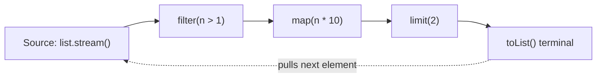

# Modern Java (8 → 21)

> **TL;DR:** Java 8 brought functional style: lambdas, functional interfaces, method references, Streams and `Optional`. Later LTS releases (11, 17, 21) added `var`, text blocks, switch expressions, records, sealed classes and pattern matching.
> Interviews focus on stream laziness, collectors (`groupingBy`, `toMap`), `map` vs `flatMap`, `Optional` misuse, and records/sealed types.

## Feature timeline (LTS in bold)

| Version | Key features |
|---|---|
| **8** | Lambdas, functional interfaces, method refs, Streams, `Optional`, default/static interface methods, `java.time` |
| 9 | `List.of`/`Set.of`/`Map.of`, private interface methods, `Optional.ifPresentOrElse`, `Stream.takeWhile/dropWhile`, modules |
| 10 | `var` for local variables |
| **11** | `String.isBlank/strip/lines/repeat`, `var` in lambda params, `HttpClient`, single-file `java Foo.java` |
| 14 | Switch expressions, helpful NullPointerException messages |
| 15 | Text blocks |
| 16 | Records, pattern matching for `instanceof`, `Stream.toList()` |
| **17** | Sealed classes |
| **21** | Pattern matching for `switch`, record patterns, virtual threads, sequenced collections |

## Lambdas

A lambda is an anonymous function that implements a **functional interface**.

```java
Runnable r = () -> System.out.println("hi");              // no params
Comparator<String> byLen = (a, b) -> a.length() - b.length();  // types inferred
Function<Integer, Integer> sq = x -> x * x;               // one param, no parens
BinaryOperator<Integer> add = (a, b) -> {                 // block body needs return
    int s = a + b;
    return s;
};

int base = 10;
Function<Integer, Integer> plusBase = x -> x + base;      // captures effectively final local
// base++;                                                // compile error: base must stay effectively final
```

- Captured locals must be **effectively final** (instance/static fields can be mutated).
- `this` inside a lambda is the **enclosing** instance (unlike anonymous classes).
- Lambdas compile to `invokedynamic`, not a separate `.class` per lambda.

## Functional interfaces

Exactly **one abstract method** (default/static methods and `Object` methods like `equals` do not count). `@FunctionalInterface` makes the compiler enforce it.

```java
@FunctionalInterface
interface Validator<T> {
    boolean validate(T t);
    default Validator<T> and(Validator<T> o) { return t -> validate(t) && o.validate(t); }
}
```

| Interface | Method | Signature | Typical use |
|---|---|---|---|
| `Function<T, R>` | `apply` | T to R | `map` |
| `BiFunction<T, U, R>` | `apply` | (T, U) to R | `Map.merge`, `reduce` with identity |
| `UnaryOperator<T>` | `apply` | T to T | `List.replaceAll` |
| `BinaryOperator<T>` | `apply` | (T, T) to T | `reduce` |
| `Predicate<T>` | `test` | T to boolean | `filter` |
| `BiPredicate<T, U>` | `test` | (T, U) to boolean | two-arg checks |
| `Consumer<T>` | `accept` | T to void | `forEach` |
| `BiConsumer<T, U>` | `accept` | (T, U) to void | `Map.forEach` |
| `Supplier<T>` | `get` | () to T | `orElseGet`, factories |
| `Runnable` | `run` | () to void | threads |
| `Callable<V>` | `call` | () to V, can throw | executors |
| `Comparator<T>` | `compare` | (T, T) to int | sorting |

Primitive specializations avoid boxing: `IntPredicate`, `IntFunction<R>`, `ToIntFunction<T>`, `IntUnaryOperator`, `IntBinaryOperator`, `IntSupplier`, etc.

```java
Predicate<String> notEmpty = s -> !s.isEmpty();
Predicate<String> shortStr = s -> s.length() < 5;
notEmpty.and(shortStr).negate().test("hello");          // composition: and, or, negate

Function<Integer, Integer> plus1 = x -> x + 1, times2 = x -> x * 2;
plus1.andThen(times2).apply(3);   // (3 + 1) * 2 = 8
plus1.compose(times2).apply(3);   // (3 * 2) + 1 = 7

Comparator<Person> cmp = Comparator.comparing(Person::age)
        .thenComparing(Person::name, Comparator.reverseOrder());
```

## Method references

Shorthand for a lambda that only calls an existing method.

| Kind | Syntax | Equivalent lambda |
|---|---|---|
| Static method | `Integer::parseInt` | `s -> Integer.parseInt(s)` |
| Instance method of a particular object (bound) | `System.out::println` | `x -> System.out.println(x)` |
| Instance method of an arbitrary object of a type (unbound) | `String::toUpperCase` | `s -> s.toUpperCase()` |
| Constructor | `ArrayList::new` | `() -> new ArrayList<>()` |

```java
List<String> names = List.of("bob", "amy");
names.stream().map(String::toUpperCase).forEach(System.out::println);
Function<String, Integer> parse = Integer::parseInt;
BiFunction<String, String, Boolean> eq = String::equals;   // unbound: first arg is the receiver
Supplier<List<String>> mk = ArrayList::new;
IntFunction<int[]> arr = int[]::new;                        // array constructor
```

## Streams API

A stream is a **lazy pipeline** over a source: **source, zero or more intermediate ops, one terminal op**. It does not store data, does not modify the source, and can be consumed **only once** (reuse throws `IllegalStateException`).

| | Intermediate | Terminal |
|---|---|---|
| Returns | A new `Stream` | A result or side effect (`List`, `long`, `Optional`, void) |
| Evaluation | Lazy: nothing runs until a terminal op | Eager: triggers the whole pipeline |
| Examples | `filter`, `map`, `flatMap`, `distinct`, `sorted`, `peek`, `limit`, `skip`, `mapToInt` | `forEach`, `collect`, `toList`, `reduce`, `count`, `min`, `max`, `anyMatch`, `allMatch`, `noneMatch`, `findFirst`, `findAny`, `toArray` |
| Special | Stateful: `sorted`, `distinct` (need to see many elements) | Short-circuiting: `anyMatch`, `findFirst`, `limit` stop early |

### Laziness: elements flow one at a time



```java
List<Integer> out = Stream.of(1, 2, 3, 4, 5)
    .filter(n -> { System.out.println("filter " + n); return n > 1; })
    .map(n -> { System.out.println("map " + n); return n * 10; })
    .limit(2)
    .toList();
// filter 1, filter 2, map 2, filter 3, map 3   -> stops: 4 and 5 are never touched
// Processing is vertical (per element), not horizontal (per stage).
// Without the terminal toList(), nothing prints at all.
```

### Common operations

```java
record Emp(String name, String dept, double salary, List<String> skills) {}
List<Emp> emps = /* ... */;

emps.stream().filter(e -> e.salary() > 50_000).map(Emp::name).sorted().toList();

// map vs flatMap: flatMap flattens Stream<List<X>> into Stream<X>
List<String> allSkills = emps.stream()
    .flatMap(e -> e.skills().stream())
    .distinct()
    .toList();

double total = emps.stream().mapToDouble(Emp::salary).sum();        // primitive stream, no boxing
Optional<Emp> top = emps.stream().max(Comparator.comparingDouble(Emp::salary));
int sum = Stream.of(1, 2, 3).reduce(0, Integer::sum);               // identity + accumulator
boolean anyRich = emps.stream().anyMatch(e -> e.salary() > 1e6);
IntStream.rangeClosed(1, 5).boxed().toList();                       // [1..5]
```

### Collectors

```java
import static java.util.stream.Collectors.*;

List<String> names = emps.stream().map(Emp::name).collect(toList());   // mutable list
List<String> names2 = emps.stream().map(Emp::name).toList();          // Java 16: unmodifiable

// toMap: throws IllegalStateException on duplicate keys unless you give a merge function
Map<String, Double> salaryByName = emps.stream()
    .collect(toMap(Emp::name, Emp::salary));
Map<String, Double> maxByDept = emps.stream()
    .collect(toMap(Emp::dept, Emp::salary, Math::max));                // merge duplicates
Map<String, Emp> ordered = emps.stream()
    .collect(toMap(Emp::name, e -> e, (a, b) -> a, LinkedHashMap::new)); // choose map type

// groupingBy: Map<K, List<V>> by default, with optional downstream collector
Map<String, List<Emp>> byDept = emps.stream().collect(groupingBy(Emp::dept));
Map<String, Long> countByDept = emps.stream().collect(groupingBy(Emp::dept, counting()));
Map<String, Double> avgByDept = emps.stream()
    .collect(groupingBy(Emp::dept, averagingDouble(Emp::salary)));
Map<String, List<String>> namesByDept = emps.stream()
    .collect(groupingBy(Emp::dept, TreeMap::new, mapping(Emp::name, toList())));

// partitioningBy: always Map<Boolean, ...> with both true and false keys
Map<Boolean, List<Emp>> richOrNot = emps.stream()
    .collect(partitioningBy(e -> e.salary() > 80_000));

String csv = emps.stream().map(Emp::name).collect(joining(", ", "[", "]"));  // [a, b, c]
long n = emps.stream().collect(counting());

// Frequency of characters: a classic interview one-liner
Map<Character, Long> freq = "banana".chars().mapToObj(c -> (char) c)
    .collect(groupingBy(c -> c, LinkedHashMap::new, counting()));   // {b=1, a=3, n=2}
```

| Collector | Result |
|---|---|
| `toList()` / `toSet()` | `List` / `Set` |
| `toMap(k, v[, merge[, mapSupplier]])` | `Map`, duplicate key throws without merge |
| `groupingBy(classifier[, mapFactory][, downstream])` | `Map<K, List<T>>` or `Map<K, downstreamResult>` |
| `partitioningBy(predicate[, downstream])` | `Map<Boolean, ...>` |
| `joining(delim, prefix, suffix)` | `String` |
| `counting()`, `summingInt`, `averagingDouble` | `Long`, number, `Double` |
| `mapping`, `filtering`, `collectingAndThen` | Adapt a downstream collector |

**Parallel streams** (`parallelStream()`) use the common `ForkJoinPool`. Only worth it for large, CPU-bound, stateless work on splittable sources (`ArrayList`, arrays); avoid shared mutable state and blocking I/O inside.

## Optional

A container that may or may not hold a non-null value; designed as a **return type** to make "no result" explicit.

```java
Optional<String> a = Optional.of("x");            // NPE if null
Optional<String> b = Optional.ofNullable(maybe);  // empty if null
Optional<String> c = Optional.empty();

String v1 = b.orElse("default");                  // default ALWAYS evaluated
String v2 = b.orElseGet(() -> expensive());       // supplier only called if empty
String v3 = b.orElseThrow();                      // NoSuchElementException (Java 10)
String v4 = b.orElseThrow(() -> new NotFoundException("id"));

findUser(id)
    .filter(u -> u.isActive())
    .map(User::email)                             // Optional<String>
    .ifPresentOrElse(this::send, () -> log.warn("no email"));   // Java 9

Optional<Address> addr = findUser(id).flatMap(User::address);   // when the mapper returns Optional
```

| Do | Don't |
|---|---|
| Return `Optional<T>` from methods that may find nothing | Use it for fields, method parameters, or in collections |
| Chain `map` / `filter` / `flatMap` / `orElse*` | Call `get()` without checking (use `orElseThrow()` if you mean it) |
| Use `orElseGet` when the default is costly | `if (opt.isPresent()) { opt.get() }`: that is just a null check |
| Return an empty collection instead of `Optional<List<T>>` | Return `null` from a method declared to return `Optional` |
| Use `OptionalInt` / `OptionalDouble` for primitives | Use `Optional` for serialization (it is not `Serializable`) |

## Default and static interface methods

```java
interface Shape {
    double area();
    default String describe() { return "Area: " + area(); }   // added without breaking implementors
    static Shape unit() { return () -> 1.0; }                  // utility on the interface
}
```

Defaults let the JDK evolve interfaces (`Collection.stream()`, `List.sort`, `Map.getOrDefault`, `Iterable.forEach`). Static interface methods are not inherited by implementing classes: call them as `Shape.unit()`.

## Date/Time API (`java.time`)

Immutable and thread-safe, unlike the old mutable `Date` and non-thread-safe `SimpleDateFormat`.

| Class | Represents |
|---|---|
| `LocalDate` / `LocalTime` / `LocalDateTime` | Date / time / both, no time zone |
| `ZonedDateTime` / `OffsetDateTime` | Date-time with zone / offset |
| `Instant` | Machine timestamp (UTC epoch) |
| `Duration` / `Period` | Time-based amount (hours, secs) / date-based amount (years, months, days) |
| `DateTimeFormatter` | Thread-safe formatting and parsing |

```java
LocalDate today = LocalDate.now();
LocalDate due = today.plusDays(30);                       // returns a NEW object
long days = ChronoUnit.DAYS.between(today, due);          // 30
Period p = Period.between(LocalDate.of(1995, 5, 20), today);
String s = due.format(DateTimeFormatter.ofPattern("dd-MM-yyyy"));
ZonedDateTime ny = ZonedDateTime.now(ZoneId.of("America/New_York"));
```

## `var` (Java 10)

Local variable type inference; the type is still static and fixed at compile time.

```java
var list = new ArrayList<String>();       // ArrayList<String>
for (var e : map.entrySet()) { }          // great for verbose generic types
// var x;              // error: needs an initializer
// var n = null;       // error: cannot infer
// var f = () -> 1;    // error: lambda needs a target type
```

Only for locals, for-loop variables and (Java 11) lambda parameters. Not for fields, method parameters or return types. `var` is a reserved type name, not a keyword.

## Text blocks (Java 15)

```java
String json = """
    {
      "name": "Ana",
      "age": 30
    }
    """;   // incidental indentation stripped; closing delimiter position controls it
```

## Switch expressions (Java 14)

```java
int days = switch (month) {
    case FEB -> 28;
    case APR, JUN, SEP, NOV -> 30;         // multiple labels, no fall-through
    default -> {
        int d = 31;
        yield d;                            // yield returns a value from a block
    }
};
```

Arrow cases never fall through; a switch **expression** must be exhaustive (enums: cover all constants or add `default`).

## Records (Java 16)

Transparent, immutable data carriers.

```java
public record Point(int x, int y) {
    public Point {                               // compact canonical constructor: validation
        if (x < 0 || y < 0) throw new IllegalArgumentException("negative");
    }
    public static Point origin() { return new Point(0, 0); }   // static members allowed
    public double dist() { return Math.hypot(x, y); }         // instance methods allowed
}

Point p = new Point(3, 4);
p.x();                      // accessor is x(), not getX()
p.equals(new Point(3, 4));  // true: auto equals/hashCode/toString
```

- Implicitly `final`, extends `java.lang.Record`, cannot extend another class, can implement interfaces.
- Fields are `private final`; no extra instance fields allowed.
- Shallowly immutable: copy mutable components (`List.copyOf`) in the compact constructor.

## Sealed classes (Java 17)

Restrict which classes may extend or implement a type.

```java
public sealed interface Shape permits Circle, Square, Rect { }
public record Circle(double r) implements Shape { }           // records are implicitly final
public record Square(double side) implements Shape { }
public non-sealed class Rect implements Shape { }             // reopens the hierarchy
```

Each permitted subclass must be `final`, `sealed`, or `non-sealed`. Benefit: the compiler knows all subtypes, so a `switch` over them can be exhaustive **without `default`**.

## Pattern matching (`instanceof` 16, `switch` 21)

```java
if (obj instanceof String s && s.length() > 3) { System.out.println(s.toUpperCase()); }

static double area(Shape shape) {
    return switch (shape) {                              // exhaustive over the sealed type
        case Circle c -> Math.PI * c.r() * c.r();
        case Square(double side) -> side * side;         // record pattern: deconstructs
        case Rect r -> 0;
    };
}

static String describe(Object o) {
    return switch (o) {
        case null -> "null";                             // switch can now handle null
        case Integer i when i > 100 -> "big int";        // guard with 'when'
        case Integer i -> "int " + i;
        case String s -> "string of " + s.length();
        default -> "other";
    };
}
```

More specific cases must come before general ones (a dominated case is a compile error).

## Interview Q&As

**Q1. What is a functional interface? Is `Comparator` one even though it declares `equals`?**
An interface with exactly one abstract method. Yes: `equals` is a public `Object` method, so it does not count.

**Q2. Intermediate vs terminal operations?**
Intermediate ops return a stream and are lazy; terminal ops produce a result and trigger execution. No terminal op means nothing runs.

**Q3. `map` vs `flatMap`?**
`map` transforms each element one-to-one (`Stream<List<X>>` stays nested). `flatMap` maps each element to a stream and flattens them into one `Stream<X>`.

**Q4. Can a stream be reused?**
No. After a terminal operation it is consumed; reuse throws `IllegalStateException`. Create a new stream (or use a `Supplier<Stream<T>>`).

**Q5. `Collectors.toList()` vs `Stream.toList()`?**
`Collectors.toList()` returns a (currently) mutable `ArrayList`; `Stream.toList()` (Java 16) returns an unmodifiable list that allows nulls.

**Q6. What happens with duplicate keys in `toMap`?**
`IllegalStateException`. Provide a merge function, e.g. `toMap(k, v, (a, b) -> a)`.

**Q7. `orElse` vs `orElseGet`?**
`orElse(x)` evaluates `x` eagerly even when a value is present; `orElseGet(supplier)` calls the supplier only if empty. Use `orElseGet` for expensive defaults.

**Q8. Why must variables captured by a lambda be effectively final?**
Lambdas capture the value, not the variable; a local may be gone (its frame popped) when the lambda runs, and mutable capture would invite data races.

**Q9. `findFirst` vs `findAny`?**
`findFirst` respects encounter order; `findAny` may return any element and is faster in parallel streams.

**Q10. Record vs Lombok `@Data` / a normal class?**
A record is final, immutable, and gets canonical constructor, accessors, `equals`, `hashCode`, `toString` from the language. It cannot extend classes or declare extra instance fields.

**Q11. Why use sealed classes?**
To model closed hierarchies (algebraic data types) and get exhaustive, `default`-free switch expressions checked by the compiler.

**Q12. Is `var` dynamic typing?**
No. The compiler infers a fixed static type at compile time; it is purely syntax sugar for locals.

**Q13. Are parallel streams always faster?**
No. Splitting, thread coordination and merging cost time. They help only for large, CPU-heavy, stateless workloads on easily splittable sources.

**Q14. Why were default methods introduced?**
To add methods (like `stream()`, `forEach`) to existing interfaces without breaking every implementing class: backward-compatible interface evolution.
