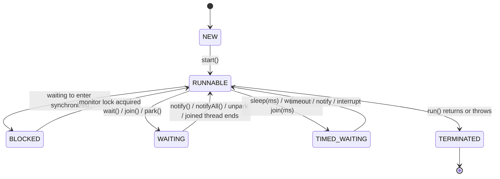
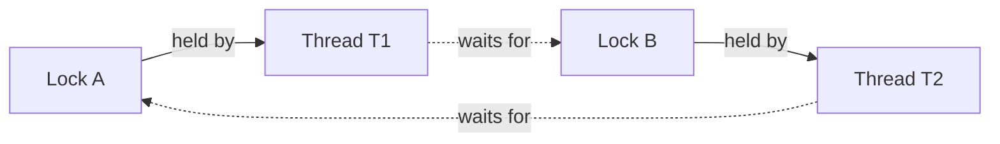

# Multithreading Basics

> **TL;DR:** Threads share the heap, so unsynchronized access to mutable state causes race conditions and visibility bugs. `synchronized` gives mutual exclusion + visibility, `volatile` gives visibility only, atomics give lock-free single-variable updates.
> In real code use `java.util.concurrent`: executors instead of raw threads, `ConcurrentHashMap`, latches and `CompletableFuture`. Avoid deadlock with a global lock order. Java 21 virtual threads make blocking I/O cheap.

## Process vs Thread

| | Process | Thread |
|---|---|---|
| What | Independent running program | Unit of execution inside a process |
| Memory | Own address space | Shares heap, Metaspace with sibling threads; own stack and PC |
| Creation / context switch | Expensive | Cheaper |
| Communication | IPC (sockets, pipes, files) | Shared objects (needs synchronization) |
| Failure isolation | Crash does not affect others | Uncaught error can corrupt shared state |

**Concurrency** is dealing with many tasks at once (interleaving); **parallelism** is running them at the same instant on multiple cores.

## Creating threads

```java
// 1. Extend Thread (uses up your single inheritance)
class Worker extends Thread {
    @Override public void run() { System.out.println("in " + getName()); }
}
new Worker().start();

// 2. Implement Runnable (preferred: separates task from thread)
Runnable task = () -> System.out.println("in " + Thread.currentThread().getName());
Thread t = new Thread(task, "worker-1");
t.start();              // new thread calls run()
// t.run();             // WRONG: runs on the CURRENT thread, no new thread
// t.start();           // calling start() twice -> IllegalThreadStateException

// 3. Callable + Future: returns a value and can throw checked exceptions
ExecutorService pool = Executors.newFixedThreadPool(2);
Callable<Integer> job = () -> { Thread.sleep(100); return 42; };
Future<Integer> f = pool.submit(job);
Integer result = f.get();                 // blocks until done; wraps failures in ExecutionException
f.get(1, TimeUnit.SECONDS);               // with timeout -> TimeoutException
pool.shutdown();
```

| `Runnable` | `Callable<V>` |
|---|---|
| `void run()` | `V call() throws Exception` |
| No result | Returns a result via `Future` |
| Cannot throw checked exceptions | Can |
| `Thread` or executor | Executor only |

## Thread lifecycle



`Thread.State` values: `NEW`, `RUNNABLE` (running or ready; the JVM does not distinguish), `BLOCKED`, `WAITING`, `TIMED_WAITING`, `TERMINATED`. A terminated thread cannot be restarted. After `notify()`, a waiting thread first moves to `BLOCKED` until it re-acquires the monitor.

| Method | Effect |
|---|---|
| `start()` | Creates the OS/virtual thread and schedules `run()` |
| `sleep(ms)` | Pauses current thread, **keeps** any locks held |
| `join()` | Waits for another thread to finish |
| `yield()` | Hint to scheduler to let others run |
| `interrupt()` | Sets the flag; blocked `sleep`/`wait`/`join` throw `InterruptedException` |
| `setDaemon(true)` | Background thread; JVM exits when only daemons remain (set before `start`) |

| `sleep()` | `wait()` |
|---|---|
| `Thread` static method | `Object` instance method |
| Keeps the lock | **Releases** the monitor lock |
| No need to hold a lock | Must hold the object's monitor (`IllegalMonitorStateException` otherwise) |
| Wakes after time / interrupt | Wakes on `notify`/`notifyAll`, timeout, interrupt, or spuriously |

## Race condition: demo and fix

`count++` is **read, modify, write**: three steps that two threads can interleave, losing updates.

```java
class Counter {
    private int count = 0;
    void increment() { count++; }            // NOT atomic
    int get() { return count; }
}

Counter c = new Counter();
Runnable r = () -> { for (int i = 0; i < 100_000; i++) c.increment(); };
Thread t1 = new Thread(r), t2 = new Thread(r);
t1.start(); t2.start();
t1.join(); t2.join();
System.out.println(c.get());   // expected 200000, usually prints less (e.g. 137412)
```

Fixes:

```java
// Fix 1: synchronized (mutual exclusion + visibility)
synchronized void increment() { count++; }

// Fix 2: lock-free atomic (CAS)
private final AtomicInteger count = new AtomicInteger();
void increment() { count.incrementAndGet(); }

// Fix 3: for very high contention counters
private final LongAdder adder = new LongAdder();   // adder.increment(); adder.sum();
```

## `synchronized` and intrinsic locks

Every object has an **intrinsic lock (monitor)**. Only one thread can hold it at a time; others trying to enter go `BLOCKED`.

```java
class Account {
    private double balance;
    private final Object lock = new Object();       // private lock: outsiders cannot grab it

    synchronized void deposit(double a) { balance += a; }       // locks 'this'

    static synchronized void audit() { }                        // locks Account.class

    void withdraw(double a) {
        // non-critical work here, outside the lock
        synchronized (lock) {                                   // block: smallest critical section
            if (balance >= a) balance -= a;
        }
    }
}
```

- **Reentrant**: a thread holding a lock can re-acquire it (a synchronized method can call another one on the same object).
- Instance and static synchronized methods use **different** locks, so they do not block each other.
- Lock is released on normal exit **and** on exception.
- **Happens-before**: everything a thread did before releasing a lock is visible to the next thread acquiring the same lock.
- Prefer synchronized blocks on a private final lock over synchronizing whole methods or on `this` (callers could lock it too). Never lock on `String` literals or boxed values (shared/cached instances).

## `volatile` and visibility

Without synchronization, a thread may keep reading a stale value (CPU cache/register, compiler reordering). `volatile` guarantees that writes are **immediately visible** to other threads and prevents reordering around it. It does **not** make compound actions atomic.

```java
class Server {
    private volatile boolean running = true;   // without volatile the loop may never stop

    void serve() {
        while (running) { /* handle requests */ }
    }
    void stop() { running = false; }           // write by another thread becomes visible
}

volatile int hits;
hits++;    // still a race: volatile does not make read-modify-write atomic
```

| | `volatile` | `synchronized` | `AtomicInteger` |
|---|---|---|---|
| Visibility | Yes | Yes | Yes |
| Atomic compound ops (`++`, check-then-act) | No | Yes | Yes (single variable) |
| Blocking | No | Yes | No (CAS spin) |
| Use for | Flags, safe publication | Multi-variable invariants | Counters, sequences |

Classic use: **double-checked locking singleton** needs `volatile` so no thread sees a partially constructed object.

```java
class Singleton {
    private static volatile Singleton instance;
    static Singleton get() {
        if (instance == null) {                          // 1st check, no lock
            synchronized (Singleton.class) {
                if (instance == null) instance = new Singleton();   // 2nd check
            }
        }
        return instance;
    }
}
```

## wait / notify: producer-consumer

```java
class BoundedBuffer {
    private final Queue<Integer> q = new LinkedList<>();
    private final int capacity = 5;

    synchronized void put(int v) throws InterruptedException {
        while (q.size() == capacity) wait();   // ALWAYS a while loop: spurious wakeups
        q.add(v);
        notifyAll();                            // wake consumers
    }

    synchronized int take() throws InterruptedException {
        while (q.isEmpty()) wait();             // releases the lock while waiting
        int v = q.poll();
        notifyAll();                            // wake producers
        return v;
    }
}
```

Rules: call `wait`/`notify` only while holding that object's monitor; re-check the condition in a `while`; prefer `notifyAll` (with one shared lock for two conditions, `notify` can wake the wrong kind of thread).

In practice use a `BlockingQueue`, which does all of this for you:

```java
BlockingQueue<Integer> queue = new ArrayBlockingQueue<>(5);
new Thread(() -> { for (int i = 0; ; i++) { try { queue.put(i); } catch (InterruptedException e) { return; } } }).start();
new Thread(() -> { while (true) { try { System.out.println(queue.take()); } catch (InterruptedException e) { return; } } }).start();
```

## `java.util.concurrent` essentials

### ExecutorService and thread pools

Reusing threads avoids creation cost and bounds resource usage.

```java
ExecutorService pool = Executors.newFixedThreadPool(4);
try {
    List<Callable<Integer>> jobs = List.of(() -> 1, () -> 2);
    List<Future<Integer>> futures = pool.invokeAll(jobs);     // run a batch, wait for all
    pool.execute(() -> System.out.println("fire and forget"));  // Runnable, no result
    Future<String> f = pool.submit(() -> "done");               // result + exceptions via Future
} finally {
    pool.shutdown();                                  // stop accepting, finish queued tasks
    if (!pool.awaitTermination(5, TimeUnit.SECONDS))
        pool.shutdownNow();                           // interrupt running, drop queued
}
```

| Factory | Behaviour |
|---|---|
| `newFixedThreadPool(n)` | n threads, unbounded queue (can grow without limit) |
| `newCachedThreadPool()` | Creates threads on demand, reuses idle ones (60s); unbounded thread count |
| `newSingleThreadExecutor()` | One thread, tasks run sequentially |
| `newScheduledThreadPool(n)` | Delayed / periodic tasks |
| `newWorkStealingPool()` | `ForkJoinPool`, work stealing |
| `newVirtualThreadPerTaskExecutor()` | Java 21: one virtual thread per task |

Production code often builds a `ThreadPoolExecutor` directly to bound everything: `corePoolSize`, `maximumPoolSize`, `keepAliveTime`, a **bounded** `workQueue`, a `ThreadFactory` (names), and a `RejectedExecutionHandler` (`AbortPolicy` default, `CallerRunsPolicy` for back-pressure). New threads beyond core are created only when the queue is full. Sizing rule of thumb: CPU-bound about `cores`, I/O-bound more (`cores * (1 + wait/compute)`).

### ReentrantLock

```java
private final ReentrantLock lock = new ReentrantLock();     // new ReentrantLock(true) = fair

void transfer() throws InterruptedException {
    if (lock.tryLock(1, TimeUnit.SECONDS)) {                 // give up instead of waiting forever
        try {
            // critical section
        } finally {
            lock.unlock();                                   // ALWAYS in finally
        }
    }
}
```

| `synchronized` | `ReentrantLock` |
|---|---|
| Implicit acquire/release, released on exception | Explicit `lock()`/`unlock()` in `finally` |
| Block-structured | Can lock in one method and unlock in another |
| No timeout, not interruptible while waiting | `tryLock()`, `tryLock(timeout)`, `lockInterruptibly()` |
| Unfair only | Optional fairness |
| One wait-set (`wait`/`notify`) | Multiple `Condition`s (`newCondition()`: `await`/`signal`) |

`ReadWriteLock` (`ReentrantReadWriteLock`) allows many concurrent readers or one writer: good for read-heavy data.

### Atomic variables

```java
AtomicInteger n = new AtomicInteger();
n.incrementAndGet();                       // ++n atomically
n.getAndAdd(5);                            // n += 5, returns old
n.compareAndSet(6, 10);                    // CAS: set 10 only if current is 6
n.updateAndGet(x -> x * 2);                // atomic functional update
AtomicReference<String> ref = new AtomicReference<>("a");
```

Built on hardware **compare-and-swap**: lock-free, no blocking. Beware the ABA problem (fix with `AtomicStampedReference`).

### ConcurrentHashMap

```java
ConcurrentHashMap<String, Integer> counts = new ConcurrentHashMap<>();
counts.merge("apple", 1, Integer::sum);                 // atomic increment
counts.computeIfAbsent("k", key -> expensiveLoad(key)); // atomic check-then-act
// if (!map.containsKey(k)) map.put(k, v);              // NOT atomic even on a CHM: use putIfAbsent
```

| | `HashMap` | `Hashtable` / `synchronizedMap` | `ConcurrentHashMap` |
|---|---|---|---|
| Thread-safe | No | Yes, one lock for the whole map | Yes, fine-grained |
| Java 8+ internals | Buckets, no locking | Every op locks the map | CAS on empty bins + `synchronized` on the bin head; lock-free reads |
| Null keys/values | Allowed (1 null key) | Not allowed | **Not allowed** (ambiguity of `get` returning null) |
| Iterators | Fail-fast (`ConcurrentModificationException`) | Fail-fast | Weakly consistent, never throw CME |

### CountDownLatch (plus CyclicBarrier, Semaphore)

```java
CountDownLatch ready = new CountDownLatch(3);
for (int i = 0; i < 3; i++) {
    pool.submit(() -> {
        loadConfig();
        ready.countDown();          // decrement
    });
}
ready.await();                      // main blocks until count reaches 0
System.out.println("all services up");
```

| Utility | Purpose |
|---|---|
| `CountDownLatch` | Wait until N events happen; one-shot, cannot reset |
| `CyclicBarrier` | N threads wait for each other at a point; reusable |
| `Semaphore` | Limit concurrent access to N permits (`acquire`/`release`) |

### CompletableFuture basics

Composable async pipelines without blocking on `get()`.

```java
CompletableFuture<String> user = CompletableFuture.supplyAsync(() -> fetchUser(1));  // common ForkJoinPool
CompletableFuture<Integer> credit = CompletableFuture.supplyAsync(() -> fetchCredit(1), pool); // custom pool

CompletableFuture<String> summary = user
    .thenApply(String::toUpperCase)                                   // transform (like map)
    .thenCompose(u -> CompletableFuture.supplyAsync(() -> orders(u))) // chain async (like flatMap)
    .thenCombine(credit, (orders, c) -> orders + " credit=" + c)      // join two independent futures
    .exceptionally(ex -> "fallback: " + ex.getMessage());             // recover from failure

CompletableFuture.allOf(user, credit).join();   // wait for all; anyOf for the first
String s = summary.join();                       // join: unchecked CompletionException (get: checked)
```

## Deadlock

Two or more threads wait forever for locks held by each other.



```java
Object a = new Object(), b = new Object();
// sleep(ms) = helper wrapping Thread.sleep to widen the race window
new Thread(() -> { synchronized (a) { sleep(50); synchronized (b) { } } }).start();  // A then B
new Thread(() -> { synchronized (b) { sleep(50); synchronized (a) { } } }).start();  // B then A: deadlock

// Fix: every thread acquires locks in the SAME global order (e.g. by account id)
void transfer(Account x, Account y, int amt) {
    Account first = x.id() < y.id() ? x : y;
    Account second = first == x ? y : x;
    synchronized (first) { synchronized (second) { /* move money */ } }
}
```

**Four necessary (Coffman) conditions**: mutual exclusion, hold and wait, no preemption, circular wait. Break any one to prevent deadlock.

How to avoid:

- Consistent **lock ordering** (breaks circular wait).
- `tryLock` with timeout and back off (breaks hold and wait).
- Hold as few locks as possible, for as short as possible; do not call unknown/alien code while holding a lock.
- Prefer higher-level concurrency utilities and immutable data.

Detect with a thread dump (`jstack <pid>`, `jcmd <pid> Thread.print`) or `ThreadMXBean.findDeadlockedThreads()`.

Related: **livelock** (threads keep reacting to each other, no progress) and **starvation** (a thread never gets CPU or a lock, e.g. unfair locks, low priority).

## Virtual threads (Java 21)

Lightweight threads managed by the JVM, not the OS. Millions are possible. When a virtual thread blocks on I/O, the JVM unmounts it from its **carrier** (platform) thread, which is freed to run another one.

```java
try (ExecutorService ex = Executors.newVirtualThreadPerTaskExecutor()) {
    for (int i = 0; i < 10_000; i++) {
        ex.submit(() -> {
            Thread.sleep(1000);            // blocking is cheap: carrier is released
            return callRemoteApi();
        });
    }
}   // close() waits for all tasks

Thread.ofVirtual().name("v-1").start(() -> System.out.println("hi"));
Thread.startVirtualThread(() -> System.out.println("hi"));
```

| Platform thread | Virtual thread |
|---|---|
| 1:1 wrapper over an OS thread (~1 MB stack) | M:N, scheduled by the JVM on a `ForkJoinPool` of carriers |
| Expensive, so pool them | Cheap, **do not pool**: one per task |
| Good for CPU-bound work | Best for high-concurrency **I/O-bound** work (thread-per-request) |

Caveats: no speedup for CPU-bound tasks; limit access to scarce resources with a `Semaphore`, not a pool size; avoid heavy `ThreadLocal` use; in Java 21 blocking inside `synchronized` **pins** the carrier (use `ReentrantLock`; fixed in Java 24 by JEP 491).

## Interview Q&As

**Q1. `start()` vs `run()`?**
`start()` creates a new thread that then calls `run()`. Calling `run()` directly just executes it on the current thread.

**Q2. Runnable vs Callable?**
`Callable` returns a value and can throw checked exceptions; results come back via `Future`. `Runnable` returns nothing.

**Q3. What does `volatile` guarantee?**
Visibility of writes across threads and no reordering around the access. Not atomicity: `volatile int x; x++` is still a race.

**Q4. `synchronized` method vs block?**
A method locks `this` (or the `Class` for static) for the whole body. A block can lock any object for the smallest critical section, reducing contention.

**Q5. Why must `wait()` be called in a loop inside `synchronized`?**
It needs the monitor (releases it while waiting), and the thread can wake spuriously or find the condition already changed by another thread, so the condition must be re-checked.

**Q6. `sleep()` vs `wait()`?**
`sleep` keeps held locks and is a static `Thread` method; `wait` releases the monitor, is an `Object` method, and needs `notify` or a timeout.

**Q7. What is a race condition?**
The result depends on the timing of threads accessing shared mutable state, e.g. two unsynchronized `count++` losing updates.

**Q8. What is a deadlock and how do you prevent it?**
Threads waiting cyclically on each other's locks. Prevent with global lock ordering, `tryLock` with timeouts, and minimal lock scope.

**Q9. Why does ConcurrentHashMap disallow null?**
In concurrent code, `get(k) == null` must unambiguously mean "absent"; with nulls you could not tell absent from mapped-to-null without a racy `containsKey`.

**Q10. `shutdown()` vs `shutdownNow()`?**
`shutdown` rejects new tasks and lets queued ones finish. `shutdownNow` interrupts running tasks and returns the unstarted ones.

**Q11. `synchronized` vs `ReentrantLock`?**
Both are reentrant mutual-exclusion locks with the same memory semantics. `ReentrantLock` adds `tryLock`, timeouts, interruptible waits, fairness and multiple conditions, but you must unlock in `finally`.

**Q12. How does `AtomicInteger` work without locks?**
It uses CPU compare-and-swap in a retry loop: read, compute, CAS; if another thread changed the value, retry.

**Q13. `CountDownLatch` vs `CyclicBarrier`?**
A latch lets threads wait until a count of events reaches zero, once. A barrier makes a fixed group of threads wait for each other and can be reused.

**Q14. When should you use virtual threads?**
For many concurrent, mostly blocking I/O tasks (web requests, DB calls). Not for CPU-bound work, and never pooled.

**Q15. What is a daemon thread?**
A background service thread (e.g. GC) that does not keep the JVM alive: the JVM exits when only daemon threads remain.
