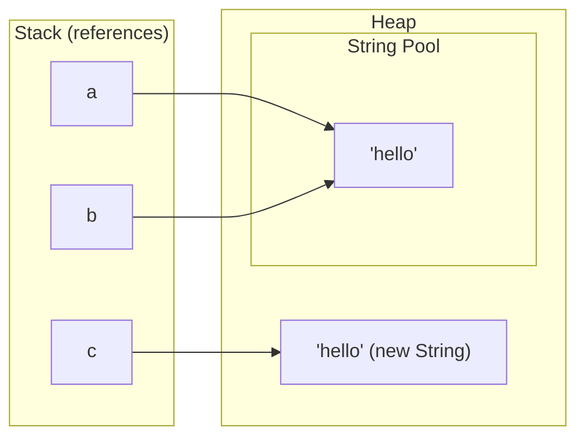

# Strings & StringBuilder

> **TL;DR**: A `String` is immutable. Every "modification" makes a new object, so `s += x` inside a loop is O(n²). Use `StringBuilder`.
> Compare strings with `.equals()`, never `==`. `substring` costs O(k) because it copies.
> For character counting over lowercase letters, an `int[26]` array beats a `HashMap` every time.

---

## 1. Immutability and the String pool

String literals are interned in the **String pool** (in the heap). Identical literals share one object. `new String(...)` always creates a fresh heap object.

```java
String a = "hello";              // goes to the pool
String b = "hello";              // reuses the same pooled object
String c = new String("hello");  // new object on the heap, outside the pool
String d = c.intern();           // returns the pooled "hello"

System.out.println(a == b);      // true  (same reference)
System.out.println(a == c);      // false (different objects)
System.out.println(a == d);      // true
System.out.println(a.equals(c)); // true  (same content)  <- always use this

String s = "hi";
s.toUpperCase();                 // result thrown away: s is still "hi"
s = s.toUpperCase();             // reassign to keep it
```



Why immutable? Safe sharing in the pool, a cached `hashCode` (great as a `HashMap` key), thread safety, and security.

### `==` vs `equals`

| Expression | Compares | Use when |
|---|---|---|
| `s1 == s2` | references (same object?) | almost never for strings |
| `s1.equals(s2)` | content, case-sensitive | always |
| `s1.equalsIgnoreCase(s2)` | content, ignores case | case-insensitive checks |
| `s1.compareTo(s2)` | lexicographic order: `<0`, `0`, `>0` | sorting, ordering |
| `Objects.equals(s1, s2)` | content, null-safe | when either side can be null |
| `"lit".equals(s)` | content, no NPE if `s` is null | defensive code |

Strings built at runtime (`sb.toString()`, `substring`, concatenation with variables) are **not** pooled, so `==` fails on them even with the same content.

---

## 2. Common String methods

Let `n` be the string length, `m` the length of the pattern or argument, and `k` the result length.

| Method | Example | Result | Time |
|---|---|---|---|
| `length()` | `"abc".length()` | `3` | O(1) |
| `charAt(i)` | `"abc".charAt(1)` | `'b'` | O(1) |
| `substring(b)` | `"hello".substring(2)` | `"llo"` | O(n-b), copies |
| `substring(b, e)` | `"hello".substring(1, 3)` | `"el"` ([b, e)) | O(e-b), copies |
| `indexOf(str)` | `"hello".indexOf("l")` | `2` (-1 if absent) | O(n·m) worst |
| `indexOf(ch, from)` | `"hello".indexOf('l', 3)` | `3` | O(n) |
| `lastIndexOf(str)` | `"hello".lastIndexOf("l")` | `3` | O(n·m) worst |
| `contains(str)` | `"hello".contains("ell")` | `true` | O(n·m) worst |
| `startsWith / endsWith` | `"hello".startsWith("he")` | `true` | O(m) |
| `equals(o)` | `"a".equals("a")` | `true` | O(n) |
| `compareTo(o)` | `"apple".compareTo("banana")` | negative | O(min(n, m)) |
| `isEmpty()` / `isBlank()` | `" ".isBlank()` | `true` (Java 11+) | O(1) / O(n) |
| `split(regex)` | `"a,b,c".split(",")` | `["a","b","c"]` | O(n) + regex cost |
| `trim()` | `"  hi ".trim()` | `"hi"` (ASCII whitespace <= ' ') | O(n) |
| `strip()` | `" hi ".strip()` | `"hi"` (Unicode-aware, Java 11+) | O(n) |
| `toCharArray()` | `"abc".toCharArray()` | `['a','b','c']` | O(n), copies |
| `String.valueOf(x)` | `String.valueOf(42)` | `"42"` | O(digits) |
| `String.join(d, parts)` | `String.join("-", List.of("a","b"))` | `"a-b"` | O(total) |
| `repeat(k)` | `"ab".repeat(3)` | `"ababab"` (Java 11+) | O(n·k) |
| `chars()` | `"abc".chars()` | `IntStream` of 97, 98, 99 | O(n) lazily |
| `toLowerCase / toUpperCase` | `"Hi".toLowerCase()` | `"hi"` | O(n) |
| `replace(a, b)` | `"aab".replace("a", "x")` | `"xxb"` (all occurrences, literal) | O(n) |
| `replaceAll(regex, b)` | `"a1b2".replaceAll("[0-9]", "")` | `"ab"` | O(n) + regex |
| `matches(regex)` | `"123".matches("\\d+")` | `true` | O(n) + regex |
| `hashCode()` | `"ab".hashCode()` | cached after the first call | O(n) first, then O(1) |

```java
String s = "Hello, World";

s.length();                     // 12
s.charAt(0);                    // 'H'
s.substring(7);                 // "World"
s.substring(0, 5);              // "Hello"
s.indexOf("o");                 // 4
s.indexOf("o", 5);              // 8  (search from index 5)
s.contains("World");            // true
s.toLowerCase();                // "hello, world"
"b".compareTo("a");             // 1  (positive: b comes after a)
"apple".compareTo("app");       // 2  (length difference when one is a prefix)

String[] parts = "a  b c".split("\\s+");   // ["a","b","c"]
String[] csv   = "x,y,,".split(",");       // ["x","y"]  trailing empties dropped!
String[] keep  = "x,y,,".split(",", -1);   // ["x","y","",""]

int sumOfCodes = "abc".chars().sum();                 // 294
long vowels = "banana".chars().filter(ch -> "aeiou".indexOf(ch) >= 0).count(); // 3

// Iterate characters
for (int i = 0; i < s.length(); i++) { char c = s.charAt(i); }
for (char c : s.toCharArray()) { /* allocates an O(n) copy, usually fine */ }
```

---

## 3. Why `+=` in a loop is O(n²)

Each `s += c` copies the entire current string into a new one: 1 + 2 + 3 + ... + n = **O(n²)** time and garbage.

```java
// BAD: O(n^2)
String s = "";
for (int i = 0; i < n; i++) s += i;

// GOOD: amortised O(n)
StringBuilder sb = new StringBuilder();
for (int i = 0; i < n; i++) sb.append(i);
String result = sb.toString();
```

A single-line concatenation like `a + b + c` is fine: the compiler optimises it. The problem is only **repeated** concatenation in loops.

---

## 4. StringBuilder

A mutable, resizable `char` buffer (it doubles its capacity when full, like `ArrayList`). It is not thread-safe. `StringBuffer` is the synchronised, slower version, so don't use it in DSA.

| Method | What it does | Time |
|---|---|---|
| `append(x)` | add at the end (any type) | amortised O(1) per char |
| `insert(i, x)` | insert at index `i` | O(n), shifts |
| `deleteCharAt(i)` | remove char at `i` | O(n - i), shifts (O(1) at the end) |
| `delete(b, e)` | remove `[b, e)` | O(n) |
| `setCharAt(i, c)` | overwrite in place | O(1) |
| `charAt(i)` | read | O(1) |
| `reverse()` | reverse in place | O(n) |
| `length()` | current length | O(1) |
| `setLength(k)` | truncate or clear (`setLength(0)`) | O(1) truncating |
| `indexOf(str)` | search | O(n·m) |
| `replace(b, e, str)` | replace a range | O(n) |
| `toString()` | build a `String` | O(n), copies |

```java
StringBuilder sb = new StringBuilder();       // or new StringBuilder("init"), or new StringBuilder(capacity)
sb.append("abc").append(1).append('x');       // "abc1x", chainable
sb.insert(0, "->");                           // "->abc1x"
sb.deleteCharAt(sb.length() - 1);             // "->abc1"  (backtracking undo: O(1) at the end)
sb.setCharAt(2, 'A');                         // "->Abc1"
sb.reverse();                                 // "1cbA>-"
sb.setLength(0);                              // clear, reuses the buffer
String out = sb.toString();

// Backtracking with a StringBuilder (generate parentheses style)
void gen(StringBuilder cur, int open, int close, int n, List<String> res) {
    if (cur.length() == 2 * n) { res.add(cur.toString()); return; }
    if (open < n)      { cur.append('('); gen(cur, open + 1, close, n, res); cur.deleteCharAt(cur.length() - 1); }
    if (close < open)  { cur.append(')'); gen(cur, open, close + 1, n, res); cur.deleteCharAt(cur.length() - 1); }
}
```

`StringBuilder` does **not** override `equals`. Compare with `sb1.toString().equals(sb2.toString())` or `sb1.compareTo(sb2) == 0` (Java 11+).

---

## 5. Conversions

```java
// int <-> String
int n = Integer.parseInt("123");           // throws NumberFormatException on "12a" or ""
long L = Long.parseLong("9999999999");
int bin = Integer.parseInt("1011", 2);     // 11  (parse in base 2)
Integer boxed = Integer.valueOf("123");    // boxed version
String s1 = String.valueOf(123);           // "123"
String s2 = Integer.toString(123);         // "123"
String s3 = "" + 123;                      // works, slightly wasteful
String b2 = Integer.toBinaryString(11);    // "1011"
String hx = Integer.toHexString(255);      // "ff"
String r7 = Integer.toString(100, 7);      // "202" in base 7

// char <-> String
String cs = String.valueOf('a');           // "a"
String cs2 = Character.toString('a');      // "a"
char c = "abc".charAt(0);                  // 'a'

// char <-> int
int digit = '7' - '0';                     // 7
char ch = (char) ('0' + 7);                // '7'
int code = 'a';                            // 97

// char[] <-> String
char[] arr = "hello".toCharArray();
String fromArr = new String(arr);          // "hello"
String fromArr2 = String.valueOf(arr);     // "hello"
String part = new String(arr, 1, 3);       // "ell" (offset, count)
// arr.toString() gives "[C@1b6d..." (WRONG)

// String <-> List<Character> / String[]
List<Character> list = new ArrayList<>();
for (char x : "abc".toCharArray()) list.add(x);
StringBuilder sb = new StringBuilder();
for (char x : list) sb.append(x);
String joined = String.join(",", new String[]{"a", "b"});   // "a,b"

// Digits of a number via its string
for (char d : String.valueOf(9075).toCharArray()) { int v = d - '0'; }
```

---

## 6. Sorting a string

```java
String s = "dcba";
char[] arr = s.toCharArray();
Arrays.sort(arr);                    // O(n log n)
String sorted = new String(arr);     // "abcd"

// Descending: char[] can't take a comparator, so sort then reverse
String desc = new StringBuilder(sorted).reverse().toString();   // "dcba"

// Sort an array of strings
String[] words = {"banana", "Apple", "cherry"};
Arrays.sort(words);                                  // [Apple, banana, cherry] (uppercase sorts first)
Arrays.sort(words, String.CASE_INSENSITIVE_ORDER);
Arrays.sort(words, (a, b) -> a.length() - b.length());          // by length
Arrays.sort(words, Comparator.comparingInt(String::length)
                             .thenComparing(Comparator.naturalOrder()));
```

Counting sort for lowercase letters is O(n):

```java
int[] cnt = new int[26];
for (char c : s.toCharArray()) cnt[c - 'a']++;
StringBuilder sb = new StringBuilder();
for (int i = 0; i < 26; i++) sb.append(String.valueOf((char) ('a' + i)).repeat(cnt[i]));
```

---

## 7. The `int[26]` frequency pattern

It is faster and lighter than `HashMap<Character, Integer>` whenever the alphabet is fixed.

```java
// Frequency of lowercase letters
int[] freq = new int[26];
for (int i = 0; i < s.length(); i++) freq[s.charAt(i) - 'a']++;

// First non-repeating character
for (int i = 0; i < s.length(); i++)
    if (freq[s.charAt(i) - 'a'] == 1) return i;

// Mixed ASCII: use 128 (or 256)
int[] ascii = new int[128];
for (char c : s.toCharArray()) ascii[c]++;

// Is t an anagram of s? (one array, increment and decrement)
boolean isAnagram(String s, String t) {
    if (s.length() != t.length()) return false;
    int[] f = new int[26];
    for (int i = 0; i < s.length(); i++) {
        f[s.charAt(i) - 'a']++;
        f[t.charAt(i) - 'a']--;
    }
    for (int x : f) if (x != 0) return false;
    return true;
}

// Sliding window: find all anagrams of p in s
List<Integer> findAnagrams(String s, String p) {
    List<Integer> res = new ArrayList<>();
    if (p.length() > s.length()) return res;
    int[] need = new int[26], win = new int[26];
    for (char c : p.toCharArray()) need[c - 'a']++;
    for (int i = 0; i < s.length(); i++) {
        win[s.charAt(i) - 'a']++;
        if (i >= p.length()) win[s.charAt(i - p.length()) - 'a']--;
        if (i >= p.length() - 1 && Arrays.equals(need, win)) res.add(i - p.length() + 1);
    }
    return res;
}
```

---

## 8. Anagram key (Group Anagrams)

Two common ways to build a key that is equal for all anagrams:

```java
// Key 1: the sorted string. O(k log k) per word
String sortedKey(String w) {
    char[] a = w.toCharArray();
    Arrays.sort(a);
    return new String(a);
}

// Key 2: the counts encoded as a string. O(k) per word
String countKey(String w) {
    int[] f = new int[26];
    for (char c : w.toCharArray()) f[c - 'a']++;
    StringBuilder sb = new StringBuilder();
    for (int x : f) sb.append('#').append(x);   // the separator matters: "1,11" vs "11,1"
    return sb.toString();
}
// Arrays.toString(f) also works as a key

List<List<String>> groupAnagrams(String[] strs) {
    Map<String, List<String>> groups = new HashMap<>();
    for (String w : strs) groups.computeIfAbsent(sortedKey(w), k -> new ArrayList<>()).add(w);
    return new ArrayList<>(groups.values());
}
```

`int[]` cannot be a `HashMap` key: arrays use identity `equals` and `hashCode`. Convert it to a `String` (or a `List<Integer>`).

---

## 9. Palindromes

```java
// Two pointers: O(n) time, O(1) space
boolean isPalindrome(String s) {
    int i = 0, j = s.length() - 1;
    while (i < j) if (s.charAt(i++) != s.charAt(j--)) return false;
    return true;
}

// Valid Palindrome (LC 125): ignore non-alphanumerics and case
boolean isPalindromeClean(String s) {
    int i = 0, j = s.length() - 1;
    while (i < j) {
        while (i < j && !Character.isLetterOrDigit(s.charAt(i))) i++;
        while (i < j && !Character.isLetterOrDigit(s.charAt(j))) j--;
        if (Character.toLowerCase(s.charAt(i)) != Character.toLowerCase(s.charAt(j))) return false;
        i++; j--;
    }
    return true;
}

// Quick but O(n) extra space
boolean viaReverse(String s) { return new StringBuilder(s).reverse().toString().equals(s); }

// Expand around the centre: longest palindromic substring, O(n^2)
String longestPalindrome(String s) {
    int start = 0, best = 0;
    for (int c = 0; c < s.length(); c++) {
        for (int[] lr : new int[][]{{c, c}, {c, c + 1}}) {       // odd, then even centre
            int l = lr[0], r = lr[1];
            while (l >= 0 && r < s.length() && s.charAt(l) == s.charAt(r)) { l--; r++; }
            if (r - l - 1 > best) { best = r - l - 1; start = l + 1; }
        }
    }
    return s.substring(start, start + best);
}
```

---

## 10. Other handy snippets

```java
// Reverse the words in a sentence
String reverseWords(String s) {
    String[] w = s.trim().split("\\s+");
    Collections.reverse(Arrays.asList(w));
    return String.join(" ", w);
}

// Is t a subsequence of s? (two pointers)
boolean isSubseq(String t, String s) {
    int i = 0;
    for (int j = 0; j < s.length() && i < t.length(); j++)
        if (t.charAt(i) == s.charAt(j)) i++;
    return i == t.length();
}

// Character-level edits: work on a char[], then rebuild once
char[] a = s.toCharArray();
a[0] = Character.toUpperCase(a[0]);
String capitalised = new String(a);

// Compare version-like numeric strings: parse, don't compare strings ("10" < "9" lexicographically!)
```

---

## Common pitfalls

- **`==` on strings** compares references. It works on literals by accident and fails on runtime-built strings. Use `.equals`.
- **Forgetting to reassign**: `s.trim();` alone does nothing. Write `s = s.trim();`.
- **`s += x` in a loop** is O(n²). Use `StringBuilder`.
- **`substring` is O(k)**, not O(1), since Java 7u6. Slicing inside loops adds up.
- **`s.length()` vs `arr.length`**: a method for strings, a field for arrays. For a `List` it's `size()`.
- **`split` with regex metacharacters** (`.`, `|`, `+`, `*`) needs escaping. Trailing empty strings are dropped unless you pass `limit = -1`.
- **`Integer.parseInt` on spaces or empty strings** throws `NumberFormatException`. Call `trim()` first.
- **`char + int` gives an int**: `'a' + 1` is `98`, not `'b'`. Cast back with `(char)`.
- **`charArray.toString()`** prints a memory address. Use `new String(arr)` or `String.valueOf(arr)`.
- **`StringBuilder.equals`** is identity-based. Compare with `toString()` or `compareTo`.
- **Lexicographic vs numeric order**: `"10".compareTo("9") < 0`. Parse numbers before comparing.
- **`int[]` as a map key** doesn't work (identity hash). Convert it to a string key.
- **Uppercase sorts before lowercase** (`'Z' < 'a'`). Use `CASE_INSENSITIVE_ORDER` when needed.
