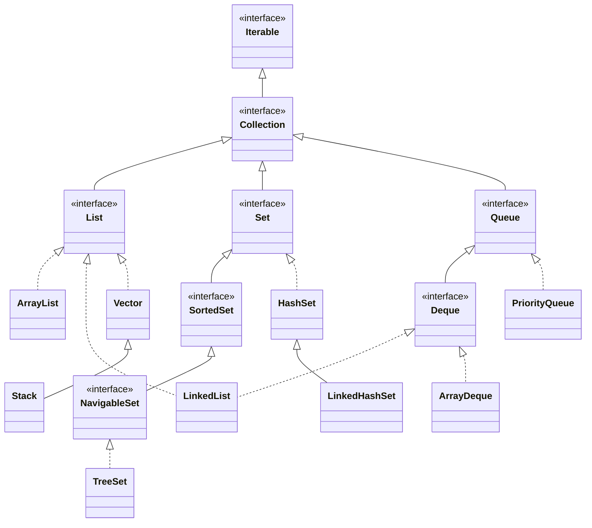
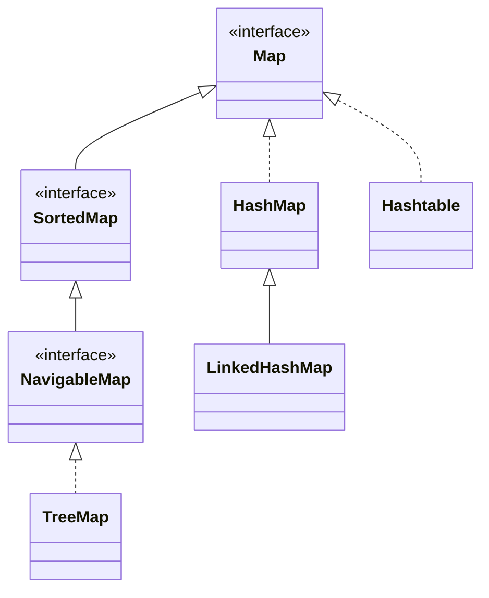
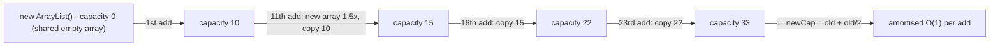
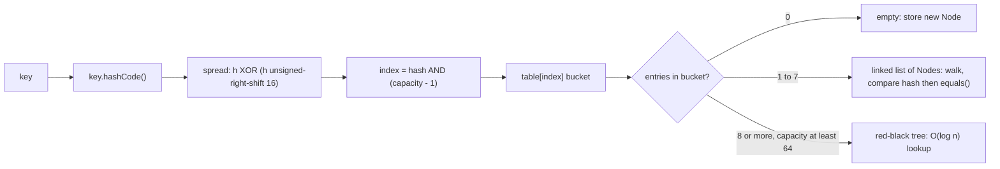
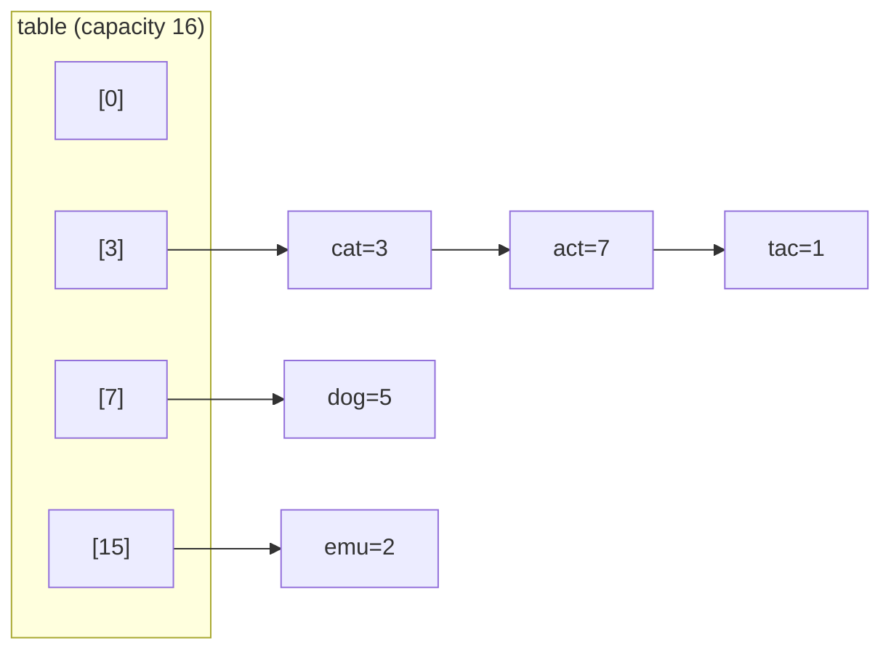
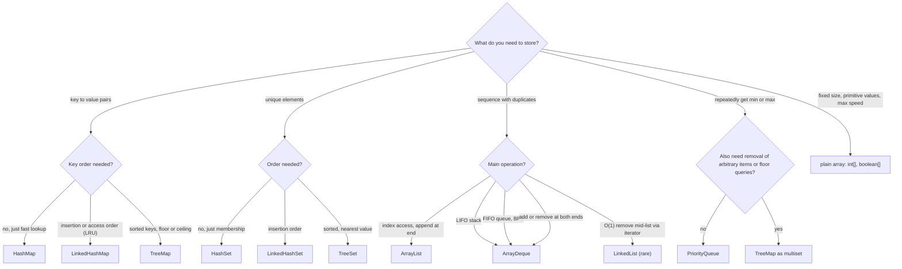

# Collections Framework

> **TL;DR**: About 90% of DSA needs five classes: `ArrayList` (dynamic array), `HashMap`/`HashSet` (O(1) lookup), `ArrayDeque` (stack + queue + deque), `PriorityQueue` (heap) and `TreeMap`/`TreeSet` (sorted, floor/ceiling in O(log n)).
> Declare with the interface type (`List<Integer> list = new ArrayList<>()`). Never use `Stack`, `Vector` or `Hashtable`.
> Know the traps: `==` on `Integer`, `remove(int)` vs `remove(Object)`, `ConcurrentModificationException`, and immutable `List.of`.

---

## 1. The hierarchy

### Collection side



### Map side (Map does NOT extend Collection)



Solid arrows (`<|--`) mean "extends". Dotted arrows (`<|..`) mean "implements". `LinkedList` implements **both** `List` and `Deque`.

### Basic rules

```java
import java.util.*;

List<Integer> list = new ArrayList<>();      // program to the interface
Map<String, Integer> map = new HashMap<>();  // diamond <> infers the types
// List<int> bad;                            // compile error: generics need objects, so use Integer
Deque<Integer> stack = new ArrayDeque<>();
Queue<Integer> q = new ArrayDeque<>();
```

---

## 2. Master complexity table

Average case. `n` is the size. "amort." means amortised.

| Class | add / put | get / access | contains | remove | Iteration order | Null allowed | Thread-safe |
|---|---|---|---|---|---|---|---|
| `ArrayList` | O(1) amort. at end, O(n) at index | O(1) by index | O(n) | O(n); O(1) at end | insertion / index | yes | no |
| `LinkedList` | O(1) at ends, O(n) at index | O(n) by index, O(1) ends | O(n) | O(1) ends or via iterator, O(n) by value | insertion | yes | no |
| `Vector` | O(1) amort. | O(1) | O(n) | O(n) | insertion | yes | yes (synchronized, slow) |
| `Stack` | `push` O(1) | `peek` O(1) | O(n) | `pop` O(1) | bottom to top | yes | yes (legacy) |
| `HashSet` | O(1) | n/a | O(1) | O(1) | unpredictable | one `null` | no |
| `LinkedHashSet` | O(1) | n/a | O(1) | O(1) | insertion | one `null` | no |
| `TreeSet` | O(log n) | `first`/`last`/`floor` O(log n) | O(log n) | O(log n) | sorted | **no** (NPE) | no |
| `HashMap` | O(1) | O(1) | key O(1), value O(n) | O(1) | unpredictable | one `null` key, `null` values | no |
| `LinkedHashMap` | O(1) | O(1) | key O(1), value O(n) | O(1) | insertion (or access order) | one `null` key, `null` values | no |
| `TreeMap` | O(log n) | O(log n) | key O(log n), value O(n) | O(log n) | sorted by key | no `null` keys, `null` values OK | no |
| `Hashtable` | O(1) | O(1) | O(1) | O(1) | unpredictable | **no** nulls | yes (legacy) |
| `ArrayDeque` | O(1) amort. at both ends | `peekFirst/Last` O(1) | O(n) | O(1) at ends, O(n) by value | head to tail | **no** (NPE) | no |
| `PriorityQueue` | `offer` O(log n) | `peek` O(1) | O(n) | `poll` O(log n), `remove(obj)` O(n) | **not sorted** (heap array) | **no** (NPE) | no |

Worst cases: `HashMap`/`HashSet` degrade to O(log n) per bucket once a bucket becomes a red-black tree (Java 8+). They degrade to O(n) with a terrible `hashCode` and non-`Comparable` keys. Resizing is O(n), but amortised O(1).

---

## 3. List implementations

### 3.1 ArrayList

**Internally:** a resizable `Object[]`. When it's full it allocates a new array **1.5x** larger and copies everything over. Index access is O(1), inserting or removing in the middle shifts elements (O(n)).



```java
List<Integer> list = new ArrayList<>();
List<Integer> sized = new ArrayList<>(100_000);          // pre-size to skip the resizes
List<Integer> copy  = new ArrayList<>(Arrays.asList(3, 1, 2)); // mutable copy

list.add(10);                 // append O(1) amortised
list.add(0, 5);               // insert at index 0: O(n) shift
list.get(1);                  // 10, O(1)
list.set(1, 99);              // replace, O(1), returns the old value
list.size();                  // not length / length()
list.isEmpty();
list.contains(99);            // O(n) linear scan
list.indexOf(99);             // first index or -1, O(n)
list.lastIndexOf(99);
list.remove(list.size() - 1); // remove the LAST element: O(1), pop-like
list.remove(0);               // remove the FIRST element: O(n) shift!
list.addAll(List.of(7, 8));
list.clear();

Collections.sort(list);                        // ascending (TimSort, stable)
list.sort(null);                               // same thing
list.sort(Comparator.reverseOrder());          // descending
list.subList(1, 3);                            // VIEW of [1, 3), not a copy
list.subList(1, 3).clear();                    // removes the range from the original list
Collections.reverse(list);
Collections.swap(list, 0, 1);

// Iterate
for (int x : list) { }                          // auto-unboxing
for (int i = 0; i < list.size(); i++) list.get(i);

// 2D: list of lists (the standard LeetCode return type)
List<List<Integer>> res = new ArrayList<>();
res.add(new ArrayList<>(List.of(1, 2)));
res.get(0).add(3);
```

Java 21 added `list.getFirst()`, `list.getLast()`, `list.removeLast()` and `list.reversed()`. They're nice, but `get(0)` and `get(size() - 1)` work on every judge.

**Use in DSA:** the default "dynamic array". Result lists, adjacency lists (`List<List<Integer>>`), a backtracking path (add, then `remove(size() - 1)`), buckets in bucket sort.

### 3.2 LinkedList

**Internally:** a doubly linked list of nodes with `first` and `last` pointers. O(1) at both ends. `get(i)` walks from the nearer end: O(n). Each node costs about 24 extra bytes, and it's cache-unfriendly.

```java
LinkedList<Integer> ll = new LinkedList<>();
ll.addFirst(1);      ll.addLast(2);       // O(1)
ll.getFirst();       ll.getLast();        // throw if empty
ll.peekFirst();      ll.peekLast();       // null if empty
ll.removeFirst();    ll.removeLast();     // throw if empty
ll.pollFirst();      ll.pollLast();       // null if empty
ll.add(1, 42);                            // O(n) walk + O(1) link
ll.get(5);                                // O(n): never in a loop!

// O(1) removal/insertion while walking: use a ListIterator
ListIterator<Integer> it = ll.listIterator();
while (it.hasNext()) {
    int v = it.next();
    if (v % 2 == 0) it.remove();          // O(1)
    else it.add(v * 10);                  // insert after the current node, O(1)
}
```

**Use in DSA:** rarely. Prefer `ArrayDeque` for stacks and queues. `LinkedList` is only needed when you must store `null` in a queue, or need O(1) removal through an iterator. LeetCode linked-list problems use their own `ListNode`, not `java.util.LinkedList`.

---

## 4. Set implementations

### 4.1 HashSet

**Internally:** a `HashMap<E, Object>` where each element is a key and the value is a dummy constant. Same hashing and buckets, so O(1) average add/contains/remove.

```java
Set<Integer> set = new HashSet<>();
Set<Integer> fromList = new HashSet<>(Arrays.asList(1, 2, 2, 3));   // {1, 2, 3}

boolean added = set.add(5);      // true the first time, false if already present
set.add(5);                      // false: duplicates ignored
set.contains(5);                 // O(1)
set.remove(5);                   // returns a boolean
set.size();  set.isEmpty();  set.clear();

// Set algebra (mutates the receiver, so copy first)
Set<Integer> a = new HashSet<>(List.of(1, 2, 3)), b = new HashSet<>(List.of(2, 3, 4));
Set<Integer> union = new HashSet<>(a);  union.addAll(b);      // {1,2,3,4}
Set<Integer> inter = new HashSet<>(a);  inter.retainAll(b);   // {2,3}
Set<Integer> diff  = new HashSet<>(a);  diff.removeAll(b);    // {1}

// Duplicate check in one line
boolean hasDup = new HashSet<>(list).size() < list.size();

// "Seen" check with add's return value
for (int x : nums) if (!set.add(x)) return true;              // found a duplicate

// Grid cells as keys: encode them, or use a record (NOT int[])
Set<Integer> seen = new HashSet<>();   seen.add(r * cols + c);
Set<String>  seen2 = new HashSet<>();  seen2.add(r + "," + c);   // slower but simple
record Cell(int r, int c) {}
Set<Cell>    seen3 = new HashSet<>();  seen3.add(new Cell(r, c));
Set<List<Integer>> seen4 = new HashSet<>(); seen4.add(List.of(r, c)); // List has value equals
```

**Use in DSA:** visited sets, duplicate detection, O(1) membership (Two Sum variants, Longest Consecutive Sequence), deduping results.

### 4.2 LinkedHashSet

**Internally:** a `HashSet` whose entries are also threaded on a doubly linked list (it's backed by a `LinkedHashMap`). Same O(1) operations, but it iterates in **insertion order**.

```java
Set<Character> lhs = new LinkedHashSet<>();
for (char c : "banana".toCharArray()) lhs.add(c);
System.out.println(lhs);                 // [b, a, n]: first-seen order kept

// Dedupe a list while keeping the original order
List<Integer> unique = new ArrayList<>(new LinkedHashSet<>(List.of(3, 1, 3, 2, 1)));  // [3, 1, 2]

// Oldest inserted element (e.g. a simple LFU bucket)
int oldest = lhs.iterator().next();
```

**Use in DSA:** dedupe preserving order, and the per-frequency buckets in the **LFU cache** (O(1) removal plus "least recently inserted" access).

### 4.3 TreeSet

**Internally:** a red-black tree (a self-balancing BST), backed by a `TreeMap`. Elements are kept sorted by natural order or a `Comparator`. Every operation is O(log n). There is no hashing, so equality comes from `compareTo`/`compare == 0`.

```java
TreeSet<Integer> ts = new TreeSet<>(List.of(10, 5, 20, 15));   // [5, 10, 15, 20]
TreeSet<Integer> desc = new TreeSet<>(Comparator.reverseOrder());

ts.add(12);  ts.remove(5);  ts.contains(10);                   // O(log n)
ts.first();  ts.last();          // smallest / largest (throw if empty)
ts.pollFirst(); ts.pollLast();   // remove and return (null if empty)

ts.floor(13);     // 12  : greatest <= 13
ts.ceiling(13);   // 15  : smallest >= 13
ts.lower(12);     // 10  : greatest <  12
ts.higher(12);    // 15  : smallest >  12
// all four return null when nothing qualifies: ALWAYS null-check

ts.headSet(15);         // view of < 15
ts.headSet(15, true);   // view of <= 15
ts.tailSet(12);         // view of >= 12
ts.subSet(10, 20);      // view of [10, 20)
ts.descendingSet();     // reverse-order view
Iterator<Integer> it = ts.descendingIterator();
```

A TreeSet can't hold duplicates. For a sorted **multiset** use `TreeMap<Integer, Integer>` (value to count), see section 9.

A comparator that returns 0 for two different objects makes the TreeSet treat them as the same element. Always add a tie-breaker, e.g. `(a, b) -> a[0] != b[0] ? Integer.compare(a[0], b[0]) : Integer.compare(a[1], b[1])`.

**Use in DSA:** "nearest value <= / >= x" queries, a sorted set of free slots, Contains Duplicate III, sweep line, a sliding window that needs min and max with removals, a scheduler.

---

## 5. Map implementations

### 5.1 HashMap

**Internally:** an array of buckets (`Node<K,V>[] table`). The index is `hash(key) & (capacity - 1)`. Collisions chain as a linked list, which turns into a red-black tree once a bucket reaches 8 entries (and the table has at least 64 slots).





Key numbers:

| Parameter | Value | Meaning |
|---|---|---|
| Default capacity | 16 | always a power of two, so `& (n-1)` works like `% n` |
| Load factor | 0.75 | resize when `size > capacity * 0.75` (threshold 12 at the start) |
| Resize | capacity x 2 | rehash all entries: O(n), amortised O(1) per put |
| `TREEIFY_THRESHOLD` | 8 | bucket list becomes a red-black tree |
| `UNTREEIFY_THRESHOLD` | 6 | tree shrinks back to a list |
| `MIN_TREEIFY_CAPACITY` | 64 | below this it resizes instead of treeifying |

Pre-size for big inputs: `new HashMap<>(2 * n)` or `(int) (n / 0.75f) + 1` to avoid repeated rehashing.

**The equals/hashCode contract:** if `a.equals(b)`, then `a.hashCode() == b.hashCode()`. Override **both** for custom key classes (or use a `record`, which does it for you). Never mutate an object while it is a key.

```java
Map<String, Integer> map = new HashMap<>();
map.put("a", 1);                    // insert or overwrite, returns the old value or null
map.get("a");                       // 1
map.get("zzz");                     // null (unboxing this into int throws an NPE!)
map.getOrDefault("zzz", 0);         // 0
map.containsKey("a");               // O(1)
map.containsValue(1);               // O(n) scan
map.remove("a");                    // returns the removed value or null
map.size(); map.isEmpty(); map.clear();

map.keySet();                       // Set<String> view
map.values();                       // Collection<Integer> view
map.entrySet();                     // Set<Map.Entry<String,Integer>> view
```

**Use in DSA:** frequency counting, value-to-index lookup (Two Sum), prefix-sum counts (Subarray Sum Equals K), grouping (Group Anagrams), memoisation (`Map<String, Long> memo`), graph adjacency with non-integer nodes.

### 5.2 LinkedHashMap

**Internally:** a `HashMap` plus a doubly linked list through all entries. It iterates in **insertion order**, or in **access order** if you construct it with `accessOrder = true` (every `get` or `put` moves the entry to the end).

```java
Map<String, Integer> lhm = new LinkedHashMap<>();
lhm.put("b", 2); lhm.put("a", 1); lhm.put("c", 3);
System.out.println(lhm);              // {b=2, a=1, c=3}: insertion order

// LRU Cache (LeetCode 146) in a few lines
class LRUCache extends LinkedHashMap<Integer, Integer> {
    private final int cap;
    LRUCache(int capacity) {
        super(capacity, 0.75f, true);            // accessOrder = true
        this.cap = capacity;
    }
    public int get(int key) { return super.getOrDefault(key, -1); }
    public void put(int key, int value) { super.put(key, value); }
    @Override
    protected boolean removeEldestEntry(Map.Entry<Integer, Integer> eldest) {
        return size() > cap;                     // evict the least recently used entry
    }
}
```

Note: `getOrDefault` on an access-ordered `LinkedHashMap` counts as an access, so it moves the entry to the end, which is exactly what LRU wants. In an interview, be ready to also build LRU by hand with a `HashMap` plus your own doubly linked list.

**Use in DSA:** LRU cache, "first unique character" or order-preserving counts, and deterministic output order.

### 5.3 TreeMap

**Internally:** a red-black tree keyed by the map's keys, sorted by natural order or a `Comparator`. O(log n) for everything, plus powerful navigation (section 8).

```java
TreeMap<Integer, String> tm = new TreeMap<>();
tm.put(30, "c"); tm.put(10, "a"); tm.put(20, "b");
System.out.println(tm);                   // {10=a, 20=b, 30=c}: sorted by key
tm.firstKey();  tm.lastKey();             // 10, 30
tm.floorKey(25);                          // 20
tm.ceilingEntry(25);                      // 30=c
TreeMap<Integer, String> rev = new TreeMap<>(Collections.reverseOrder());
```

**Use in DSA:** sorted multiset (value to count), interval scheduling (My Calendar), sweep line with a difference map (`tm.merge(start, 1, Integer::sum); tm.merge(end, -1, Integer::sum);`), time-based key-value store (`floorEntry(timestamp)`), stock price tracking, "k-th smallest in a stream" style problems.

---

## 6. Queue / Deque implementations

### 6.1 ArrayDeque

**Internally:** a resizable **circular array** with `head` and `tail` indices. Adding or removing at either end is O(1) amortised, with no node allocations. It is faster than both `Stack` and `LinkedList`. It does not allow `null` elements.

```java
Deque<Integer> dq = new ArrayDeque<>();

// Deque, both ends
dq.offerFirst(1);  dq.offerLast(2);       // add (the add* variants throw on failure)
dq.peekFirst();    dq.peekLast();         // look (null if empty)
dq.pollFirst();    dq.pollLast();         // remove (null if empty)
dq.size(); dq.isEmpty();

// As a STACK (the top is the head)
Deque<Integer> stack = new ArrayDeque<>();
stack.push(1); stack.push(2);             // addFirst
stack.peek();                             // 2 (peekFirst)
stack.pop();                              // 2 (removeFirst, throws if empty)

// As a QUEUE (FIFO: add at the tail, remove from the head)
Queue<Integer> queue = new ArrayDeque<>();
queue.offer(1); queue.offer(2);           // offerLast
queue.peek();                             // 1
queue.poll();                             // 1 (null if empty)

// BFS level by level
Queue<int[]> bfs = new ArrayDeque<>();
bfs.offer(new int[]{sr, sc});
while (!bfs.isEmpty()) {
    int sz = bfs.size();                  // freeze the level size
    for (int i = 0; i < sz; i++) {
        int[] cur = bfs.poll();
        // expand neighbours with bfs.offer(...)
    }
}

// Monotonic deque: sliding window maximum, O(n)
int[] maxSlidingWindow(int[] nums, int k) {
    int[] res = new int[nums.length - k + 1];
    Deque<Integer> idx = new ArrayDeque<>();          // indices, values decreasing
    for (int i = 0; i < nums.length; i++) {
        if (!idx.isEmpty() && idx.peekFirst() <= i - k) idx.pollFirst();       // out of window
        while (!idx.isEmpty() && nums[idx.peekLast()] <= nums[i]) idx.pollLast(); // drop smaller
        idx.offerLast(i);
        if (i >= k - 1) res[i - k + 1] = nums[idx.peekFirst()];
    }
    return res;
}
```

**Use in DSA:** every stack problem (valid parentheses, monotonic stack, iterative DFS), every queue (BFS, topological sort), 0-1 BFS (`offerFirst` for weight 0 and `offerLast` for weight 1), sliding window max/min.

### 6.2 PriorityQueue

**Internally:** a **binary heap** stored in an array (children of `i` are `2i+1` and `2i+2`). `peek` is O(1), `offer`/`poll` are O(log n), and `contains`/`remove(Object)` are O(n). Iterating or printing it does **not** give sorted order. Only repeated `poll()` does.

```java
PriorityQueue<Integer> minHeap = new PriorityQueue<>();                       // smallest at the top
PriorityQueue<Integer> maxHeap = new PriorityQueue<>(Collections.reverseOrder()); // largest at the top
PriorityQueue<Integer> maxHeap2 = new PriorityQueue<>((a, b) -> Integer.compare(b, a)); // safe
PriorityQueue<Integer> heapified = new PriorityQueue<>(List.of(5, 1, 3));      // O(n) build

minHeap.offer(5); minHeap.offer(1); minHeap.offer(3);   // add() works too
minHeap.peek();       // 1 (null if empty)
minHeap.poll();       // 1 (null if empty)
minHeap.size();
minHeap.remove(3);    // removes a specific element: O(n)
System.out.println(minHeap);   // prints the internal heap array: NOT guaranteed sorted
```

Details in section 10.

**Use in DSA:** top-K, K-th largest, merge K sorted lists, Dijkstra, Prim, median of a stream (two heaps), task scheduler, greedy "always take the best available".

---

## 7. Why not `Stack` / `Vector`: use `ArrayDeque`

`Stack extends Vector`. Every method is `synchronized` (lock overhead you don't need), it inherits index methods like `get(i)` and `add(i, x)` that break the stack abstraction, and even the Javadoc says to prefer `Deque`. The same goes for `Hashtable`: use `HashMap`.

| Intent | Legacy `Stack` / `Queue` call | `ArrayDeque` equivalent | Empty behaviour |
|---|---|---|---|
| push onto stack | `stack.push(x)` | `dq.push(x)` = `addFirst(x)` | n/a |
| pop from stack | `stack.pop()` | `dq.pop()` = `removeFirst()` | throws `NoSuchElementException` |
| pop, safe | none | `dq.pollFirst()` / `dq.poll()` | returns `null` |
| peek stack top | `stack.peek()` | `dq.peek()` = `peekFirst()` | `null` (Stack **throws** `EmptyStackException`) |
| enqueue | `queue.offer(x)` / `add(x)` | `dq.offer(x)` = `offerLast(x)` | n/a |
| dequeue | `queue.poll()` | `dq.poll()` = `pollFirst()` | returns `null` |
| dequeue, strict | `queue.remove()` | `dq.remove()` = `removeFirst()` | throws |
| queue front | `queue.peek()` | `dq.peek()` = `peekFirst()` | returns `null` |
| queue front, strict | `queue.element()` | `dq.element()` = `getFirst()` | throws |
| back of queue | none | `dq.peekLast()` | returns `null` |
| is empty | `stack.empty()` / `isEmpty()` | `dq.isEmpty()` | |

### Queue method pairs (throw vs return a special value)

| Operation | Throws an exception | Returns special value |
|---|---|---|
| Insert | `add(e)` | `offer(e)` returns `false` |
| Remove head | `remove()` | `poll()` returns `null` |
| Examine head | `element()` | `peek()` returns `null` |

```java
// Valid Parentheses with ArrayDeque
boolean isValid(String s) {
    Deque<Character> st = new ArrayDeque<>();
    for (char c : s.toCharArray()) {
        if (c == '(') st.push(')');
        else if (c == '[') st.push(']');
        else if (c == '{') st.push('}');
        else if (st.isEmpty() || st.pop() != c) return false;
    }
    return st.isEmpty();
}
```

Two gotchas. First, iterating a `Stack` goes bottom to top, while iterating an `ArrayDeque` used as a stack goes **top to bottom**. Second, `ArrayDeque` rejects `null` (`push(null)` throws an NPE).

For a primitive-heavy stack in tight loops, a plain `int[] st = new int[n]; int top = 0;` beats any collection (no boxing).

---

## 8. Map idioms (memorise these)

```java
Map<String, Integer> freq = new HashMap<>();
String[] words = {"a", "b", "a"};

// 1. Counting: three equivalent ways
for (String w : words) freq.put(w, freq.getOrDefault(w, 0) + 1);
for (String w : words) freq.merge(w, 1, Integer::sum);            // most concise
for (String w : words) freq.compute(w, (k, v) -> v == null ? 1 : v + 1);

// 2. Decrement and remove at zero (sliding window)
freq.merge("a", -1, Integer::sum);
if (freq.get("a") == 0) freq.remove("a");
// or in one step: returning null from the remapping function removes the key
freq.computeIfPresent("a", (k, v) -> v == 1 ? null : v - 1);

// 3. Grouping: map from key to list (adjacency list, group anagrams)
Map<Integer, List<Integer>> graph = new HashMap<>();
graph.computeIfAbsent(1, x -> new ArrayList<>()).add(2);   // creates the list on first use
graph.computeIfAbsent(1, x -> new ArrayList<>()).add(3);   // reuses it: {1=[2, 3]}
graph.getOrDefault(99, Collections.emptyList());           // safe read for a missing key

// 4. putIfAbsent: keep the FIRST occurrence (e.g. first index of a prefix sum)
Map<Integer, Integer> firstIdx = new HashMap<>();
firstIdx.putIfAbsent(0, -1);
// putIfAbsent(k, new ArrayList<>()) allocates every call; prefer computeIfAbsent

// 5. Iterating
for (Map.Entry<String, Integer> e : freq.entrySet()) {
    String k = e.getKey();
    int v = e.getValue();
    e.setValue(v * 2);                 // allowed: modifies in place
}
for (String k : freq.keySet()) { }
for (int v : freq.values()) { }
freq.forEach((k, v) -> System.out.println(k + "=" + v));

// 6. Safe removal while iterating
freq.entrySet().removeIf(e -> e.getValue() < 2);
freq.values().removeIf(v -> v == 0);

// 7. Max entry by value
Map.Entry<String, Integer> best = Collections.max(freq.entrySet(), Map.Entry.comparingByValue());

// 8. Prefix-sum count (Subarray Sum Equals K)
int subarraySum(int[] nums, int k) {
    Map<Integer, Integer> count = new HashMap<>();
    count.put(0, 1);
    int sum = 0, res = 0;
    for (int x : nums) {
        sum += x;
        res += count.getOrDefault(sum - k, 0);
        count.merge(sum, 1, Integer::sum);
    }
    return res;
}
```

### Sorting a map by value

A `HashMap` can't be sorted in place. Pull out the entries, sort them, and optionally rebuild as a `LinkedHashMap`.

```java
Map<String, Integer> freq = Map.of("a", 3, "b", 1, "c", 2);

// A. List of entries (the most common approach in interviews)
List<Map.Entry<String, Integer>> entries = new ArrayList<>(freq.entrySet());
entries.sort((x, y) -> Integer.compare(y.getValue(), x.getValue()));        // value desc
// or: entries.sort(Map.Entry.<String, Integer>comparingByValue().reversed());
for (Map.Entry<String, Integer> e : entries) System.out.println(e.getKey() + " " + e.getValue());

// B. Value desc, then key asc for ties
entries.sort(Map.Entry.<String, Integer>comparingByValue(Comparator.reverseOrder())
                      .thenComparing(Map.Entry.comparingByKey()));

// C. Streams into a LinkedHashMap (keeps the sorted order)
Map<String, Integer> sorted = freq.entrySet().stream()
    .sorted(Map.Entry.<String, Integer>comparingByValue().reversed())
    .collect(java.util.stream.Collectors.toMap(
        Map.Entry::getKey, Map.Entry::getValue, (a, b) -> a, LinkedHashMap::new));

// D. Top-K frequent: a heap beats a full sort, O(n log k)
PriorityQueue<Map.Entry<String, Integer>> pq =
    new PriorityQueue<>((x, y) -> Integer.compare(x.getValue(), y.getValue()));   // min-heap by count
for (Map.Entry<String, Integer> e : freq.entrySet()) {
    pq.offer(e);
    if (pq.size() > 2) pq.poll();         // keep the k = 2 largest
}

// E. Bucket sort by frequency, O(n) (Top K Frequent Elements)
List<Integer>[] buckets = new List[nums.length + 1];   // index = frequency
```

### Map.Entry and pairs

```java
Map.Entry<Integer, Integer> p = Map.entry(1, 2);                          // immutable, Java 9+, no nulls
Map.Entry<Integer, Integer> q = new AbstractMap.SimpleEntry<>(1, 2);      // mutable (setValue)
record Pair(int first, int second) {}                                     // cleanest custom pair
```

---

## 9. TreeMap / TreeSet navigation

For `TreeMap<Integer, V> tm` with keys `{10, 20, 30, 40}`:

| Method | Meaning | `tm.xxx(25)` | `tm.xxx(20)` | When nothing qualifies |
|---|---|---|---|---|
| `floorKey(k)` | greatest key **<=** k | 20 | 20 | `null` |
| `ceilingKey(k)` | smallest key **>=** k | 30 | 20 | `null` |
| `lowerKey(k)` | greatest key **<** k | 20 | 10 | `null` |
| `higherKey(k)` | smallest key **>** k | 30 | 30 | `null` |
| `firstKey()` | smallest key | 10 | | throws `NoSuchElementException` |
| `lastKey()` | largest key | 40 | | throws |
| `firstEntry()` / `lastEntry()` | smallest/largest entry | 10=... | | `null` |
| `pollFirstEntry()` / `pollLastEntry()` | remove and return the smallest/largest | | | `null` |
| `headMap(k)` | view of keys **<** k | {10, 20} | {10} | empty view |
| `headMap(k, true)` | view of keys **<=** k | {10, 20} | {10, 20} | |
| `tailMap(k)` | view of keys **>=** k | {30, 40} | {20, 30, 40} | |
| `tailMap(k, false)` | view of keys **>** k | {30, 40} | {30, 40} | |
| `subMap(a, b)` | view of **[a, b)** | | | |
| `subMap(a, true, b, true)` | view of **[a, b]** | | | |
| `descendingMap()` | reverse-order view | | | |

The `*Entry` versions (`floorEntry`, `ceilingEntry`, ...) return a `Map.Entry`. For `TreeSet`, the same methods are named `floor`, `ceiling`, `lower`, `higher`, `first`, `last`, `pollFirst`, `pollLast`, `headSet`, `tailSet`, `subSet`.

```java
TreeMap<Integer, Integer> tm = new TreeMap<>(Map.of(10, 1, 20, 2, 30, 3, 40, 4));

Integer f = tm.floorKey(25);                 // 20
if (f != null) { /* use f */ }               // ALWAYS null-check: floorKey(5) is null

Map.Entry<Integer, Integer> e = tm.ceilingEntry(25);   // 30=3
Map.Entry<Integer, Integer> smallest = tm.pollFirstEntry(); // removes 10=1

SortedMap<Integer, Integer> head = tm.headMap(30);     // {20=2}: a LIVE view
NavigableMap<Integer, Integer> sub = tm.subMap(15, true, 35, true);   // {20=2, 30=3}

// Iterate from largest to smallest
for (int key : tm.descendingKeySet()) { }

// Sorted multiset: value -> count (sliding window min/max with duplicates)
TreeMap<Integer, Integer> ms = new TreeMap<>();
ms.merge(5, 1, Integer::sum);  ms.merge(5, 1, Integer::sum);  ms.merge(2, 1, Integer::sum);
int windowMin = ms.firstKey(), windowMax = ms.lastKey();
if (ms.merge(5, -1, Integer::sum) == 0) ms.remove(5);    // remove one copy of 5

// My Calendar I: no overlapping [start, end) bookings
TreeMap<Integer, Integer> cal = new TreeMap<>();
boolean book(int start, int end) {
    Integer prev = cal.floorKey(start), next = cal.ceilingKey(start);
    if (prev != null && cal.get(prev) > start) return false;
    if (next != null && next < end) return false;
    cal.put(start, end);
    return true;
}

// Time-based key-value store: latest value at or before t
TreeMap<Integer, String> history = new TreeMap<>();
Map.Entry<Integer, String> at = history.floorEntry(7);
String val = at == null ? "" : at.getValue();
```

`headMap(k).size()` / `headSet(k).size()` is **O(n)**, not O(log n). Java's trees don't store subtree sizes. For rank queries ("how many elements < x") use a Fenwick tree or sort plus binary search.

---

## 10. PriorityQueue in depth

```java
// Min-heap (default natural order)
PriorityQueue<Integer> min = new PriorityQueue<>();

// Max-heap, three ways
PriorityQueue<Integer> max1 = new PriorityQueue<>(Collections.reverseOrder());
PriorityQueue<Integer> max2 = new PriorityQueue<>((a, b) -> Integer.compare(b, a));
PriorityQueue<Integer> max3 = new PriorityQueue<>((a, b) -> b - a);   // AVOID, see below
```

### The `(a, b) -> b - a` overflow caveat

The subtraction comparator overflows when the values have opposite signs and large magnitude:

```java
int a = Integer.MIN_VALUE, b = 1;
System.out.println(b - a);                  // -2147483647: overflowed, says b < a (WRONG)
System.out.println(Integer.compare(b, a));  // 1 (correct)
```

It's fine when values are guaranteed small (e.g. 0 to 10^9 with the same sign), but `Integer.compare` / `Long.compare` is always correct. Make it a habit.

### PQ of `int[]` (and objects)

```java
// Sort by a[0] asc, tie-break by a[1] asc
PriorityQueue<int[]> pq = new PriorityQueue<>((x, y) ->
        x[0] != y[0] ? Integer.compare(x[0], y[0]) : Integer.compare(x[1], y[1]));

// Same thing with Comparator helpers
PriorityQueue<int[]> pq2 = new PriorityQueue<>(
        Comparator.<int[]>comparingInt(x -> x[0]).thenComparingInt(x -> x[1]));

// Dijkstra: {node, dist}, min by dist, using long distances
PriorityQueue<long[]> heap = new PriorityQueue<>((x, y) -> Long.compare(x[1], y[1]));
long[] dist = new long[n];
Arrays.fill(dist, Long.MAX_VALUE);
dist[src] = 0;
heap.offer(new long[]{src, 0});
while (!heap.isEmpty()) {
    long[] cur = heap.poll();
    int u = (int) cur[0];
    if (cur[1] > dist[u]) continue;                // stale entry: lazy deletion
    for (int[] edge : adj.get(u)) {                // edge = {v, w}
        int v = edge[0];
        long nd = dist[u] + edge[1];
        if (nd < dist[v]) { dist[v] = nd; heap.offer(new long[]{v, nd}); }
    }
}

// Objects / records
record Task(String name, int priority) {}
PriorityQueue<Task> tasks = new PriorityQueue<>(Comparator.comparingInt(Task::priority).reversed());
```

### Classic heap patterns

```java
// K-th largest: min-heap of size k, O(n log k)
int findKthLargest(int[] nums, int k) {
    PriorityQueue<Integer> h = new PriorityQueue<>();
    for (int x : nums) {
        h.offer(x);
        if (h.size() > k) h.poll();
    }
    return h.peek();
}

// Median of a data stream: two heaps
PriorityQueue<Integer> lo = new PriorityQueue<>(Collections.reverseOrder()); // max-heap, lower half
PriorityQueue<Integer> hi = new PriorityQueue<>();                           // min-heap, upper half
void addNum(int x) {
    lo.offer(x);
    hi.offer(lo.poll());
    if (hi.size() > lo.size()) lo.offer(hi.poll());
}
double findMedian() {
    return lo.size() > hi.size() ? lo.peek() : (lo.peek() + (long) hi.peek()) / 2.0;
}

// Drain in sorted order
while (!min.isEmpty()) System.out.print(min.poll() + " ");
```

There is no decrease-key. To change a priority, either `remove(obj)` and then `offer` (O(n)), or push a new entry and skip stale ones on `poll` (lazy deletion, as in the Dijkstra above).

---

## 11. The `Collections` utility class

```java
List<Integer> list = new ArrayList<>(List.of(4, 1, 3, 1));

Collections.sort(list);                          // [1, 1, 3, 4]
Collections.sort(list, Collections.reverseOrder());   // [4, 3, 1, 1]
Collections.reverse(list);                       // reverse in place, O(n)
Collections.max(list);  Collections.min(list);   // O(n)
Collections.max(list, comparator);               // with a custom order
Collections.frequency(list, 1);                  // 2, O(n)
Collections.swap(list, 0, 2);
Collections.shuffle(list);
Collections.fill(list, 0);                       // set every element
Collections.rotate(list, 1);                     // rotate right by 1
Collections.binarySearch(sortedList, 3);         // needs a sorted list
Collections.addAll(list, 7, 8, 9);

List<Integer> ro = Collections.unmodifiableList(list);  // read-only VIEW: changes to list show through
List<Integer> zeros = Collections.nCopies(5, 0);        // immutable [0, 0, 0, 0, 0]
List<Integer> mutableZeros = new ArrayList<>(Collections.nCopies(5, 0));
List<Integer> empty = Collections.emptyList();          // immutable
List<Integer> one = Collections.singletonList(42);      // immutable, size 1

// Initialise a list of n empty lists
List<List<Integer>> adj = new ArrayList<>();
for (int i = 0; i < n; i++) adj.add(new ArrayList<>());
// NOT Collections.nCopies(n, new ArrayList<>()): that is n references to ONE list
```

### `List.of` vs `Arrays.asList` vs `new ArrayList<>`

| | `List.of(a, b)` (Java 9+) | `Arrays.asList(a, b)` | `new ArrayList<>(...)` | `Collections.unmodifiableList(x)` |
|---|---|---|---|---|
| `add` / `remove` | `UnsupportedOperationException` | `UnsupportedOperationException` (fixed size) | OK | `UnsupportedOperationException` |
| `set(i, v)` | `UnsupportedOperationException` | OK, writes through to the array | OK | `UnsupportedOperationException` |
| `null` elements | NPE (even `contains(null)` throws) | allowed | allowed | allowed |
| Backed by | its own immutable storage | the original array | its own copy | a view of `x` (sees later changes) |
| `Collections.sort` on it | throws | works (sorts the array) | works | throws |

```java
List<Integer> fixed = Arrays.asList(1, 2, 3);
fixed.set(0, 9);        // OK
// fixed.add(4);        // UnsupportedOperationException

List<Integer> imm = List.of(1, 2, 3);
// imm.set(0, 9);       // UnsupportedOperationException

List<Integer> ok = new ArrayList<>(List.of(1, 2, 3));   // the fix: wrap in ArrayList
ok.add(4);

Set<Integer> s = Set.of(1, 2);          // immutable; Set.of(1, 1) throws IllegalArgumentException
Map<String, Integer> m = Map.of("a", 1);// immutable, at most 10 pairs; use Map.ofEntries for more
```

`stream().toList()` (Java 16+) is also immutable. `Collectors.toList()` currently returns an `ArrayList`, but that isn't guaranteed.

---

## 12. Iterators and ConcurrentModificationException

Collections keep a `modCount`. A for-each loop uses an iterator that checks it on every step. If you structurally modify the collection (add/remove) **through the collection itself** during iteration, you get a `ConcurrentModificationException`.

```java
List<Integer> list = new ArrayList<>(List.of(1, 2, 3, 4, 5, 6));

// WRONG: throws ConcurrentModificationException
// for (int x : list) if (x % 2 == 0) list.remove(Integer.valueOf(x));

// FIX 1: Iterator.remove()
Iterator<Integer> it = list.iterator();
while (it.hasNext()) {
    if (it.next() % 2 == 0) it.remove();       // safe
}

// FIX 2: removeIf (cleanest; O(n) for ArrayList)
list.removeIf(x -> x % 2 == 0);

// FIX 3: index loop going BACKWARDS (indices don't shift under you)
for (int i = list.size() - 1; i >= 0; i--) if (list.get(i) % 2 == 0) list.remove(i);

// FIX 4: collect the changes, apply them after the loop
List<Integer> toAdd = new ArrayList<>();
for (int x : list) if (x > 3) toAdd.add(x * 10);
list.addAll(toAdd);

// Maps too
Map<String, Integer> map = new HashMap<>(Map.of("a", 0, "b", 1));
// for (String k : map.keySet()) if (map.get(k) == 0) map.remove(k);   // CME
map.entrySet().removeIf(e -> e.getValue() == 0);                       // safe
Iterator<Map.Entry<String, Integer>> mit = map.entrySet().iterator();
while (mit.hasNext()) if (mit.next().getValue() == 0) mit.remove();    // safe
// Updating VALUES of existing keys (map.put(k, newV) for an existing k) during iteration is fine
```

A forward index loop with `remove(i)` doesn't throw, but it **skips** the element after each removal. Go backwards, or do `i--` after removing.

### `list.remove(int index)` vs `list.remove(Object o)`

`List<Integer>` has two overloads. An `int` argument picks **remove by index**.

```java
List<Integer> nums = new ArrayList<>(List.of(10, 20, 30, 1));

nums.remove(1);                     // removes INDEX 1 (value 20): [10, 30, 1]
nums.remove(Integer.valueOf(1));    // removes VALUE 1:             [10, 30]
nums.remove((Integer) 10);          // removes VALUE 10:            [30]
// nums.remove(30);                 // IndexOutOfBoundsException: treated as index 30!

int x = 30;
nums.remove((Integer) x);           // value removal with an int variable
```

`Set.remove` and `Deque.remove(Object)` have no index overload, so they're unaffected. `Deque.remove()` with no args removes the head.

---

## 13. Converting between arrays and collections

```java
import java.util.stream.*;

int[] arr = {3, 1, 2};

// int[] -> List<Integer>
List<Integer> l1 = Arrays.stream(arr).boxed().collect(Collectors.toList());  // mutable ArrayList
List<Integer> l2 = Arrays.stream(arr).boxed().toList();                      // immutable (Java 16+)
List<Integer> l3 = new ArrayList<>();
for (int x : arr) l3.add(x);                                                 // fastest, simplest

// List<Integer> -> int[]
int[] back1 = l1.stream().mapToInt(Integer::intValue).toArray();
int[] back2 = new int[l1.size()];
for (int i = 0; i < back2.length; i++) back2[i] = l1.get(i);

// Integer[] <-> List<Integer>
Integer[] boxed = {3, 1, 2};
List<Integer> view = Arrays.asList(boxed);                 // fixed-size view
List<Integer> own  = new ArrayList<>(Arrays.asList(boxed));// independent, mutable
Integer[] boxedBack = own.toArray(new Integer[0]);

// String[] <-> List<String>
String[] sa = {"b", "a"};
List<String> sl = new ArrayList<>(Arrays.asList(sa));
String[] saBack = sl.toArray(new String[0]);               // or sl.toArray(String[]::new) on Java 11+

// int[] -> Set<Integer>
Set<Integer> set = Arrays.stream(arr).boxed().collect(Collectors.toSet());
Set<Integer> set2 = new HashSet<>();
for (int x : arr) set2.add(x);

// Set<Integer> -> int[]
int[] fromSet = set.stream().mapToInt(Integer::intValue).toArray();

// List<int[]> -> int[][] (Merge Intervals return value)
List<int[]> merged = new ArrayList<>();
merged.add(new int[]{1, 6});
int[][] result = merged.toArray(new int[0][]);            // or new int[merged.size()][]

// List<List<Integer>> -> int[][]
List<List<Integer>> ll = List.of(List.of(1, 2), List.of(3));
int[][] jag = ll.stream().map(r -> r.stream().mapToInt(Integer::intValue).toArray()).toArray(int[][]::new);

// char[] / String -> List<Character>
List<Character> chars = "abc".chars().mapToObj(c -> (char) c).collect(Collectors.toList());
```

`Arrays.asList(int[])` returns a `List<int[]>` of size 1. To box a primitive array, use a stream or a loop.

---

## 14. Which collection should I use?



| Problem smell | Reach for |
|---|---|
| "count occurrences", "frequency" | `HashMap<K, Integer>` or `int[26]` |
| "seen before?", "duplicate?" | `HashSet` |
| "k largest / smallest", "k closest" | `PriorityQueue` of size k |
| "next greater element", "matching brackets" | `ArrayDeque` as a (monotonic) stack |
| "shortest path in unweighted graph", "level order" | `ArrayDeque` as a queue |
| "sliding window max/min" | `ArrayDeque` monotonic deque |
| "closest value <= x", "intervals overlap?" | `TreeMap` / `TreeSet` |
| "recently used", "evict oldest" | `LinkedHashMap` |
| "group by some key" | `HashMap<K, List<V>>` + `computeIfAbsent` |
| "running median" | two `PriorityQueue`s |
| "weighted shortest path" | `PriorityQueue<int[]>` (Dijkstra) |

---

## 15. equals / hashCode for custom keys

```java
// Records get equals, hashCode and toString automatically. The best choice for keys.
record Point(int x, int y) {}
Map<Point, Integer> dist = new HashMap<>();
dist.put(new Point(1, 2), 5);
dist.get(new Point(1, 2));          // 5

// Manual class: override BOTH
class P {
    final int x, y;
    P(int x, int y) { this.x = x; this.y = y; }
    @Override public boolean equals(Object o) {
        if (this == o) return true;
        if (!(o instanceof P)) return false;
        P p = (P) o;
        return x == p.x && y == p.y;
    }
    @Override public int hashCode() { return Objects.hash(x, y); }   // or 31 * x + y
}

// Cheapest key for small coordinates: pack them into a long
long key = ((long) x << 32) | (y & 0xffffffffL);
```

`int[]` as a key: `new int[]{1, 2}.equals(new int[]{1, 2})` is **false** (identity). Use a record, `List.of(a, b)`, a packed `long`, or a `String` key.

---

## Common pitfalls

- **`==` on boxed values** from collections (`map.get(a) == map.get(b)`, `stack.peek() == q.peek()`) is false for values outside [-128, 127]. Use `.equals` or unbox to `int` first.
- **`int v = map.get(k)` for a missing key** throws an NPE. Use `getOrDefault`.
- **`list.remove(x)` with an `int`** removes by index. Use `remove(Integer.valueOf(x))` to remove by value.
- **Modifying a collection in a for-each loop** throws `ConcurrentModificationException`. Use `iterator.remove()`, `removeIf`, or a backwards index loop.
- **`List.of` / `Arrays.asList` / `Collections.nCopies` / `stream().toList()`** are immutable or fixed-size. Wrap them in `new ArrayList<>(...)`.
- **`Collections.nCopies(n, new ArrayList<>())`** gives n references to the same list.
- **Printing or iterating a `PriorityQueue`** is not sorted. Only `poll()` gives order.
- **`(a, b) -> b - a` comparators** overflow on large or opposite-sign values. Use `Integer.compare(b, a)`.
- **A TreeSet/TreeMap comparator returning 0** for distinct items silently drops elements. Add tie-breakers.
- **`floorKey` / `ceiling` / `higher` return `null`** when nothing qualifies. Null-check before unboxing.
- **`firstKey()` / `first()` / `pop()` / `remove()` on empty** throw. The `poll*` / `peek*` versions return `null`.
- **`ArrayDeque` and `PriorityQueue` reject `null`.** `TreeMap` rejects `null` keys.
- **Using `Stack`**: it's synchronized, iterates bottom to top, and `peek` throws on empty. Use `ArrayDeque`.
- **`LinkedList.get(i)` in a loop** is O(n²).
- **`list.contains` / `pq.contains` / `pq.remove(obj)`** are O(n). Keep a `HashSet` alongside if you need fast membership.
- **`headSet(x).size()`** is O(n). There's no order-statistics tree in the JDK.
- **Mutable objects as HashMap keys**, or `int[]` keys, give lookups that never match. Use records or immutable keys.
- **Adding `path` instead of `new ArrayList<>(path)`** to the results in backtracking.
- **`subList` is a view.** Structurally modifying the parent list afterwards makes the view throw CME.
- **Forgetting `new ArrayList<>()` per adjacency slot** causes an NPE on `adj.get(u).add(v)`.
