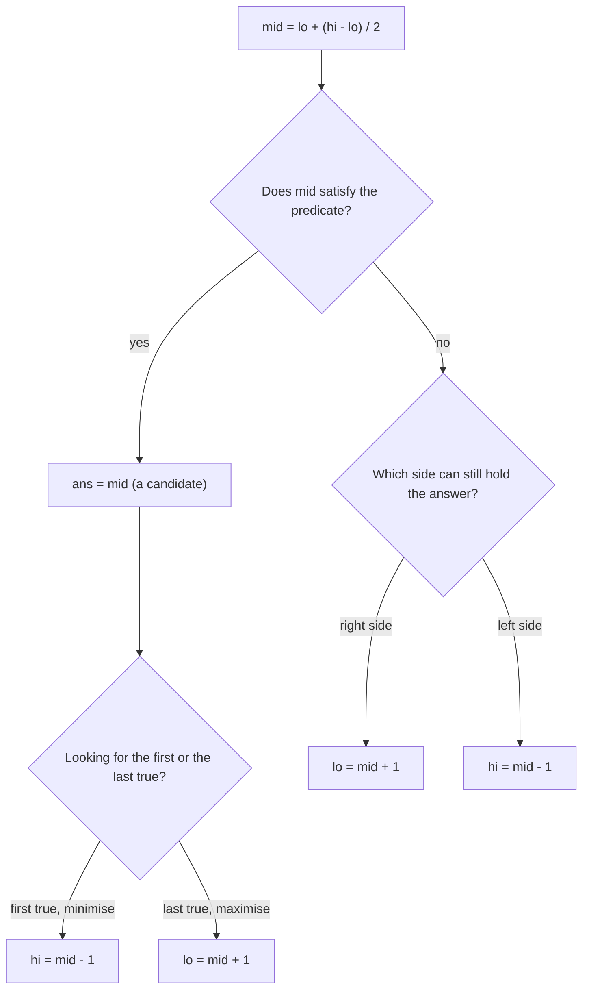

# Binary Search

## When to use / signals

- The input is **sorted** (or sorted then rotated) and you need a position, first / last occurrence, floor / ceil.
- A **monotonic predicate** exists: `false false false true true true` over indices or over answer values.
- "Minimise the maximum" / "maximise the minimum" / "smallest capacity (speed, days) such that ...": **binary search on the answer**.
- The answer range is huge (1e9) but checking one candidate is cheap (O(n)).
- The problem demands O(log n), or n is 1e5+ and a linear scan per query is too slow.

## Templates

### Classic search

```java
int search(int[] a, int target) {
    int lo = 0, hi = a.length - 1;
    while (lo <= hi) {
        int mid = lo + (hi - lo) / 2;          // overflow-safe; (lo + hi) can exceed Integer.MAX_VALUE
        if (a[mid] == target) return mid;
        if (a[mid] < target) lo = mid + 1;     // answer is to the right
        else hi = mid - 1;                     // answer is to the left
    }
    return -1;                                 // lo = insertion point here
}
```

Overflow-safe mid: `lo + (hi - lo) / 2` or `(lo + hi) >>> 1`. Never `(lo + hi) / 2` on big ranges.

### Choosing how to move low / high



Two equivalent styles; pick one and use it everywhere:

- **Style A** `while (lo <= hi)`, keep `ans`, always move to `mid ± 1`. Used below.
- **Style B** `while (lo < hi)`, `hi = mid` or `lo = mid + 1`, answer is `lo` at the end. Great for "min in rotated" and "peak". If you ever write `lo = mid`, use the upper mid `lo + (hi - lo + 1) / 2` or it loops forever.

### Lower bound / upper bound / first and last occurrence

```java
int lowerBound(int[] a, int x) {               // first index with a[i] >= x (n if none)
    int lo = 0, hi = a.length - 1, ans = a.length;
    while (lo <= hi) {
        int mid = lo + (hi - lo) / 2;
        if (a[mid] >= x) { ans = mid; hi = mid - 1; }   // candidate, try further left
        else lo = mid + 1;
    }
    return ans;
}

int upperBound(int[] a, int x) {               // first index with a[i] > x (n if none)
    int lo = 0, hi = a.length - 1, ans = a.length;
    while (lo <= hi) {
        int mid = lo + (hi - lo) / 2;
        if (a[mid] > x) { ans = mid; hi = mid - 1; }
        else lo = mid + 1;
    }
    return ans;
}

int[] searchRange(int[] a, int x) {            // first and last occurrence
    int first = lowerBound(a, x);
    if (first == a.length || a[first] != x) return new int[]{-1, -1};
    return new int[]{first, upperBound(a, x) - 1};
}
// count(x) = upperBound - lowerBound; search insert position = lowerBound;
// floor(x) = upperBound - 1 (if >= 0); ceil(x) = lowerBound (if < n).
```

### Rotated sorted array

```java
public int search(int[] a, int target) {
    int lo = 0, hi = a.length - 1;
    while (lo <= hi) {
        int mid = lo + (hi - lo) / 2;
        if (a[mid] == target) return mid;
        // With duplicates (II): if (a[lo] == a[mid] && a[mid] == a[hi]) { lo++; hi--; continue; }
        if (a[lo] <= a[mid]) {                                  // left half is sorted
            if (a[lo] <= target && target < a[mid]) hi = mid - 1;
            else lo = mid + 1;
        } else {                                                // right half is sorted
            if (a[mid] < target && target <= a[hi]) lo = mid + 1;
            else hi = mid - 1;
        }
    }
    return -1;
}

public int findMin(int[] a) {                   // Style B; index of min = number of rotations
    int lo = 0, hi = a.length - 1;
    while (lo < hi) {
        int mid = lo + (hi - lo) / 2;
        if (a[mid] > a[hi]) lo = mid + 1;       // min lies strictly right of mid
        else hi = mid;                          // mid itself may be the min
    }
    return a[lo];
}
```

### Peak element

```java
public int findPeakElement(int[] a) {
    int lo = 0, hi = a.length - 1;
    while (lo < hi) {
        int mid = lo + (hi - lo) / 2;
        if (a[mid] < a[mid + 1]) lo = mid + 1;  // going uphill: a peak exists on the right
        else hi = mid;                          // downhill: mid or something left is a peak
    }
    return lo;
}
```

### Binary search on the answer

```java
// Smallest x in [lo, hi] with possible(x) == true, where possible is F F F T T T
int minFeasible(int lo, int hi) {
    int ans = -1;
    while (lo <= hi) {
        int mid = lo + (hi - lo) / 2;
        if (possible(mid)) { ans = mid; hi = mid - 1; }
        else lo = mid + 1;
    }
    return ans;
}
// Largest feasible (T T T F F F): on success set ans = mid and lo = mid + 1 instead.
```

Recipe: (1) define the answer range `[lo, hi]`, (2) write `possible(mid)` in O(n), usually greedy, (3) check monotonicity, (4) min or max decides the move.

```java
// Koko eating bananas: min speed k to finish in h hours. Range [1, max pile]
public int minEatingSpeed(int[] piles, int h) {
    int lo = 1, hi = Arrays.stream(piles).max().getAsInt(), ans = hi;
    while (lo <= hi) {
        int mid = lo + (hi - lo) / 2;
        if (hours(piles, mid) <= h) { ans = mid; hi = mid - 1; }
        else lo = mid + 1;
    }
    return ans;
}
private long hours(int[] piles, int k) {
    long total = 0;
    for (int p : piles) total += (p + (long) k - 1) / k;   // ceil(p / k)
    return total;
}

// Ship packages in D days / book allocation / split array largest sum / painter's partition:
// minimise the max load. Range [max element, sum]. Greedy: count groups needed for a cap.
public int shipWithinDays(int[] w, int days) {
    int lo = 0, hi = 0;
    for (int x : w) { lo = Math.max(lo, x); hi += x; }
    int ans = hi;
    while (lo <= hi) {
        int mid = lo + (hi - lo) / 2;
        if (groupsNeeded(w, mid) <= days) { ans = mid; hi = mid - 1; }
        else lo = mid + 1;
    }
    return ans;
}
private int groupsNeeded(int[] w, int cap) {
    int groups = 1, load = 0;
    for (int x : w) {
        if (load + x > cap) { groups++; load = 0; }   // start a new day / student
        load += x;
    }
    return groups;
}
// Book allocation: same code with (books, students); return -1 if students > books.length.

// Aggressive cows: maximise the minimum distance. Range [1, max - min]
int aggressiveCows(int[] stalls, int cows) {
    Arrays.sort(stalls);
    int lo = 1, hi = stalls[stalls.length - 1] - stalls[0], ans = 0;
    while (lo <= hi) {
        int mid = lo + (hi - lo) / 2;
        if (canPlace(stalls, cows, mid)) { ans = mid; lo = mid + 1; }   // feasible: try larger
        else hi = mid - 1;
    }
    return ans;
}
private boolean canPlace(int[] s, int cows, int dist) {
    int placed = 1, last = s[0];                  // greedy: first cow in the first stall
    for (int i = 1; i < s.length && placed < cows; i++)
        if (s[i] - last >= dist) { placed++; last = s[i]; }
    return placed >= cows;
}
```

### 2D matrix search

```java
// Fully sorted matrix (each row starts after the previous row ends): treat as 1D of m * n
public boolean searchMatrix(int[][] m, int target) {
    int cols = m[0].length, lo = 0, hi = m.length * cols - 1;
    while (lo <= hi) {
        int mid = lo + (hi - lo) / 2;
        int v = m[mid / cols][mid % cols];          // 1D index -> (row, col)
        if (v == target) return true;
        if (v < target) lo = mid + 1; else hi = mid - 1;
    }
    return false;
}

// Rows and columns sorted separately (Search a 2D Matrix II): staircase from top-right
public boolean searchMatrixII(int[][] m, int target) {
    int r = 0, c = m[0].length - 1;
    while (r < m.length && c >= 0) {
        if (m[r][c] == target) return true;
        if (m[r][c] > target) c--; else r++;        // drop a column or a row each step
    }
    return false;
}
```

## Complexity

| Problem | Time | Space |
|---|---|---|
| Classic / lower / upper bound / first-last | O(log n) | O(1) |
| Rotated array (distinct) / min in rotated | O(log n) | O(1) |
| Rotated array with duplicates | O(log n) average, O(n) worst | O(1) |
| Peak element | O(log n) | O(1) |
| Binary search on answer | O(n · log(range)) | O(1) |
| Aggressive cows | O(n log n + n · log(range)) | O(1) |
| Fully sorted 2D matrix | O(log(m · n)) | O(1) |
| Row / column sorted matrix (staircase) | O(m + n) | O(1) |

## Pitfalls

- `(lo + hi) / 2` overflows for large indices or answer ranges; use `lo + (hi - lo) / 2`.
- Style B with `lo = mid` and a lower mid loops forever on two elements; use the upper mid.
- The predicate must be monotonic; if it is not, binary search gives wrong answers silently.
- Answer range bounds: Koko's `lo = 1` (not 0, division by zero); shipping's `lo = max(w)` (a package can't be split).
- Sums inside `possible()` overflow `int` (1e5 × 1e9); use `long`.
- Rotated search needs `a[lo] <= a[mid]` (with `=`) for the case `lo == mid`.
- Peak element compares `a[mid]` with `a[mid + 1]`; this is safe only because `lo < hi` keeps `mid + 1 <= hi`.
- Return `ans` (the last recorded candidate), not `mid`, and decide what to return when nothing is feasible.

## Must-know problems

- Binary Search
- Search Insert Position
- Lower Bound / Upper Bound
- Floor and Ceil in a Sorted Array
- Find First and Last Position of Element in Sorted Array
- Count Occurrences in a Sorted Array
- Search in Rotated Sorted Array I and II
- Find Minimum in Rotated Sorted Array
- Find How Many Times an Array Is Rotated
- Single Element in a Sorted Array
- Find Peak Element
- Sqrt(x) / Nth Root of a Number
- Koko Eating Bananas
- Minimum Number of Days to Make m Bouquets
- Find the Smallest Divisor Given a Threshold
- Capacity To Ship Packages Within D Days
- Kth Missing Positive Number
- Aggressive Cows
- Book Allocation
- Split Array Largest Sum
- Painter's Partition
- Minimise Max Distance to Gas Station
- Median of Two Sorted Arrays
- Kth Element of Two Sorted Arrays
- Row with Maximum 1s
- Search a 2D Matrix I and II
- Find a Peak Element II
- Median in a Row-wise Sorted Matrix
