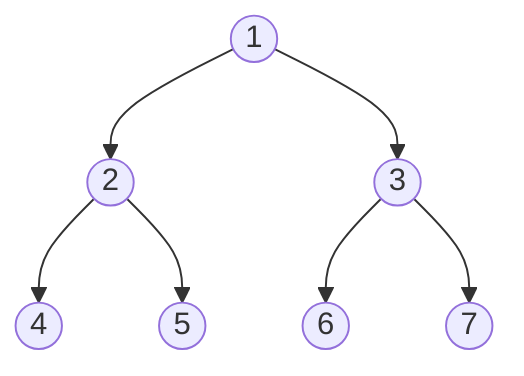

# Binary Trees

## When to use / signals

- Input is a `TreeNode root`: almost every answer is a DFS that combines results from the two children.
- "Level", "depth", "view", "zig-zag", "minimum depth", "nodes at distance K": BFS with a queue.
- "Path", "diameter", "max sum", "balanced", "subtree": postorder DFS that returns info to the parent.
- "Ancestor", "burn", "distance between nodes": LCA, or a parent map to treat the tree as a graph.
- O(1) extra space traversal requested: Morris traversal.

## Templates

### Node class and example tree

```java
public class TreeNode {
    int val;
    TreeNode left, right;
    TreeNode(int val) { this.val = val; }
}
```



| Traversal | Order | Result for the tree above |
|---|---|---|
| Preorder | root, left, right | 1 2 4 5 3 6 7 |
| Inorder | left, root, right | 4 2 5 1 6 3 7 |
| Postorder | left, right, root | 4 5 2 6 7 3 1 |
| Level order | level by level | [1], [2, 3], [4, 5, 6, 7] |

### Recursive traversals

```java
void preorder(TreeNode n, List<Integer> out) {
    if (n == null) return;
    out.add(n.val);                                   // root before children
    preorder(n.left, out);
    preorder(n.right, out);
}
// inorder:   left, out.add(n.val), right
// postorder: left, right, out.add(n.val)
```

### Iterative traversals

```java
List<Integer> preorderIter(TreeNode root) {
    List<Integer> res = new ArrayList<>();
    if (root == null) return res;
    Deque<TreeNode> st = new ArrayDeque<>();
    st.push(root);
    while (!st.isEmpty()) {
        TreeNode n = st.pop();
        res.add(n.val);
        if (n.right != null) st.push(n.right);        // right first so left pops first
        if (n.left != null) st.push(n.left);
    }
    return res;
}

List<Integer> inorderIter(TreeNode root) {
    List<Integer> res = new ArrayList<>();
    Deque<TreeNode> st = new ArrayDeque<>();
    TreeNode cur = root;
    while (cur != null || !st.isEmpty()) {
        while (cur != null) { st.push(cur); cur = cur.left; }   // go all the way left
        cur = st.pop();
        res.add(cur.val);
        cur = cur.right;
    }
    return res;
}

List<Integer> postorderIter(TreeNode root) {      // reverse of (root, right, left)
    LinkedList<Integer> res = new LinkedList<>();
    if (root == null) return res;
    Deque<TreeNode> st = new ArrayDeque<>();
    st.push(root);
    while (!st.isEmpty()) {
        TreeNode n = st.pop();
        res.addFirst(n.val);
        if (n.left != null) st.push(n.left);
        if (n.right != null) st.push(n.right);
    }
    return res;
}

List<List<Integer>> levelOrder(TreeNode root) {
    List<List<Integer>> res = new ArrayList<>();
    if (root == null) return res;
    Queue<TreeNode> q = new ArrayDeque<>();
    q.offer(root);
    while (!q.isEmpty()) {
        List<Integer> level = new ArrayList<>();
        for (int i = q.size(); i > 0; i--) {          // freeze the level size first
            TreeNode n = q.poll();
            level.add(n.val);
            if (n.left != null) q.offer(n.left);
            if (n.right != null) q.offer(n.right);
        }
        res.add(level);
    }
    return res;
}
```

### DFS that returns info from children

Recipe: recurse on both children, use their return values to (a) update a global answer for the path that bends at this node and (b) return the single-branch value the parent needs.

```java
int height(TreeNode n) { return n == null ? 0 : 1 + Math.max(height(n.left), height(n.right)); }

int diameter = 0;                                     // longest path in edges
int depth(TreeNode n) {
    if (n == null) return 0;
    int l = depth(n.left), r = depth(n.right);
    diameter = Math.max(diameter, l + r);             // path bending at n
    return 1 + Math.max(l, r);                        // what the parent can extend
}

int maxSum = Integer.MIN_VALUE;                       // Binary Tree Maximum Path Sum
int gain(TreeNode n) {
    if (n == null) return 0;
    int l = Math.max(0, gain(n.left));                // drop negative branches
    int r = Math.max(0, gain(n.right));
    maxSum = Math.max(maxSum, n.val + l + r);
    return n.val + Math.max(l, r);
}

int checkBalanced(TreeNode n) {                       // height, or -1 if unbalanced
    if (n == null) return 0;
    int l = checkBalanced(n.left);
    if (l == -1) return -1;
    int r = checkBalanced(n.right);
    if (r == -1 || Math.abs(l - r) > 1) return -1;
    return 1 + Math.max(l, r);
}
// isBalanced(root) = checkBalanced(root) != -1. Same shape: identical trees, symmetric tree.
```

### Views

```java
List<Integer> rightView(TreeNode root) {          // BFS: last node of each level; DFS below is shorter
    List<Integer> res = new ArrayList<>();
    viewDfs(root, 0, res);
    return res;
}
void viewDfs(TreeNode n, int depth, List<Integer> res) {
    if (n == null) return;
    if (depth == res.size()) res.add(n.val);          // first node seen at this depth
    viewDfs(n.right, depth + 1, res);                 // right first = right view; swap for left view
    viewDfs(n.left, depth + 1, res);
}

List<Integer> topView(TreeNode root) {            // BFS with a column index
    TreeMap<Integer, Integer> byCol = new TreeMap<>();   // column -> value, sorted left to right
    Queue<TreeNode> q = new ArrayDeque<>();
    Queue<Integer> cols = new ArrayDeque<>();
    if (root != null) { q.offer(root); cols.offer(0); }
    while (!q.isEmpty()) {
        TreeNode n = q.poll();
        int c = cols.poll();
        byCol.putIfAbsent(c, n.val);                  // top view: first node per column
        // bottom view: byCol.put(c, n.val);          // last node per column wins
        if (n.left != null)  { q.offer(n.left);  cols.offer(c - 1); }
        if (n.right != null) { q.offer(n.right); cols.offer(c + 1); }
    }
    return new ArrayList<>(byCol.values());
}
// Vertical order traversal: TreeMap<col, TreeMap<row, PriorityQueue<val>>>, same BFS/DFS with (row, col).
```

### Zig-zag level order

```java
List<List<Integer>> zigzagLevelOrder(TreeNode root) {
    List<List<Integer>> res = new ArrayList<>();
    if (root == null) return res;
    Queue<TreeNode> q = new ArrayDeque<>();
    q.offer(root);
    boolean leftToRight = true;
    while (!q.isEmpty()) {
        LinkedList<Integer> level = new LinkedList<>();
        for (int i = q.size(); i > 0; i--) {
            TreeNode n = q.poll();
            if (leftToRight) level.addLast(n.val); else level.addFirst(n.val);
            if (n.left != null) q.offer(n.left);
            if (n.right != null) q.offer(n.right);
        }
        res.add(level);
        leftToRight = !leftToRight;
    }
    return res;
}
```

### Lowest common ancestor

```java
TreeNode lowestCommonAncestor(TreeNode root, TreeNode p, TreeNode q) {
    if (root == null || root == p || root == q) return root;
    TreeNode l = lowestCommonAncestor(root.left, p, q);
    TreeNode r = lowestCommonAncestor(root.right, p, q);
    if (l != null && r != null) return root;          // p and q are on different sides
    return l != null ? l : r;                         // both on one side (or not found)
}
```

### Boundary traversal (anticlockwise)

```java
List<Integer> boundary(TreeNode root) {
    List<Integer> res = new ArrayList<>();
    if (root == null) return res;
    if (!isLeaf(root)) res.add(root.val);
    for (TreeNode c = root.left; c != null; c = c.left != null ? c.left : c.right)
        if (!isLeaf(c)) res.add(c.val);               // left boundary, top-down
    addLeaves(root, res);                             // leaves, left to right
    Deque<Integer> st = new ArrayDeque<>();
    for (TreeNode c = root.right; c != null; c = c.right != null ? c.right : c.left)
        if (!isLeaf(c)) st.push(c.val);               // right boundary, added bottom-up
    while (!st.isEmpty()) res.add(st.pop());
    return res;
}
boolean isLeaf(TreeNode n) { return n.left == null && n.right == null; }
void addLeaves(TreeNode n, List<Integer> res) {
    if (n == null) return;
    if (isLeaf(n)) { res.add(n.val); return; }
    addLeaves(n.left, res);
    addLeaves(n.right, res);
}
```

### Build tree from preorder + inorder

```java
private int preIdx = 0;
private final Map<Integer, Integer> inPos = new HashMap<>();

TreeNode buildTree(int[] preorder, int[] inorder) {
    for (int i = 0; i < inorder.length; i++) inPos.put(inorder[i], i);
    return build(preorder, 0, inorder.length - 1);
}
TreeNode build(int[] preorder, int lo, int hi) {      // subtree occupies inorder[lo..hi]
    if (lo > hi) return null;
    TreeNode root = new TreeNode(preorder[preIdx++]); // next preorder value is this subtree's root
    int mid = inPos.get(root.val);
    root.left = build(preorder, lo, mid - 1);         // build left first to match preorder
    root.right = build(preorder, mid + 1, hi);
    return root;
}
// Postorder + inorder: consume postorder from the end and build RIGHT before left.
```

### Serialize / deserialize (preorder with null markers)

```java
public class Codec {
    public String serialize(TreeNode root) {
        StringBuilder sb = new StringBuilder();
        ser(root, sb);
        return sb.toString();
    }
    private void ser(TreeNode n, StringBuilder sb) {
        if (n == null) { sb.append("#,"); return; }
        sb.append(n.val).append(',');
        ser(n.left, sb);
        ser(n.right, sb);
    }
    public TreeNode deserialize(String data) {
        return des(new ArrayDeque<>(Arrays.asList(data.split(","))));
    }
    private TreeNode des(Deque<String> tokens) {
        String t = tokens.poll();
        if (t.equals("#")) return null;
        TreeNode n = new TreeNode(Integer.parseInt(t));
        n.left = des(tokens);
        n.right = des(tokens);
        return n;
    }
}
```

### Morris inorder traversal (O(1) extra space)

```java
List<Integer> morrisInorder(TreeNode root) {
    List<Integer> res = new ArrayList<>();
    TreeNode cur = root;
    while (cur != null) {
        if (cur.left == null) { res.add(cur.val); cur = cur.right; continue; }
        TreeNode pred = cur.left;                     // rightmost node of the left subtree
        while (pred.right != null && pred.right != cur) pred = pred.right;
        if (pred.right == null) {                     // first visit: thread back to cur, go left
            pred.right = cur;
            cur = cur.left;
        } else {                                      // second visit: remove thread, visit, go right
            pred.right = null;
            res.add(cur.val);
            cur = cur.right;
        }
    }
    return res;
}
// Morris preorder: add cur.val when creating the thread instead of when removing it.
```

### Children sum property

```java
void changeTree(TreeNode n) {                         // only increments allowed
    if (n == null) return;
    int child = (n.left != null ? n.left.val : 0) + (n.right != null ? n.right.val : 0);
    if (child >= n.val) n.val = child;
    else {                                            // push the parent's value down
        if (n.left != null) n.left.val = n.val;
        if (n.right != null) n.right.val = n.val;
    }
    changeTree(n.left);
    changeTree(n.right);
    if (n.left != null || n.right != null)            // fix up on the way back
        n.val = (n.left != null ? n.left.val : 0) + (n.right != null ? n.right.val : 0);
}
```

### Distance K / burn tree (parent map + BFS)

```java
List<Integer> distanceK(TreeNode root, TreeNode target, int k) {
    Map<TreeNode, TreeNode> parent = new HashMap<>();
    Queue<TreeNode> q = new ArrayDeque<>();
    q.offer(root);
    while (!q.isEmpty()) {                            // 1) record parent pointers
        TreeNode n = q.poll();
        if (n.left != null)  { parent.put(n.left, n);  q.offer(n.left); }
        if (n.right != null) { parent.put(n.right, n); q.offer(n.right); }
    }
    Set<TreeNode> seen = new HashSet<>();             // 2) BFS from target as an undirected graph
    q.offer(target);
    seen.add(target);
    for (int d = 0; d < k && !q.isEmpty(); d++) {
        for (int i = q.size(); i > 0; i--) {
            TreeNode n = q.poll();
            for (TreeNode nb : new TreeNode[]{n.left, n.right, parent.get(n)})
                if (nb != null && seen.add(nb)) q.offer(nb);
        }
    }
    List<Integer> res = new ArrayList<>();
    for (TreeNode n : q) res.add(n.val);              // exactly the nodes at distance k
    return res;
}
// Minimum time to burn the tree: same BFS from the start node, count levels until the queue empties.
```

## Complexity

| Operation | Time | Space |
|---|---|---|
| Any traversal (recursive / iterative / BFS) | O(n) | O(h) stack or O(w) queue |
| Height, diameter, max path sum, balanced | O(n) | O(h) |
| Views, zig-zag, boundary | O(n) (top/bottom view O(n log n) with TreeMap) | O(n) |
| LCA | O(n) | O(h) |
| Build from preorder + inorder | O(n) with the index map | O(n) |
| Serialize / deserialize | O(n) | O(n) |
| Morris traversal | O(n) | O(1) |
| Distance K / burn tree | O(n) | O(n) |

`h` is the height (log n if balanced, n if skewed); `w` is the max width.

## Pitfalls

- Computing height separately inside the recursion (`height(left) - height(right)` at every node) is O(n^2). Return it instead.
- Max path sum: initialise the answer to `Integer.MIN_VALUE`, not 0 (all-negative trees), and clamp child gains at 0.
- Diameter counts edges, not nodes; check what the problem wants.
- BFS: capture `q.size()` before the inner loop; it changes as you add children.
- Build tree: duplicate values break the value-to-index map; the classic problem guarantees unique values.
- Serialization must mark nulls, or the shape is ambiguous.
- Morris traversal temporarily modifies the tree; always remove the threads (don't break out early).
- Deep skewed trees (10^5 nodes) can overflow the recursion stack; switch to iterative.

## Must-know problems

- Preorder, Inorder, Postorder (recursive and iterative), Level Order Traversal
- Maximum Depth, Minimum Depth
- Balanced Binary Tree
- Diameter of Binary Tree
- Binary Tree Maximum Path Sum
- Same Tree, Symmetric Tree
- Zigzag Level Order Traversal
- Boundary Traversal
- Vertical Order Traversal
- Top View, Bottom View, Left View, Right View
- Lowest Common Ancestor of a Binary Tree
- Maximum Width of Binary Tree
- Children Sum Property
- All Nodes Distance K in Binary Tree
- Minimum Time to Burn a Binary Tree
- Count Nodes in a Complete Binary Tree
- Construct Binary Tree from Preorder and Inorder / Inorder and Postorder
- Serialize and Deserialize Binary Tree
- Morris Inorder / Preorder Traversal
- Flatten Binary Tree to Linked List
- Root to Node Path, Path Sum
