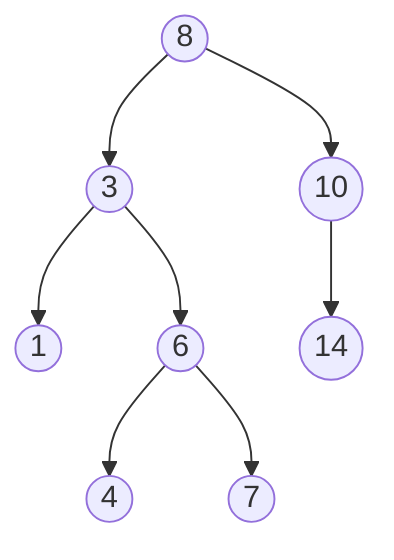

# Binary Search Trees

## When to use / signals

- The input is a BST: every search can discard half the tree, like binary search, giving O(h).
- "Sorted order", "k-th smallest / largest", "successor / predecessor": inorder of a BST is sorted.
- "Floor / ceil / closest value": walk down, remember the best candidate.
- Validating or recovering a BST: think in terms of the inorder sequence or an allowed `(low, high)` range.
- Ordered map / set operations in Java: `TreeMap` / `TreeSet` are balanced BSTs (red-black trees).

## Templates

### The BST property

For every node, all values in the left subtree are `< node.val` and all values in the right subtree are `> node.val` (the whole subtree, not just the direct child). Consequence: inorder traversal is strictly increasing.



Inorder: 1 3 4 6 7 8 10 14.

### Search, insert, delete

```java
TreeNode searchBST(TreeNode root, int val) {
    while (root != null && root.val != val) root = val < root.val ? root.left : root.right;
    return root;
}

TreeNode insertIntoBST(TreeNode root, int val) {
    if (root == null) return new TreeNode(val);
    if (val < root.val) root.left = insertIntoBST(root.left, val);
    else root.right = insertIntoBST(root.right, val);
    return root;
}

TreeNode deleteNode(TreeNode root, int key) {
    if (root == null) return null;
    if (key < root.val) root.left = deleteNode(root.left, key);
    else if (key > root.val) root.right = deleteNode(root.right, key);
    else {
        if (root.left == null) return root.right;         // 0 or 1 child: splice out
        if (root.right == null) return root.left;
        TreeNode succ = root.right;                        // 2 children: copy inorder successor
        while (succ.left != null) succ = succ.left;
        root.val = succ.val;
        root.right = deleteNode(root.right, succ.val);     // then delete the successor
    }
    return root;
}
```

### Floor, ceil, successor

```java
int floor(TreeNode root, int x) {           // largest value <= x, or -1
    int ans = -1;
    while (root != null) {
        if (root.val == x) return x;
        if (root.val < x) { ans = root.val; root = root.right; }   // candidate, try bigger
        else root = root.left;
    }
    return ans;
}

int ceil(TreeNode root, int x) {            // smallest value >= x, or -1
    int ans = -1;
    while (root != null) {
        if (root.val == x) return x;
        if (root.val > x) { ans = root.val; root = root.left; }    // candidate, try smaller
        else root = root.right;
    }
    return ans;
}

TreeNode inorderSuccessor(TreeNode root, TreeNode p) {   // strictly greater than p
    TreeNode succ = null;
    while (root != null) {
        if (p.val < root.val) { succ = root; root = root.left; }
        else root = root.right;
    }
    return succ;
}
// Predecessor: mirror it (p.val > root.val -> candidate, go right).
```

### Validate BST with a range

```java
boolean isValidBST(TreeNode root) { return valid(root, Long.MIN_VALUE, Long.MAX_VALUE); }

boolean valid(TreeNode n, long lo, long hi) {  // every value must lie strictly in (lo, hi)
    if (n == null) return true;
    if (n.val <= lo || n.val >= hi) return false;
    return valid(n.left, lo, n.val) && valid(n.right, n.val, hi);
}
```

### K-th smallest (inorder with early stop)

```java
int kthSmallest(TreeNode root, int k) {
    Deque<TreeNode> st = new ArrayDeque<>();
    TreeNode cur = root;
    while (true) {
        while (cur != null) { st.push(cur); cur = cur.left; }
        cur = st.pop();
        if (--k == 0) return cur.val;              // k-th node in sorted order
        cur = cur.right;
    }
}
// K-th largest: reverse inorder (right, node, left), or kthSmallest(n - k + 1).
```

### LCA in a BST

```java
TreeNode lowestCommonAncestor(TreeNode root, TreeNode p, TreeNode q) {
    while (root != null) {
        if (p.val < root.val && q.val < root.val) root = root.left;
        else if (p.val > root.val && q.val > root.val) root = root.right;
        else return root;                          // they split here (or root is p or q)
    }
    return null;
}
```

### BST iterator (controlled inorder with a stack)

```java
class BSTIterator {
    private final Deque<TreeNode> st = new ArrayDeque<>();
    public BSTIterator(TreeNode root) { pushLeft(root); }
    public int next() {
        TreeNode n = st.pop();
        pushLeft(n.right);                         // next smallest lives in the right subtree's left spine
        return n.val;
    }
    public boolean hasNext() { return !st.isEmpty(); }
    private void pushLeft(TreeNode n) { for (; n != null; n = n.left) st.push(n); }
}
// Descending iterator ("before"): push the right spine and move to n.left instead.
```

### Two sum in a BST (two iterators, like two pointers)

```java
boolean findTarget(TreeNode root, int k) {
    Deque<TreeNode> lo = new ArrayDeque<>(), hi = new ArrayDeque<>();
    for (TreeNode n = root; n != null; n = n.left) lo.push(n);    // ascending iterator
    for (TreeNode n = root; n != null; n = n.right) hi.push(n);   // descending iterator
    while (lo.peek() != hi.peek()) {                              // stop when both point at the same node
        int sum = lo.peek().val + hi.peek().val;
        if (sum == k) return true;
        if (sum < k) {                                            // advance the small side
            TreeNode n = lo.pop();
            for (n = n.right; n != null; n = n.left) lo.push(n);
        } else {                                                  // advance the big side
            TreeNode n = hi.pop();
            for (n = n.left; n != null; n = n.right) hi.push(n);
        }
    }
    return false;
}
// Guard root == null before calling. Simpler O(n) space version: inorder to a list, then two pointers.
```

### Recover a BST (two swapped nodes)

```java
private TreeNode first, second, prev;

void recoverTree(TreeNode root) {
    inorder(root);
    int t = first.val; first.val = second.val; second.val = t;
}
void inorder(TreeNode n) {
    if (n == null) return;
    inorder(n.left);
    if (prev != null && prev.val > n.val) {        // an inversion in the sorted order
        if (first == null) first = prev;           // first inversion: the bigger one is misplaced
        second = n;                                // last inversion: the smaller one is misplaced
    }
    prev = n;
    inorder(n.right);
}
// Adjacent swap gives one inversion, a distant swap gives two; this handles both.
```

### Largest BST in a binary tree (postorder with min / max / size)

```java
private int best = 0;

int largestBst(TreeNode root) { info(root); return best; }

// returns {min, max, size} of the subtree; an invalid subtree returns an impossible range
private long[] info(TreeNode n) {
    if (n == null) return new long[]{Long.MAX_VALUE, Long.MIN_VALUE, 0};   // empty: fits anywhere
    long[] l = info(n.left), r = info(n.right);
    if (l[1] < n.val && n.val < r[0]) {            // left max < val < right min
        long size = l[2] + r[2] + 1;
        best = Math.max(best, (int) size);
        return new long[]{Math.min(l[0], n.val), Math.max(r[1], n.val), size};
    }
    return new long[]{Long.MIN_VALUE, Long.MAX_VALUE, 0};                  // poisons every ancestor
}
// Maximum Sum BST in Binary Tree: same shape, carry the sum instead of the size.
```

### Construct BST from preorder (upper bound)

```java
private int idx = 0;

TreeNode bstFromPreorder(int[] preorder) { return build(preorder, Integer.MAX_VALUE); }

TreeNode build(int[] pre, int bound) {
    if (idx == pre.length || pre[idx] > bound) return null;   // belongs to an ancestor's right side
    TreeNode root = new TreeNode(pre[idx++]);
    root.left = build(pre, root.val);              // left subtree: values below root
    root.right = build(pre, bound);                // right subtree: up to the inherited bound
    return root;
}
```

## Complexity

| Operation | Time | Space |
|---|---|---|
| Search / insert / delete / floor / ceil / successor | O(h) | O(1) iterative, O(h) recursive |
| Validate BST | O(n) | O(h) |
| K-th smallest | O(h + k) | O(h) |
| LCA in BST | O(h) | O(1) |
| BST iterator `next` / `hasNext` | O(1) amortised | O(h) |
| Two sum in BST | O(n) | O(h) |
| Recover BST | O(n) | O(h) (O(1) with Morris) |
| Largest BST in a binary tree | O(n) | O(h) |
| Build from preorder | O(n) | O(h) |

`h` is log n for a balanced tree and n for a skewed one (inserting sorted data makes it a linked list).

## Pitfalls

- Validating by only comparing a node to its direct children is wrong: `5 -> left 4 -> right 6` passes locally but 6 is in 5's left subtree.
- Use `long` bounds (or nullable `Integer`) in the range check; node values can be `Integer.MIN_VALUE` / `MAX_VALUE`.
- Duplicates: decide a convention (usually none allowed, or duplicates go right) and keep it consistent in insert and validate.
- Delete: after copying the successor's value, delete the successor from the right subtree, not the original key.
- Recover BST: `second` must be updated on every inversion, `first` only on the first one.
- The two-iterator two-sum must stop when the iterators meet, or a value can pair with itself.
- An unbalanced BST degrades to O(n); interviews expect you to mention AVL / red-black trees and `TreeMap`.

## Must-know problems

- Search in a BST
- Insert into a BST
- Delete Node in a BST
- Floor and Ceil in a BST
- Validate Binary Search Tree
- Kth Smallest / Kth Largest Element in a BST
- Lowest Common Ancestor of a BST
- Inorder Successor / Predecessor in BST
- Binary Search Tree Iterator
- Two Sum IV (Input is a BST)
- Recover Binary Search Tree
- Largest BST in a Binary Tree / Maximum Sum BST in Binary Tree
- Construct BST from Preorder Traversal
- Convert Sorted Array to BST
- Min / Max value in a BST
