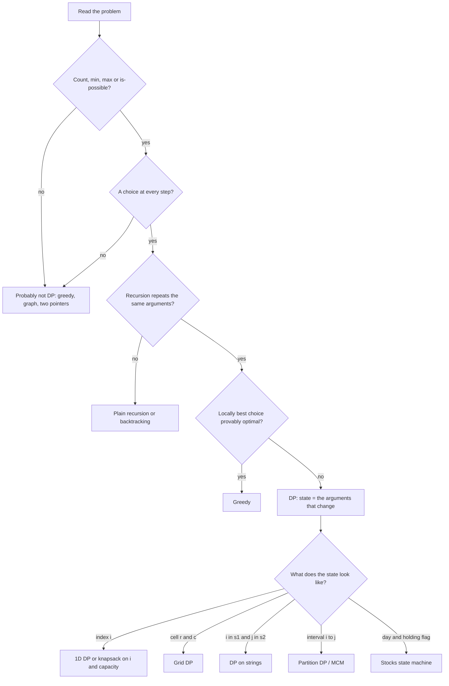
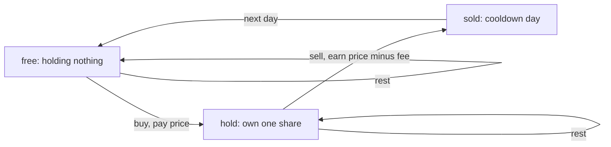

# Dynamic Programming

## When to use / signals

- The question asks for a **count** ("number of ways"), an **optimum** ("min cost", "max profit", "longest") or **feasibility** ("can you reach / partition").
- At each step you make a choice (take / skip, cut here, move right / down, match / skip a character) and the choices interact.
- The brute-force recursion calls itself with the same arguments many times (overlapping subproblems).
- An optimal answer is built from optimal answers to smaller parts (optimal substructure).
- Constraints like n up to 10^3 (O(n^2)), n * sum up to 10^7, or two strings up to 10^3 each.

## Templates

### How to identify DP



| Family | State definition | Transition | Answer |
|---|---|---|---|
| 1D | `dp[i]` = best / ways for the first i items (or ending at i) | from `dp[i-1]`, `dp[i-2]` | `dp[n-1]` |
| Grid | `dp[r][c]` = best / ways to reach cell (r, c) | from top and left | `dp[R-1][C-1]` |
| Knapsack / subsets | `dp[i][s]` = using items 0..i with sum or capacity s | skip item i, or take it | `dp[n-1][target]` |
| Strings | `dp[i][j]` = answer for prefixes `a[0..i)`, `b[0..j)` | match: diagonal; else combine up / left | `dp[n][m]` |
| Stocks | `dp[i][hold][k]` = best cash on day i, holding or not, k transactions left | buy, sell, rest | `dp[n][0][k]` |
| LIS | `dp[i]` = longest increasing subsequence ending at i | max over `j < i` with `a[j] < a[i]` | `max(dp)` |
| Partition / MCM | `dp[i][j]` = best for segment i..j | try every split k in the segment | `dp[0][n-1]` |
| Squares | `dp[r][c]` = side of the largest square with bottom-right corner (r, c) | `1 + min(top, left, diag)` | max or sum |

### The 3-step method (worked example: Frog Jump)

Frog on stair 0 must reach stair n-1, jumping 1 or 2 stairs; a jump from i to j costs `|h[i] - h[j]|`. Minimise the total cost.

1. **Recursion + memo**: define `f(i)` = min cost to reach i. `f(i) = min(f(i-1) + |h[i]-h[i-1]|, f(i-2) + |h[i]-h[i-2]|)`, base `f(0) = 0`. Cache results.
2. **Tabulation**: fill `dp[]` from the base case upwards in the reverse order of the recursion.
3. **Space optimisation**: `dp[i]` only reads the last two values, so keep two variables.

```java
// Step 1: top-down (memoization)
int[] memo;                                   // memo = new int[n]; Arrays.fill(memo, -1); solve(n - 1, h)
int solve(int i, int[] h) {
    if (i == 0) return 0;
    if (memo[i] != -1) return memo[i];
    int one = solve(i - 1, h) + Math.abs(h[i] - h[i - 1]);
    int two = i > 1 ? solve(i - 2, h) + Math.abs(h[i] - h[i - 2]) : Integer.MAX_VALUE;
    return memo[i] = Math.min(one, two);
}

// Step 2: bottom-up (tabulation)
int frogTab(int[] h) {
    int n = h.length;
    int[] dp = new int[n];                    // dp[0] = 0
    for (int i = 1; i < n; i++) {
        int one = dp[i - 1] + Math.abs(h[i] - h[i - 1]);
        int two = i > 1 ? dp[i - 2] + Math.abs(h[i] - h[i - 2]) : Integer.MAX_VALUE;
        dp[i] = Math.min(one, two);
    }
    return dp[n - 1];
}

// Step 3: O(1) space
int frogOpt(int[] h) {
    int prev2 = 0, prev = 0;                  // dp[i-2], dp[i-1]
    for (int i = 1; i < h.length; i++) {
        int one = prev + Math.abs(h[i] - h[i - 1]);
        int two = i > 1 ? prev2 + Math.abs(h[i] - h[i - 2]) : Integer.MAX_VALUE;
        prev2 = prev;
        prev = Math.min(one, two);
    }
    return prev;
}
// Frog with k jumps: inner loop j = 1..k over dp[i - j]; O(n * k).
```

### 1D DP

```java
int climbStairs(int n) {                      // ways(i) = ways(i-1) + ways(i-2): Fibonacci
    int a = 1, b = 1;                         // ways(0), ways(1)
    for (int i = 2; i <= n; i++) { int c = a + b; a = b; b = c; }
    return b;
}

int rob(int[] nums) {                         // House Robber: no two adjacent
    int prev2 = 0, prev = 0;                  // best up to i-2, best up to i-1
    for (int x : nums) {
        int cur = Math.max(prev, prev2 + x);  // skip house i, or rob it
        prev2 = prev;
        prev = cur;
    }
    return prev;
}
// House Robber II (circular): max(rob(nums[0..n-2]), rob(nums[1..n-1])); n == 1 -> nums[0].
```

### 2D grid DP

```java
int uniquePathsWithObstacles(int[][] g) {
    int C = g[0].length;
    int[] dp = new int[C];                    // one row: dp[c] = ways to reach (r, c)
    dp[0] = 1;
    for (int[] row : g)
        for (int c = 0; c < C; c++) {
            if (row[c] == 1) dp[c] = 0;                   // obstacle
            else if (c > 0) dp[c] += dp[c - 1];           // from top (old dp[c]) + from left
        }
    return dp[C - 1];
}

int minPathSum(int[][] g) {
    int R = g.length, C = g[0].length;
    int[] dp = new int[C];
    for (int r = 0; r < R; r++)
        for (int c = 0; c < C; c++) {
            if (r == 0 && c == 0) dp[c] = g[0][0];
            else if (r == 0) dp[c] = dp[c - 1] + g[r][c];
            else if (c == 0) dp[c] += g[r][c];
            else dp[c] = Math.min(dp[c], dp[c - 1]) + g[r][c];
        }
    return dp[C - 1];
}

int minimumTotal(List<List<Integer>> tri) {  // Triangle: bottom-up avoids edge cases
    int n = tri.size();
    int[] dp = new int[n + 1];
    for (int r = n - 1; r >= 0; r--)
        for (int c = 0; c <= r; c++)
            dp[c] = tri.get(r).get(c) + Math.min(dp[c], dp[c + 1]);
    return dp[0];
}

// Cherry Pickup II: two robots move down together, state (row, c1, c2), 3 x 3 = 9 move combos
int cherryPickup(int[][] g) {
    int R = g.length, C = g[0].length;
    int[][] below = new int[C][C];            // best from the next row down
    for (int r = R - 1; r >= 0; r--) {
        int[][] cur = new int[C][C];
        for (int c1 = 0; c1 < C; c1++)
            for (int c2 = 0; c2 < C; c2++) {
                int best = 0;
                if (r < R - 1)
                    for (int d1 = -1; d1 <= 1; d1++)
                        for (int d2 = -1; d2 <= 1; d2++) {
                            int n1 = c1 + d1, n2 = c2 + d2;
                            if (n1 >= 0 && n2 >= 0 && n1 < C && n2 < C) best = Math.max(best, below[n1][n2]);
                        }
                cur[c1][c2] = best + g[r][c1] + (c1 != c2 ? g[r][c2] : 0);   // same cell counts once
            }
        below = cur;
    }
    return below[0][C - 1];
}
// Cherry Pickup I (there and back): two walkers from (0,0) at the same step t, state (t, r1, r2).
```

### Subsequences and knapsack

```java
boolean subsetSum(int[] a, int target) {
    boolean[] dp = new boolean[target + 1];   // dp[s] = some subset of the items so far sums to s
    dp[0] = true;
    for (int x : a)
        for (int s = target; s >= x; s--)     // backwards: each item used at most once
            dp[s] |= dp[s - x];
    return dp[target];
}
// Partition Equal Subset Sum: total is even && subsetSum(a, total / 2).
// Min subset sum difference: fill dp up to total, answer = min |total - 2s| over reachable s <= total/2.

int countSubsets(int[] a, int k) {            // number of subsets with sum k (zeros handled)
    final int MOD = 1_000_000_007;
    int[] dp = new int[k + 1];
    dp[0] = 1;
    for (int x : a)
        for (int s = k; s >= x; s--)          // x = 0 doubles every count, which is correct
            dp[s] = (dp[s] + dp[s - x]) % MOD;
    return dp[k];
}
// Target Sum / partitions with difference D: s1 = (total + D) / 2 -> countSubsets(a, s1)
// (0 ways if total + D is odd or D > total).

int knapsack01(int[] wt, int[] val, int W) {
    int[] dp = new int[W + 1];                // dp[c] = best value with capacity c
    for (int i = 0; i < wt.length; i++)
        for (int c = W; c >= wt[i]; c--)      // backwards: item i at most once
            dp[c] = Math.max(dp[c], dp[c - wt[i]] + val[i]);
    return dp[W];
}

int unboundedKnapsack(int[] wt, int[] val, int W) {
    int[] dp = new int[W + 1];
    for (int i = 0; i < wt.length; i++)
        for (int c = wt[i]; c <= W; c++)      // forwards: item i can be reused
            dp[c] = Math.max(dp[c], dp[c - wt[i]] + val[i]);
    return dp[W];
}

int cutRod(int[] price, int n) {              // price[i] = price of a piece of length i + 1
    int[] dp = new int[n + 1];                // unbounded knapsack where weight = length
    for (int len = 1; len <= n; len++)
        for (int cut = 1; cut <= len; cut++)
            dp[len] = Math.max(dp[len], price[cut - 1] + dp[len - cut]);
    return dp[n];
}

int coinChange(int[] coins, int amount) {     // min coins (unbounded)
    int[] dp = new int[amount + 1];
    Arrays.fill(dp, amount + 1);              // "infinity" that cannot overflow on + 1
    dp[0] = 0;
    for (int coin : coins)
        for (int s = coin; s <= amount; s++)
            dp[s] = Math.min(dp[s], dp[s - coin] + 1);
    return dp[amount] > amount ? -1 : dp[amount];
}

int change(int amount, int[] coins) {         // number of combinations (Coin Change II)
    int[] dp = new int[amount + 1];
    dp[0] = 1;
    for (int coin : coins)                    // coins outer: each combination counted once
        for (int s = coin; s <= amount; s++)
            dp[s] += dp[s - coin];
    return dp[amount];
}
// Swap the loops (amount outer, coins inner) and you count ordered sequences (Combination Sum IV).
```

### DP on strings

```java
String lcs(String a, String b) {              // Longest Common Subsequence + print one
    int n = a.length(), m = b.length();
    int[][] dp = new int[n + 1][m + 1];       // dp[i][j] = LCS of a[0..i) and b[0..j)
    for (int i = 1; i <= n; i++)
        for (int j = 1; j <= m; j++)
            dp[i][j] = a.charAt(i - 1) == b.charAt(j - 1)
                    ? dp[i - 1][j - 1] + 1
                    : Math.max(dp[i - 1][j], dp[i][j - 1]);
    StringBuilder sb = new StringBuilder();   // walk back from (n, m)
    for (int i = n, j = m; i > 0 && j > 0; ) {
        if (a.charAt(i - 1) == b.charAt(j - 1)) { sb.append(a.charAt(i - 1)); i--; j--; }
        else if (dp[i - 1][j] >= dp[i][j - 1]) i--;
        else j--;
    }
    return sb.reverse().toString();           // its length is dp[n][m]
}
// Shortest common supersequence length = n + m - LCS. Min insert + delete to turn a into b = n + m - 2 * LCS.

int longestCommonSubstring(String a, String b) {
    int best = 0;
    int[][] dp = new int[a.length() + 1][b.length() + 1];   // common suffix ending at a[i-1], b[j-1]
    for (int i = 1; i <= a.length(); i++)
        for (int j = 1; j <= b.length(); j++)
            if (a.charAt(i - 1) == b.charAt(j - 1)) {
                dp[i][j] = dp[i - 1][j - 1] + 1;
                best = Math.max(best, dp[i][j]);
            }                                 // mismatch: stays 0, the run is broken
    return best;
}

int longestPalindromeSubseq(String s) {       // LPS = LCS(s, reverse(s)); interval form:
    int n = s.length();
    int[][] dp = new int[n][n];               // dp[i][j] = LPS of s[i..j]
    for (int i = n - 1; i >= 0; i--) {
        dp[i][i] = 1;
        for (int j = i + 1; j < n; j++)
            dp[i][j] = s.charAt(i) == s.charAt(j) ? dp[i + 1][j - 1] + 2
                                                  : Math.max(dp[i + 1][j], dp[i][j - 1]);
    }
    return dp[0][n - 1];
}
// Min insertions to make a palindrome = n - LPS.

int minDistance(String a, String b) {         // Edit Distance
    int n = a.length(), m = b.length();
    int[][] dp = new int[n + 1][m + 1];       // ops to turn a[0..i) into b[0..j)
    for (int i = 0; i <= n; i++) dp[i][0] = i;   // delete everything
    for (int j = 0; j <= m; j++) dp[0][j] = j;   // insert everything
    for (int i = 1; i <= n; i++)
        for (int j = 1; j <= m; j++)
            dp[i][j] = a.charAt(i - 1) == b.charAt(j - 1)
                    ? dp[i - 1][j - 1]
                    : 1 + Math.min(dp[i - 1][j - 1],              // replace
                          Math.min(dp[i - 1][j], dp[i][j - 1]));  // delete, insert
    return dp[n][m];
}

boolean wildcardMatch(String s, String p) {   // '?' = one char, '*' = any sequence
    int n = s.length(), m = p.length();
    boolean[][] dp = new boolean[n + 1][m + 1];
    dp[0][0] = true;
    for (int j = 1; j <= m; j++) dp[0][j] = dp[0][j - 1] && p.charAt(j - 1) == '*';
    for (int i = 1; i <= n; i++)
        for (int j = 1; j <= m; j++) {
            char pc = p.charAt(j - 1);
            if (pc == '*') dp[i][j] = dp[i][j - 1] || dp[i - 1][j];   // '*' matches empty, or eats s[i-1]
            else dp[i][j] = dp[i - 1][j - 1] && (pc == '?' || pc == s.charAt(i - 1));
        }
    return dp[n][m];
}

boolean regexMatch(String s, String p) {      // '.' = one char, 'x*' = zero or more x
    int n = s.length(), m = p.length();
    boolean[][] dp = new boolean[n + 1][m + 1];
    dp[0][0] = true;
    for (int j = 2; j <= m; j++) dp[0][j] = p.charAt(j - 1) == '*' && dp[0][j - 2];
    for (int i = 1; i <= n; i++)
        for (int j = 1; j <= m; j++) {
            char pc = p.charAt(j - 1);
            if (pc == '*') {
                char prev = p.charAt(j - 2);
                boolean prevMatches = prev == '.' || prev == s.charAt(i - 1);
                dp[i][j] = dp[i][j - 2] || (prevMatches && dp[i - 1][j]);   // zero copies, or one more
            } else dp[i][j] = dp[i - 1][j - 1] && (pc == '.' || pc == s.charAt(i - 1));
        }
    return dp[n][m];
}

int numDistinct(String s, String t) {         // Distinct Subsequences: ways s forms t
    int m = t.length();
    long[] dp = new long[m + 1];              // dp[j] = ways to form t[0..j) so far
    dp[0] = 1;
    for (int i = 0; i < s.length(); i++)
        for (int j = m; j >= 1; j--)          // backwards: s[i] used once per j
            if (s.charAt(i) == t.charAt(j - 1)) dp[j] += dp[j - 1];
    return (int) dp[m];
}
```

### Stocks (state machine)



Without a cooldown, `sold` collapses into `free`. With a transaction limit, add a counter to the state.

```java
int maxProfitI(int[] prices) {                // one transaction
    int minPrice = Integer.MAX_VALUE, best = 0;
    for (int p : prices) {
        minPrice = Math.min(minPrice, p);
        best = Math.max(best, p - minPrice);
    }
    return best;
}

int maxProfitII(int[] prices, int fee) {      // unlimited transactions (fee = 0 for plain II)
    int free = 0, hold = -prices[0];          // best cash when not holding / holding
    for (int p : prices) {                    // (MIN_VALUE for hold would overflow on + p - fee)
        int newFree = Math.max(free, hold + p - fee);   // rest, or sell
        hold = Math.max(hold, free - p);                // rest, or buy
        free = newFree;
    }
    return free;
}

int maxProfitK(int k, int[] prices) {         // at most k transactions (III: k = 2, IV: any k)
    int[] buy = new int[k + 1], sell = new int[k + 1];  // best cash after the t-th buy / sell
    Arrays.fill(buy, Integer.MIN_VALUE);
    for (int p : prices)
        for (int t = 1; t <= k; t++) {
            buy[t] = Math.max(buy[t], sell[t - 1] - p); // t-th buy spends profit of t-1 sells
            sell[t] = Math.max(sell[t], buy[t] + p);
        }
    return sell[k];
}

int maxProfitCooldown(int[] prices) {
    int hold = Integer.MIN_VALUE, sold = 0, rest = 0;   // rest = free and allowed to buy
    for (int p : prices) {
        int prevSold = sold;
        sold = hold + p;                      // sell today, forced rest tomorrow
        hold = Math.max(hold, rest - p);
        rest = Math.max(rest, prevSold);
    }
    return Math.max(sold, rest);
}
```

### Longest increasing subsequence

```java
int lisQuadratic(int[] a) {                   // O(n^2); prev[] lets you print the sequence
    int n = a.length, best = 0;
    int[] dp = new int[n], prev = new int[n]; // dp[i] = LIS ending at i
    for (int i = 0; i < n; i++) {
        dp[i] = 1;
        prev[i] = -1;
        for (int j = 0; j < i; j++)
            if (a[j] < a[i] && dp[j] + 1 > dp[i]) { dp[i] = dp[j] + 1; prev[i] = j; }
        best = Math.max(best, dp[i]);
    }
    return best;                              // print: follow prev[] from the argmax, then reverse
}

int lisBinarySearch(int[] a) {                // O(n log n)
    int[] tails = new int[a.length];          // tails[k] = smallest tail of an IS of length k + 1
    int len = 0;
    for (int x : a) {
        int lo = 0, hi = len;                 // first tail >= x (lower bound): strictly increasing
        while (lo < hi) {
            int mid = (lo + hi) >>> 1;
            if (tails[mid] < x) lo = mid + 1; else hi = mid;
        }
        tails[lo] = x;                        // extend (lo == len) or improve a tail
        if (lo == len) len++;
    }
    return len;                               // tails[] is NOT an actual LIS, only the length is
}

int longestBitonic(int[] a) {                 // increasing then decreasing
    int n = a.length, best = 0;
    int[] inc = new int[n], dec = new int[n]; // LIS ending at i, LDS starting at i
    for (int i = 0; i < n; i++) {
        inc[i] = 1;
        for (int j = 0; j < i; j++) if (a[j] < a[i]) inc[i] = Math.max(inc[i], inc[j] + 1);
    }
    for (int i = n - 1; i >= 0; i--) {
        dec[i] = 1;
        for (int j = n - 1; j > i; j--) if (a[j] < a[i]) dec[i] = Math.max(dec[i], dec[j] + 1);
        best = Math.max(best, inc[i] + dec[i] - 1);     // peak counted once
    }
    return best;
}

int findNumberOfLIS(int[] a) {
    int n = a.length, best = 0, total = 0;
    int[] len = new int[n], cnt = new int[n];
    for (int i = 0; i < n; i++) {
        len[i] = cnt[i] = 1;
        for (int j = 0; j < i; j++) {
            if (a[j] >= a[i]) continue;
            if (len[j] + 1 > len[i]) { len[i] = len[j] + 1; cnt[i] = cnt[j]; }   // longer: reset
            else if (len[j] + 1 == len[i]) cnt[i] += cnt[j];                      // tie: add ways
        }
        if (len[i] > best) { best = len[i]; total = cnt[i]; }
        else if (len[i] == best) total += cnt[i];
    }
    return total;
}
// Largest Divisible Subset / Longest String Chain: same O(n^2) LIS after sorting, different "a[j] fits a[i]" test.
```

### Partition DP / MCM

Pattern: `dp[i][j] = best over k in [i, j) of dp[i][k] + dp[k+1][j] + cost(i, k, j)`; fill by increasing interval length so smaller intervals are ready.

```java
int matrixChain(int[] dims) {                 // matrix i is dims[i-1] x dims[i], i = 1..n-1
    int n = dims.length;
    int[][] dp = new int[n][n];               // dp[i][j] = min cost to multiply matrices i..j
    for (int len = 2; len < n; len++)         // number of matrices in the chain
        for (int i = 1; i + len - 1 < n; i++) {
            int j = i + len - 1;
            dp[i][j] = Integer.MAX_VALUE;
            for (int k = i; k < j; k++)       // last multiplication splits (i..k)(k+1..j)
                dp[i][j] = Math.min(dp[i][j], dp[i][k] + dp[k + 1][j] + dims[i - 1] * dims[k] * dims[j]);
        }
    return dp[1][n - 1];
}

int maxCoins(int[] nums) {                    // Burst Balloons: choose the LAST balloon in (i, j)
    int n = nums.length;
    int[] a = new int[n + 2];
    a[0] = a[n + 1] = 1;                      // virtual 1s at both ends
    for (int i = 0; i < n; i++) a[i + 1] = nums[i];
    int[][] dp = new int[n + 2][n + 2];       // dp[i][j] = best for balloons strictly between i and j
    for (int len = 2; len <= n + 1; len++)
        for (int i = 0; i + len <= n + 1; i++) {
            int j = i + len;
            for (int k = i + 1; k < j; k++)
                dp[i][j] = Math.max(dp[i][j], dp[i][k] + dp[k][j] + a[i] * a[k] * a[j]);
        }
    return dp[0][n + 1];
}

int minCut(String s) {                        // Palindrome Partitioning II (front partition)
    int n = s.length();
    boolean[][] pal = new boolean[n][n];
    int[] cuts = new int[n];                  // cuts[j] = min cuts for s[0..j]
    for (int j = 0; j < n; j++) {
        cuts[j] = j;                          // worst case: cut between every character
        for (int i = 0; i <= j; i++) {
            if (s.charAt(i) == s.charAt(j) && (j - i < 2 || pal[i + 1][j - 1])) {
                pal[i][j] = true;             // s[i..j] is a palindrome
                cuts[j] = i == 0 ? 0 : Math.min(cuts[j], cuts[i - 1] + 1);
            }
        }
    }
    return cuts[n - 1];
}
// Same family: Minimum Cost to Cut a Stick, Evaluate Boolean Expression to True, Partition Array for Max Sum.
```

### DP on squares

```java
int maximalSquare(char[][] m) {
    int R = m.length, C = m[0].length, best = 0;
    int[][] dp = new int[R + 1][C + 1];       // side of the largest square ending at (r-1, c-1)
    for (int r = 1; r <= R; r++)
        for (int c = 1; c <= C; c++)
            if (m[r - 1][c - 1] == '1') {
                dp[r][c] = 1 + Math.min(dp[r - 1][c - 1], Math.min(dp[r - 1][c], dp[r][c - 1]));
                best = Math.max(best, dp[r][c]);
            }
    return best * best;
}

int countSquares(int[][] m) {                 // Count Square Submatrices with All Ones
    int total = 0;
    for (int r = 0; r < m.length; r++)
        for (int c = 0; c < m[0].length; c++) {
            if (m[r][c] == 1 && r > 0 && c > 0)
                m[r][c] = 1 + Math.min(m[r - 1][c - 1], Math.min(m[r - 1][c], m[r][c - 1]));
            total += m[r][c];                 // a square of side k adds k squares
        }
    return total;
}
// Maximal Rectangle of 1s: histogram per row + monotonic stack (see Stack & Queue).
```

## Complexity

| Problem | Time | Space (optimised) |
|---|---|---|
| Climbing stairs, house robber, frog jump | O(n) | O(1) |
| Unique paths, min path sum, triangle | O(R * C) | O(C) |
| Cherry Pickup II | O(R * C^2 * 9) | O(C^2) |
| Subset sum, partition, count subsets, 0/1 knapsack | O(n * target) | O(target) |
| Coin change (min / ways), unbounded knapsack, rod cutting | O(n * amount) | O(amount) |
| LCS, longest common substring, edit distance, wildcard, regex, distinct subsequences | O(n * m) | O(m) |
| LPS | O(n^2) | O(n) |
| Stocks I / II / cooldown / fee | O(n) | O(1) |
| Stocks with k transactions | O(n * k) | O(k) |
| LIS | O(n^2) or O(n log n) | O(n) |
| Number of LIS, bitonic | O(n^2) | O(n) |
| Matrix chain, burst balloons | O(n^3) | O(n^2) |
| Palindrome partitioning II | O(n^2) | O(n^2) |
| Maximal square, count squares | O(R * C) | O(C) or in place |

## Pitfalls

- 0/1 vs unbounded in 1D arrays: iterate capacity **backwards** for 0/1, **forwards** for unbounded.
- Coin Change II loop order: coins outer counts combinations; amount outer counts permutations.
- "Infinity" as `Integer.MAX_VALUE` overflows on `+ 1` or `+ cost`; use `amount + 1`, `1e9`, or guard before adding.
- Memo sentinel: if `-1` or `0` is a valid answer, use `Integer[]` (null = not computed) or a separate visited array.
- String DP is easiest 1-indexed: row / column 0 is the empty prefix, and characters are `charAt(i - 1)`.
- Space optimising a 2D table that reads the diagonal `dp[i-1][j-1]` needs a saved `diag` variable (or two rows).
- Counting problems need `% MOD` after every addition, with `long` intermediates.
- Subset sum with negative numbers or zeros: offset sums, and remember zeros double the count.
- LIS binary search: lower bound for strictly increasing, upper bound for non-decreasing.
- Recursion depth: memoized recursion on n = 10^5 overflows the stack; tabulate instead.
- Interval DP must be filled by increasing length (or `i` descending, `j` ascending), never row by row from the top.

## Must-know problems

- Climbing Stairs, Frog Jump (1 and k steps), House Robber I and II, Ninja's Training
- Unique Paths I and II, Minimum Path Sum, Triangle, Minimum Falling Path Sum, Cherry Pickup II
- Subset Sum, Partition Equal Subset Sum, Minimum Subset Sum Difference, Count Subsets with Sum K
- Count Partitions with Given Difference, Target Sum, 0/1 Knapsack
- Coin Change, Coin Change II, Unbounded Knapsack, Rod Cutting
- Longest Common Subsequence (and print it), Longest Common Substring
- Longest Palindromic Subsequence, Minimum Insertions to Make a String Palindrome
- Shortest Common Supersequence, Delete Operation for Two Strings
- Distinct Subsequences, Edit Distance, Wildcard Matching, Regular Expression Matching
- Best Time to Buy and Sell Stock I, II, III, IV, with Cooldown, with Transaction Fee
- Longest Increasing Subsequence (both methods, and print), Largest Divisible Subset
- Longest String Chain, Longest Bitonic Subsequence, Number of Longest Increasing Subsequences
- Matrix Chain Multiplication, Minimum Cost to Cut a Stick, Burst Balloons
- Evaluate Boolean Expression to True, Palindrome Partitioning II, Partition Array for Maximum Sum
- Maximal Square, Count Square Submatrices with All Ones, Maximal Rectangle
