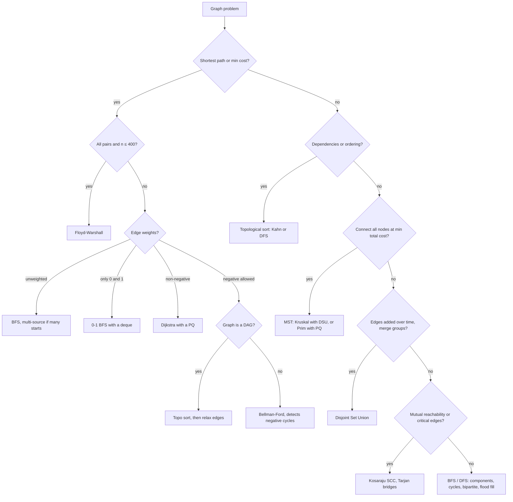

# Graphs

## When to use / signals

- Entities plus pairwise relations: cities and roads, courses and prerequisites, accounts sharing emails, words differing by one letter.
- A 2D grid where you move between cells: an implicit graph (each cell is a node, 4 or 8 neighbours).
- "Shortest", "minimum steps / cost / time": BFS (unit weights) or Dijkstra (weights).
- "Order respecting dependencies", "is it possible to finish": topological sort / cycle detection.
- "Connect everything cheaply": MST. "Are these connected? Merge groups": DSU.
- "Groups that all reach each other", "critical connection": SCC, bridges.

## Templates

### Which graph algorithm?



### Representations

```java
// n nodes 0..n-1, edges[i] = {u, v} or {u, v, w}
List<List<Integer>> adj = new ArrayList<>();
for (int i = 0; i < n; i++) adj.add(new ArrayList<>());
for (int[] e : edges) {
    adj.get(e[0]).add(e[1]);
    adj.get(e[1]).add(e[0]);                  // omit for a directed graph
}

List<List<int[]>> wadj = new ArrayList<>();   // weighted: wadj.get(u) holds {v, w}
for (int i = 0; i < n; i++) wadj.add(new ArrayList<>());
for (int[] e : edges) wadj.get(e[0]).add(new int[]{e[1], e[2]});

int[][] mat = new int[n][n];                  // adjacency matrix: mat[u][v] = w (or 1)
```

| | Adjacency list | Adjacency matrix |
|---|---|---|
| Space | O(V + E) | O(V^2) |
| Is there an edge u-v? | O(deg u) | O(1) |
| Iterate neighbours of u | O(deg u) | O(V) |
| Best for | sparse graphs (almost every problem) | dense graphs, Floyd-Warshall, V up to ~1000 |

### BFS and DFS

```java
int[] bfs(List<List<Integer>> adj, int src) {         // shortest distances in an unweighted graph
    int[] dist = new int[adj.size()];
    Arrays.fill(dist, -1);                             // -1 doubles as "not visited"
    Queue<Integer> q = new ArrayDeque<>();
    dist[src] = 0;
    q.offer(src);
    while (!q.isEmpty()) {
        int u = q.poll();
        for (int v : adj.get(u)) {
            if (dist[v] == -1) {                       // mark when enqueued, not when polled
                dist[v] = dist[u] + 1;
                q.offer(v);
            }
        }
    }
    return dist;
}

void dfs(int u, List<List<Integer>> adj, boolean[] vis) {
    vis[u] = true;
    for (int v : adj.get(u)) if (!vis[v]) dfs(v, adj, vis);
}

int countComponents(int n, List<List<Integer>> adj) {  // also: Number of Provinces
    boolean[] vis = new boolean[n];
    int comps = 0;
    for (int i = 0; i < n; i++)
        if (!vis[i]) { comps++; dfs(i, adj, vis); }    // each new start is a new component
    return comps;
}
```

### Grid BFS / DFS

```java
static final int[][] DIRS = {{1, 0}, {-1, 0}, {0, 1}, {0, -1}};   // add the 4 diagonals for 8-dir

int numIslands(char[][] g) {
    int count = 0;
    for (int r = 0; r < g.length; r++)
        for (int c = 0; c < g[0].length; c++)
            if (g[r][c] == '1') { count++; sink(g, r, c); }
    return count;
}
void sink(char[][] g, int r, int c) {
    if (r < 0 || c < 0 || r >= g.length || c >= g[0].length || g[r][c] != '1') return;
    g[r][c] = '0';                                     // mark visited in place
    for (int[] d : DIRS) sink(g, r + d[0], c + d[1]);
}
// Surrounded Regions / Number of Enclaves: first flood-fill from every border cell, then scan.
```

### Multi-source BFS (rotting oranges)

```java
int orangesRotting(int[][] g) {
    int R = g.length, C = g[0].length, fresh = 0, minutes = 0;
    Queue<int[]> q = new ArrayDeque<>();
    for (int r = 0; r < R; r++)
        for (int c = 0; c < C; c++) {
            if (g[r][c] == 2) q.offer(new int[]{r, c});   // every source starts at time 0
            else if (g[r][c] == 1) fresh++;
        }
    while (!q.isEmpty() && fresh > 0) {
        minutes++;
        for (int i = q.size(); i > 0; i--) {              // one BFS level = one minute
            int[] cur = q.poll();
            for (int[] d : DIRS) {
                int nr = cur[0] + d[0], nc = cur[1] + d[1];
                if (nr < 0 || nc < 0 || nr >= R || nc >= C || g[nr][nc] != 1) continue;
                g[nr][nc] = 2;
                fresh--;
                q.offer(new int[]{nr, nc});
            }
        }
    }
    return fresh == 0 ? minutes : -1;
}
// 01 Matrix / distance to nearest 0: enqueue all 0s first, BFS outwards.
```

### 0-1 BFS

```java
int[] zeroOneBfs(int n, List<List<int[]>> adj, int src) {  // weights are only 0 or 1
    int[] dist = new int[n];
    Arrays.fill(dist, Integer.MAX_VALUE);
    Deque<Integer> dq = new ArrayDeque<>();
    dist[src] = 0;
    dq.offer(src);
    while (!dq.isEmpty()) {
        int u = dq.pollFirst();
        for (int[] e : adj.get(u)) {
            int v = e[0], nd = dist[u] + e[1];
            if (nd < dist[v]) {
                dist[v] = nd;
                if (e[1] == 0) dq.offerFirst(v); else dq.offerLast(v);   // 0-edges jump the queue
            }
        }
    }
    return dist;
}
```

### Cycle detection

```java
// Undirected, BFS: a visited neighbour that is not my parent closes a cycle
boolean hasCycleUndirected(int n, List<List<Integer>> adj) {
    boolean[] vis = new boolean[n];
    for (int s = 0; s < n; s++) {                         // every component
        if (vis[s]) continue;
        Queue<int[]> q = new ArrayDeque<>();              // {node, parent}
        q.offer(new int[]{s, -1});
        vis[s] = true;
        while (!q.isEmpty()) {
            int[] cur = q.poll();
            for (int v : adj.get(cur[0])) {
                if (!vis[v]) { vis[v] = true; q.offer(new int[]{v, cur[0]}); }
                else if (v != cur[1]) return true;
            }
        }
    }
    return false;
}

// Undirected, DFS
boolean dfsCycle(int u, int parent, List<List<Integer>> adj, boolean[] vis) {
    vis[u] = true;
    for (int v : adj.get(u)) {
        if (!vis[v]) { if (dfsCycle(v, u, adj, vis)) return true; }
        else if (v != parent) return true;
    }
    return false;
}

// Directed: state 0 = unvisited, 1 = on the current DFS path, 2 = fully explored
boolean hasCycleDirected(int u, List<List<Integer>> adj, int[] state) {
    state[u] = 1;
    for (int v : adj.get(u)) {
        if (state[v] == 1) return true;                   // back edge into the current path
        if (state[v] == 0 && hasCycleDirected(v, adj, state)) return true;
    }
    state[u] = 2;
    return false;
}
// Eventual Safe States: nodes that end in state 2 without ever reaching a cycle.
// Kahn's algorithm also detects directed cycles: processed count < n.
```

### Bipartite check (2-colouring)

```java
boolean isBipartite(int[][] graph) {                      // graph[u] = neighbours of u
    int n = graph.length;
    int[] color = new int[n];                             // 0 = uncoloured, 1 / -1 = the two sides
    for (int s = 0; s < n; s++) {
        if (color[s] != 0) continue;
        Queue<Integer> q = new ArrayDeque<>();
        q.offer(s);
        color[s] = 1;
        while (!q.isEmpty()) {
            int u = q.poll();
            for (int v : graph[u]) {
                if (color[v] == 0) { color[v] = -color[u]; q.offer(v); }
                else if (color[v] == color[u]) return false;   // an odd cycle
            }
        }
    }
    return true;
}
```

### Topological sort (DAG only)

```java
// DFS: push a node after all its descendants; the stack pops in topological order
void topoDfs(int u, List<List<Integer>> adj, boolean[] vis, Deque<Integer> st) {
    vis[u] = true;
    for (int v : adj.get(u)) if (!vis[v]) topoDfs(v, adj, vis, st);
    st.push(u);
}

// Kahn's BFS: repeatedly take nodes with in-degree 0
int[] topoSortKahn(int n, List<List<Integer>> adj) {
    int[] indeg = new int[n];
    for (int u = 0; u < n; u++) for (int v : adj.get(u)) indeg[v]++;
    Queue<Integer> q = new ArrayDeque<>();
    for (int i = 0; i < n; i++) if (indeg[i] == 0) q.offer(i);
    int[] order = new int[n];
    int idx = 0;
    while (!q.isEmpty()) {
        int u = q.poll();
        order[idx++] = u;
        for (int v : adj.get(u)) if (--indeg[v] == 0) q.offer(v);
    }
    return idx == n ? order : new int[0];                 // fewer than n processed means a cycle
}

int[] findOrder(int numCourses, int[][] prerequisites) {  // Course Schedule II
    List<List<Integer>> adj = new ArrayList<>();
    for (int i = 0; i < numCourses; i++) adj.add(new ArrayList<>());
    for (int[] p : prerequisites) adj.get(p[1]).add(p[0]);   // p[1] must come before p[0]
    return topoSortKahn(numCourses, adj);                    // Course Schedule I: length == numCourses
}
// Alien Dictionary: edge from the first differing character of each pair of adjacent words.
```

### Shortest path in a DAG (works with negative weights)

```java
int[] shortestPathDAG(int n, List<List<int[]>> adj, int src) {   // adj.get(u) holds {v, w}
    int[] indeg = new int[n];
    for (int u = 0; u < n; u++) for (int[] e : adj.get(u)) indeg[e[0]]++;
    Queue<Integer> q = new ArrayDeque<>();
    for (int i = 0; i < n; i++) if (indeg[i] == 0) q.offer(i);
    int[] dist = new int[n];
    Arrays.fill(dist, Integer.MAX_VALUE);
    dist[src] = 0;
    while (!q.isEmpty()) {                                 // relax edges in topological order
        int u = q.poll();
        for (int[] e : adj.get(u)) {
            if (dist[u] != Integer.MAX_VALUE && dist[u] + e[1] < dist[e[0]]) dist[e[0]] = dist[u] + e[1];
            if (--indeg[e[0]] == 0) q.offer(e[0]);
        }
    }
    return dist;
}
```

### Dijkstra (non-negative weights)

```java
int[] dijkstra(int n, List<List<int[]>> adj, int src) {   // adj.get(u) holds {v, w}
    int[] dist = new int[n];
    Arrays.fill(dist, Integer.MAX_VALUE);
    dist[src] = 0;
    PriorityQueue<int[]> pq = new PriorityQueue<>((a, b) -> Integer.compare(a[0], b[0]));  // {dist, node}
    pq.offer(new int[]{0, src});
    while (!pq.isEmpty()) {
        int[] cur = pq.poll();
        int d = cur[0], u = cur[1];
        if (d > dist[u]) continue;                         // stale entry: lazy deletion
        for (int[] e : adj.get(u)) {
            int v = e[0], nd = d + e[1];
            if (nd < dist[v]) {
                dist[v] = nd;                              // parent[v] = u to rebuild the path
                pq.offer(new int[]{nd, v});
            }
        }
    }
    return dist;
}
// Path With Minimum Effort: nd = max(d, |h diff|). Number of Ways to Arrive: count ties (nd == dist[v]).
// Cheapest Flights Within K Stops: BFS by stops (or K+1 Bellman-Ford rounds), not plain Dijkstra.
```

### Bellman-Ford (negative weights, detects negative cycles)

```java
int[] bellmanFord(int n, int[][] edges, int src) {        // edges[i] = {u, v, w}
    int[] dist = new int[n];
    Arrays.fill(dist, Integer.MAX_VALUE);
    dist[src] = 0;
    for (int round = 0; round < n - 1; round++) {         // a shortest path has at most n-1 edges
        boolean changed = false;
        for (int[] e : edges) {
            if (dist[e[0]] != Integer.MAX_VALUE && dist[e[0]] + e[2] < dist[e[1]]) {
                dist[e[1]] = dist[e[0]] + e[2];
                changed = true;
            }
        }
        if (!changed) break;                              // converged early
    }
    for (int[] e : edges)                                 // still relaxing after n-1 rounds
        if (dist[e[0]] != Integer.MAX_VALUE && dist[e[0]] + e[2] < dist[e[1]]) return null;  // negative cycle
    return dist;
}
```

### Floyd-Warshall (all pairs)

```java
static final int INF = (int) 1e9;                         // safe to add two of these

void floydWarshall(int[][] d) {                           // d[i][j] = w or INF, d[i][i] = 0
    int n = d.length;
    for (int k = 0; k < n; k++)                           // k (the allowed intermediate) is OUTERMOST
        for (int i = 0; i < n; i++)
            for (int j = 0; j < n; j++)
                if (d[i][k] < INF && d[k][j] < INF)
                    d[i][j] = Math.min(d[i][j], d[i][k] + d[k][j]);
    // negative cycle exists iff some d[i][i] < 0
}
```

### Minimum spanning tree: Prim and Kruskal

```java
int primMST(int n, List<List<int[]>> adj) {               // undirected, adj.get(u) holds {v, w}
    boolean[] inMST = new boolean[n];
    PriorityQueue<int[]> pq = new PriorityQueue<>((a, b) -> Integer.compare(a[0], b[0]));  // {w, node}
    pq.offer(new int[]{0, 0});
    int total = 0;
    while (!pq.isEmpty()) {
        int[] cur = pq.poll();
        int w = cur[0], u = cur[1];
        if (inMST[u]) continue;                           // already attached more cheaply
        inMST[u] = true;
        total += w;
        for (int[] e : adj.get(u)) if (!inMST[e[0]]) pq.offer(new int[]{e[1], e[0]});
    }
    return total;
}

int kruskalMST(int n, int[][] edges) {                    // edges[i] = {u, v, w}
    Arrays.sort(edges, (a, b) -> Integer.compare(a[2], b[2]));   // cheapest edges first
    DSU dsu = new DSU(n);
    int total = 0, used = 0;
    for (int[] e : edges) {
        if (dsu.union(e[0], e[1])) {                      // skip edges that would close a cycle
            total += e[2];
            if (++used == n - 1) break;
        }
    }
    return total;
}
```

### Disjoint Set Union (Union-Find)

```java
class DSU {
    private final int[] parent, size, rank;
    int components;

    DSU(int n) {
        parent = new int[n];
        size = new int[n];
        rank = new int[n];
        components = n;
        for (int i = 0; i < n; i++) { parent[i] = i; size[i] = 1; }
    }

    int find(int x) {                                     // path compression
        if (parent[x] != x) parent[x] = find(parent[x]);
        return parent[x];
    }

    boolean union(int a, int b) {                         // union by size; false if already joined
        int ra = find(a), rb = find(b);
        if (ra == rb) return false;
        if (size[ra] < size[rb]) { int t = ra; ra = rb; rb = t; }
        parent[rb] = ra;                                  // attach the smaller tree under the bigger
        size[ra] += size[rb];
        components--;
        return true;
    }

    boolean unionByRank(int a, int b) {                   // alternative: rank = upper bound on height
        int ra = find(a), rb = find(b);
        if (ra == rb) return false;
        if (rank[ra] < rank[rb]) { int t = ra; ra = rb; rb = t; }
        parent[rb] = ra;
        if (rank[ra] == rank[rb]) rank[ra]++;             // only equal ranks grow the height
        components--;
        return true;
    }

    boolean connected(int a, int b) { return find(a) == find(b); }
    int sizeOf(int x) { return size[find(x)]; }
}
```

Use one union strategy per DSU instance; size is handier because it also answers "how big is this group".

### DSU applications: Number of Islands II, Accounts Merge

```java
List<Integer> numIslands2(int m, int n, int[][] positions) {
    DSU dsu = new DSU(m * n);
    boolean[] land = new boolean[m * n];
    List<Integer> res = new ArrayList<>();
    int islands = 0;
    for (int[] p : positions) {
        int id = p[0] * n + p[1];                         // flatten (r, c) to r * cols + c
        if (!land[id]) {
            land[id] = true;
            islands++;                                    // new island, then merge with neighbours
            for (int[] d : DIRS) {
                int r = p[0] + d[0], c = p[1] + d[1];
                if (r < 0 || c < 0 || r >= m || c >= n || !land[r * n + c]) continue;
                if (dsu.union(id, r * n + c)) islands--;
            }
        }
        res.add(islands);
    }
    return res;
}

List<List<String>> accountsMerge(List<List<String>> accounts) {
    DSU dsu = new DSU(accounts.size());
    Map<String, Integer> owner = new HashMap<>();         // email -> first account that had it
    for (int i = 0; i < accounts.size(); i++)
        for (int j = 1; j < accounts.get(i).size(); j++) {
            Integer prev = owner.putIfAbsent(accounts.get(i).get(j), i);
            if (prev != null) dsu.union(prev, i);         // shared email means same person
        }
    Map<Integer, TreeSet<String>> groups = new HashMap<>();
    for (Map.Entry<String, Integer> e : owner.entrySet())
        groups.computeIfAbsent(dsu.find(e.getValue()), k -> new TreeSet<>()).add(e.getKey());
    List<List<String>> res = new ArrayList<>();
    for (Map.Entry<Integer, TreeSet<String>> g : groups.entrySet()) {
        List<String> acc = new ArrayList<>();
        acc.add(accounts.get(g.getKey()).get(0));         // name
        acc.addAll(g.getValue());                         // sorted emails
        res.add(acc);
    }
    return res;
}
// Also DSU: Redundant Connection, Most Stones Removed (n - components),
// Operations to Make Network Connected (need extraEdges >= components - 1), Making a Large Island.
```

### Kosaraju: strongly connected components

```java
int kosaraju(int n, List<List<Integer>> adj) {
    boolean[] vis = new boolean[n];
    Deque<Integer> order = new ArrayDeque<>();
    for (int i = 0; i < n; i++) if (!vis[i]) topoDfs(i, adj, vis, order);  // 1) finish order
    List<List<Integer>> rev = new ArrayList<>();                            // 2) transpose
    for (int i = 0; i < n; i++) rev.add(new ArrayList<>());
    for (int u = 0; u < n; u++) for (int v : adj.get(u)) rev.get(v).add(u);
    Arrays.fill(vis, false);
    int scc = 0;
    while (!order.isEmpty()) {                                              // 3) DFS on transpose
        int u = order.pop();                                                //    in finish order
        if (!vis[u]) { scc++; dfs(u, rev, vis); }                           // one tree = one SCC
    }
    return scc;
}
```

### Tarjan: bridges and articulation points (brief)

`tin[u]` = discovery time, `low[u]` = lowest `tin` reachable from u's subtree using at most one back edge.

```java
int timer = 0;
int[] tin, low;                                           // allocate new int[n]; tin 0 = unvisited
List<List<Integer>> bridges = new ArrayList<>();

void bridgeDfs(int u, int parent, List<List<Integer>> adj) {
    tin[u] = low[u] = ++timer;
    for (int v : adj.get(u)) {
        if (v == parent) continue;
        if (tin[v] == 0) {                                // tree edge
            bridgeDfs(v, u, adj);
            low[u] = Math.min(low[u], low[v]);
            if (low[v] > tin[u]) bridges.add(Arrays.asList(u, v));   // v cannot get back above u
        } else low[u] = Math.min(low[u], tin[v]);         // back edge
    }
}
// Articulation point u: non-root with a child v where low[v] >= tin[u], or the DFS root with >= 2 children.
```

## Complexity

| Algorithm | Time | Space | Notes |
|---|---|---|---|
| BFS / DFS / components | O(V + E) | O(V) | grid: O(R * C) |
| Multi-source BFS, 0-1 BFS | O(V + E) | O(V) | |
| Cycle detection, bipartite | O(V + E) | O(V) | |
| Topological sort (Kahn / DFS) | O(V + E) | O(V) | DAG only |
| Shortest path in DAG | O(V + E) | O(V) | negative weights fine |
| Dijkstra (binary heap) | O((V + E) log V) | O(V + E) | no negative edges |
| Bellman-Ford | O(V * E) | O(V) | negative edges, cycle detection |
| Floyd-Warshall | O(V^3) | O(V^2) | all pairs, V up to ~400 |
| Prim (heap) | O(E log V) | O(V + E) | |
| Kruskal | O(E log E) | O(V) | sort + DSU |
| DSU find / union | O(α(n)) amortised (effectively constant) | O(n) | needs both optimisations |
| Kosaraju / Tarjan | O(V + E) | O(V + E) | |

## Pitfalls

- BFS: mark visited when you enqueue, not when you poll, or the same node enters the queue many times.
- Disconnected graphs: loop over every node as a potential start (components, cycle checks, topo sort, bipartite).
- `dist[u] + w` overflows when `dist[u] == Integer.MAX_VALUE`; guard it or use `INF = 1e9` / `long`.
- Dijkstra is wrong with negative edges; always skip stale PQ entries (`d > dist[u]`).
- Directed cycle detection needs the "on current path" state; a plain visited array reports false cycles on diamonds.
- Undirected cycle via `v != parent` fails with parallel edges between the same pair; track the parent edge id instead.
- Floyd-Warshall: `k` must be the outermost loop.
- Topological sort only exists for a DAG; Kahn's count `< n` means there is a cycle.
- Recursive DFS on 10^5 nodes or a 1000 x 1000 grid can overflow the Java stack; use BFS or an explicit stack.
- Grid: check bounds before indexing and flatten cells as `r * cols + c` (use `cols`, not `rows`).
- Prim / Kruskal on a disconnected graph gives a forest; check that `n - 1` edges were used.
- Comparator overflow in PQs: `(a, b) -> a[0] - b[0]`; prefer `Integer.compare`.

## Must-know problems

- BFS and DFS of a graph, Number of Provinces, Connected Components
- Number of Islands, Flood Fill, Number of Enclaves, Surrounded Regions, Number of Distinct Islands
- Rotting Oranges, 01 Matrix, Walls and Gates
- Detect Cycle in Undirected Graph (BFS and DFS), Detect Cycle in Directed Graph
- Is Graph Bipartite?
- Topological Sort (DFS and Kahn), Course Schedule I and II, Find Eventual Safe States, Alien Dictionary
- Shortest Path in Undirected Graph with Unit Weights, Shortest Path in DAG
- Word Ladder I and II
- Dijkstra's Algorithm, Network Delay Time, Path With Minimum Effort, Shortest Path in Binary Matrix
- Cheapest Flights Within K Stops, Minimum Multiplications to Reach End, Number of Ways to Arrive at Destination
- Bellman-Ford, Floyd-Warshall, Find the City With the Smallest Number of Neighbours
- Minimum Spanning Tree (Prim and Kruskal), Min Cost to Connect All Points
- Disjoint Set (union by rank and size), Number of Operations to Make Network Connected
- Accounts Merge, Number of Islands II, Most Stones Removed, Making a Large Island, Redundant Connection
- Kosaraju's Algorithm (SCC)
- Critical Connections in a Network (bridges), Articulation Points
- Clone Graph
