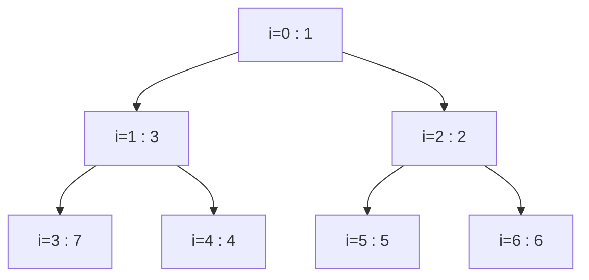

# Heaps / Priority Queue

## When to use / signals

- "K largest / smallest / most frequent / closest": heap of size K.
- "Merge K sorted lists / arrays", "smallest range covering K lists": K-way merge with a min-heap.
- "Median of a stream", "balance two halves": two heaps.
- Repeatedly take the current best (min cost, max count, earliest deadline): greedy + heap (task scheduler, Dijkstra, Prim).
- You need the min or max quickly while inserting, but not full sorted order.

## Templates

### Heap as an array

A binary heap is a complete binary tree stored level by level in an array. Min-heap invariant: every parent is `<=` its children, so the minimum is at index 0.

| Relation | Index (0-based) |
|---|---|
| Parent of `i` | `(i - 1) / 2` |
| Left child of `i` | `2 * i + 1` |
| Right child of `i` | `2 * i + 2` |
| Last non-leaf | `n / 2 - 1` |



Array form: `[1, 3, 2, 7, 4, 5, 6]`.

- **Heapify up (sift up)**: after appending at the end, swap with the parent while smaller. Used by `push`.
- **Heapify down (sift down)**: after moving the last element to the root, swap with the smaller child while bigger. Used by `pop` and build-heap.
- **Build heap in O(n)**: sift down every node from `n / 2 - 1` down to 0 (most nodes are near the bottom and move very little).

### Min-heap from scratch

```java
class MinHeap {
    private int[] a = new int[16];
    private int size = 0;

    void push(int x) {
        if (size == a.length) a = Arrays.copyOf(a, size * 2);
        a[size] = x;
        siftUp(size++);
    }
    int pop() {                                    // remove and return the min
        if (size == 0) throw new NoSuchElementException();
        int top = a[0];
        a[0] = a[--size];                          // move last element to the root
        siftDown(0);
        return top;
    }
    int peek() { return a[0]; }
    int size() { return size; }

    private void siftUp(int i) {
        while (i > 0 && a[(i - 1) / 2] > a[i]) {
            swap(i, (i - 1) / 2);
            i = (i - 1) / 2;
        }
    }
    private void siftDown(int i) {
        while (true) {
            int l = 2 * i + 1, r = l + 1, min = i;
            if (l < size && a[l] < a[min]) min = l;
            if (r < size && a[r] < a[min]) min = r;
            if (min == i) return;                  // heap property holds
            swap(i, min);
            i = min;
        }
    }
    private void swap(int i, int j) { int t = a[i]; a[i] = a[j]; a[j] = t; }
}
```

### PriorityQueue in Java

```java
PriorityQueue<Integer> minHeap = new PriorityQueue<>();
PriorityQueue<Integer> maxHeap = new PriorityQueue<>(Collections.reverseOrder());
PriorityQueue<int[]> byFirst = new PriorityQueue<>((a, b) -> Integer.compare(a[0], b[0]));
PriorityQueue<int[]> byFirstThenSecondDesc = new PriorityQueue<>(
        (a, b) -> a[0] != b[0] ? Integer.compare(a[0], b[0]) : Integer.compare(b[1], a[1]));
PriorityQueue<String> byLength = new PriorityQueue<>(Comparator.comparingInt(String::length));
PriorityQueue<Integer> fromList = new PriorityQueue<>(list);   // O(n) heapify
```

| Method | Cost | Notes |
|---|---|---|
| `offer(x)` / `add(x)` | O(log n) | |
| `poll()` | O(log n) | returns `null` if empty |
| `peek()` | O(1) | returns `null` if empty |
| `remove(obj)` / `contains(obj)` | O(n) | linear scan; prefer lazy deletion |
| iteration / `toString()` | O(n) | NOT in sorted order |

### Top-K pattern (min-heap of size K)

```java
int findKthLargest(int[] nums, int k) {
    PriorityQueue<Integer> pq = new PriorityQueue<>();    // holds the k largest seen so far
    for (int x : nums) {
        pq.offer(x);
        if (pq.size() > k) pq.poll();                     // evict the smallest of them
    }
    return pq.peek();                                     // smallest of the k largest
}

int[] topKFrequent(int[] nums, int k) {
    Map<Integer, Integer> cnt = new HashMap<>();
    for (int x : nums) cnt.merge(x, 1, Integer::sum);
    PriorityQueue<Integer> pq = new PriorityQueue<>((a, b) -> Integer.compare(cnt.get(a), cnt.get(b)));
    for (int key : cnt.keySet()) {
        pq.offer(key);
        if (pq.size() > k) pq.poll();                     // drop the least frequent
    }
    int[] res = new int[k];
    for (int i = k - 1; i >= 0; i--) res[i] = pq.poll();
    return res;
}
// K smallest / K closest points: flip it, use a MAX-heap of size k and evict the largest.
```

### K-way merge

```java
ListNode mergeKLists(ListNode[] lists) {
    PriorityQueue<ListNode> pq = new PriorityQueue<>((a, b) -> Integer.compare(a.val, b.val));
    for (ListNode l : lists) if (l != null) pq.offer(l);  // one head per list
    ListNode dummy = new ListNode(0), tail = dummy;
    while (!pq.isEmpty()) {
        ListNode n = pq.poll();
        tail.next = n;
        tail = n;
        if (n.next != null) pq.offer(n.next);             // next candidate from the same list
    }
    return dummy.next;
}
// Arrays / matrix rows: store {value, listIndex, elementIndex} in the heap instead of nodes.
```

### Two heaps: running median

```java
class MedianFinder {
    private final PriorityQueue<Integer> low = new PriorityQueue<>(Collections.reverseOrder()); // smaller half
    private final PriorityQueue<Integer> high = new PriorityQueue<>();                          // larger half

    public void addNum(int num) {
        low.offer(num);
        high.offer(low.poll());                           // largest of low moves up: keeps low <= high
        if (high.size() > low.size()) low.offer(high.poll());   // keep low.size() >= high.size()
    }
    public double findMedian() {
        return low.size() > high.size() ? low.peek() : (low.peek() + (long) high.peek()) / 2.0;
    }
}
// Sliding window median: same idea plus lazy deletion (a map of values to remove when they surface).
```

### Task scheduler (max-heap + cooldown queue)

```java
int leastInterval(char[] tasks, int n) {
    int[] cnt = new int[26];
    for (char t : tasks) cnt[t - 'A']++;
    PriorityQueue<Integer> pq = new PriorityQueue<>(Collections.reverseOrder());  // remaining counts
    for (int c : cnt) if (c > 0) pq.offer(c);
    Queue<int[]> cooling = new ArrayDeque<>();            // {remaining, time it is available again}
    int time = 0;
    while (!pq.isEmpty() || !cooling.isEmpty()) {
        time++;
        if (!pq.isEmpty()) {
            int left = pq.poll() - 1;                     // run the most frequent available task
            if (left > 0) cooling.offer(new int[]{left, time + n});
        }                                                 // else: CPU idles this tick
        if (!cooling.isEmpty() && cooling.peek()[1] == time) pq.offer(cooling.poll()[0]);
    }
    return time;
}
// O(1) formula: max(tasks.length, (maxCount - 1) * (n + 1) + countOfTasksWithMaxCount)
```

### Heap sort (in place, max-heap)

```java
void heapSort(int[] a) {
    int n = a.length;
    for (int i = n / 2 - 1; i >= 0; i--) siftDown(a, i, n);   // build max-heap in O(n)
    for (int end = n - 1; end > 0; end--) {
        swap(a, 0, end);                                      // current max to its final slot
        siftDown(a, 0, end);                                  // restore heap on a[0..end)
    }
}
void siftDown(int[] a, int i, int n) {
    while (true) {
        int l = 2 * i + 1, r = l + 1, big = i;
        if (l < n && a[l] > a[big]) big = l;
        if (r < n && a[r] > a[big]) big = r;
        if (big == i) return;
        swap(a, i, big);
        i = big;
    }
}
void swap(int[] a, int i, int j) { int t = a[i]; a[i] = a[j]; a[j] = t; }
```

## Complexity

| Operation / pattern | Time | Space |
|---|---|---|
| push / pop | O(log n) | |
| peek | O(1) | |
| Build heap (heapify an array) | O(n) | O(1) in place |
| Remove arbitrary element (`PriorityQueue.remove`) | O(n) | |
| Heap sort | O(n log n), not stable | O(1) |
| Top-K with a size-K heap | O(n log k) | O(k) |
| K-way merge of N total elements | O(N log k) | O(k) |
| Running median: add / find | O(log n) / O(1) | O(n) |
| Task scheduler | O(T log 26) = O(T) for T time slots | O(1) |

## Pitfalls

- `(a, b) -> b - a` overflows for large or negative values; use `Collections.reverseOrder()` or `Integer.compare(b, a)`.
- Iterating or printing a `PriorityQueue` does not give sorted order; poll repeatedly.
- Mutating a field of an object already in the heap breaks the invariant; remove it, change it, re-insert (or push a new entry and skip stale ones on poll).
- Top-K: "K largest" needs a MIN-heap (to evict small ones); "K smallest" needs a MAX-heap.
- Median: `(low.peek() + high.peek()) / 2` overflows `int` and truncates; widen to `long` and divide by `2.0`.
- Comparing boxed `Integer` peeks with `==` compares references.
- `PriorityQueue` is not thread-safe and allows duplicates; use `TreeSet` / `TreeMap` if you need ordered unique keys with O(log n) removal.

## Must-know problems

- Implement a Min-Heap / Max-Heap
- Check if an array represents a min-heap
- Convert Min-Heap to Max-Heap
- Kth Largest Element in an Array
- Kth Largest Element in a Stream
- Top K Frequent Elements, Top K Frequent Words
- K Closest Points to Origin
- Merge K Sorted Lists / Arrays
- Kth Smallest Element in a Sorted Matrix
- Find Median from Data Stream
- Sliding Window Median
- Task Scheduler
- Hand of Straights
- Reorganize String
- Maximum Sum Combinations
- Minimum Cost to Connect Sticks / Ropes
- Heap Sort
