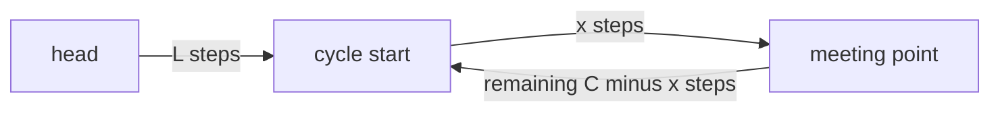

# Linked List

## When to use / signals

- Input is a `ListNode head`: think pointer rewiring, not indices.
- "Middle", "cycle", "kth from the end", "palindrome list": **fast / slow pointers**.
- The head might change (insert / delete / merge / partition): **dummy node**.
- "Reverse" a whole list, a sublist, or k-groups: **prev / cur / next rewiring**.
- "Merge", "sort" a list: **merge two sorted lists**, merge sort (no random access, so no quick sort).
- O(1) insert / delete at a known node, or LRU-style ordering: **doubly linked list + hash map**.

## Templates

### Node class and traversal

```java
class ListNode {
    int val;
    ListNode next;
    ListNode(int val) { this.val = val; }
    ListNode(int val, ListNode next) { this.val = val; this.next = next; }
}

int length(ListNode head) {
    int n = 0;
    for (ListNode cur = head; cur != null; cur = cur.next) n++;
    return n;
}

ListNode fromArray(int[] a) {                     // handy for testing
    ListNode dummy = new ListNode(0), tail = dummy;
    for (int x : a) { tail.next = new ListNode(x); tail = tail.next; }
    return dummy.next;
}
```

### Insert and delete with a dummy node

A dummy (sentinel) node before the head means the head is never a special case: every real node has a predecessor. Return `dummy.next`.

```java
ListNode insertAt(ListNode head, int pos, int val) {      // 0-based; pos 0 = new head
    ListNode dummy = new ListNode(0, head), prev = dummy;
    for (int i = 0; i < pos && prev.next != null; i++) prev = prev.next;
    prev.next = new ListNode(val, prev.next);
    return dummy.next;
}

ListNode deleteValue(ListNode head, int val) {            // delete ALL nodes with this value
    ListNode dummy = new ListNode(0, head), prev = dummy;
    while (prev.next != null) {
        if (prev.next.val == val) prev.next = prev.next.next;   // unlink, stay on prev
        else prev = prev.next;
    }
    return dummy.next;
}

void deleteNode(ListNode node) {                  // only the node is given (not the tail)
    node.val = node.next.val;                     // copy the successor, then skip it
    node.next = node.next.next;
}
```

### Reverse (iterative and recursive)

```java
public ListNode reverseList(ListNode head) {
    ListNode prev = null, cur = head;
    while (cur != null) {
        ListNode next = cur.next;                 // 1. save the rest
        cur.next = prev;                          // 2. flip the link
        prev = cur;                               // 3. advance both
        cur = next;
    }
    return prev;                                  // new head
}

public ListNode reverseRec(ListNode head) {
    if (head == null || head.next == null) return head;
    ListNode newHead = reverseRec(head.next);     // reverse the rest
    head.next.next = head;                        // the old next now points back to head
    head.next = null;                             // head becomes the tail
    return newHead;
}
```

### Fast / slow pointers: middle

```java
public ListNode middleNode(ListNode head) {
    ListNode slow = head, fast = head;
    while (fast != null && fast.next != null) {   // check fast first, then fast.next
        slow = slow.next;
        fast = fast.next.next;
    }
    return slow;                                  // second middle for even length
}
// First middle (needed to split for merge sort): start with fast = head.next.
```

### Cycle detection (Floyd) and cycle start



When they meet, slow walked `L + x` and fast walked `2(L + x)`. The extra `L + x` is a whole number of laps, so `L + x = kC`, i.e. `L = kC - x`. A pointer from the head and a pointer from the meeting point, both moving 1 step, meet exactly at the cycle start.

```java
public boolean hasCycle(ListNode head) {
    ListNode slow = head, fast = head;
    while (fast != null && fast.next != null) {
        slow = slow.next;
        fast = fast.next.next;
        if (slow == fast) return true;            // compare nodes (identity), not values
    }
    return false;
}

public ListNode detectCycle(ListNode head) {
    ListNode slow = head, fast = head;
    while (fast != null && fast.next != null) {
        slow = slow.next;
        fast = fast.next.next;
        if (slow == fast) {                       // phase 2: restart one pointer from head
            ListNode p = head;
            while (p != slow) { p = p.next; slow = slow.next; }
            return p;
        }
    }
    return null;
}
// Cycle length: from the meeting point, walk until you return to it, counting steps.
```

### Merge two sorted lists

```java
public ListNode mergeTwoLists(ListNode a, ListNode b) {
    ListNode dummy = new ListNode(0), tail = dummy;
    while (a != null && b != null) {
        if (a.val <= b.val) { tail.next = a; a = a.next; }
        else { tail.next = b; b = b.next; }
        tail = tail.next;
    }
    tail.next = (a != null) ? a : b;              // attach the leftover
    return dummy.next;
}
```

### Remove nth node from end (gap of n)

```java
public ListNode removeNthFromEnd(ListNode head, int n) {
    ListNode dummy = new ListNode(0, head), fast = dummy, slow = dummy;
    for (int i = 0; i <= n; i++) fast = fast.next;   // n + 1 steps ahead
    while (fast != null) { fast = fast.next; slow = slow.next; }
    slow.next = slow.next.next;                      // slow stops just before the target
    return dummy.next;                               // handles removing the head
}
```

### Intersection of two lists

```java
public ListNode getIntersectionNode(ListNode a, ListNode b) {
    ListNode p = a, q = b;
    while (p != q) {                              // both walk lenA + lenB steps, then align
        p = (p == null) ? b : p.next;
        q = (q == null) ? a : q.next;
    }
    return p;                                     // the intersection, or null if none
}
```

### Merge sort on a linked list

```java
public ListNode sortList(ListNode head) {
    if (head == null || head.next == null) return head;
    ListNode slow = head, fast = head.next;       // first middle so both halves shrink
    while (fast != null && fast.next != null) { slow = slow.next; fast = fast.next.next; }
    ListNode right = slow.next;
    slow.next = null;                             // cut into two lists
    return mergeTwoLists(sortList(head), sortList(right));
}
```

### Palindrome list (middle + reverse second half)

```java
public boolean isPalindrome(ListNode head) {
    ListNode slow = head, fast = head;
    while (fast != null && fast.next != null) { slow = slow.next; fast = fast.next.next; }
    for (ListNode p = head, q = reverseList(slow); q != null; p = p.next, q = q.next)
        if (p.val != q.val) return false;         // restore with reverseList again if required
    return true;
}
```

### Doubly linked list basics

```java
class DNode {
    int val;
    DNode prev, next;
    DNode(int val) { this.val = val; }
}

void insertAfter(DNode node, DNode x) {           // node <-> x <-> old next
    x.prev = node;
    x.next = node.next;
    if (node.next != null) node.next.prev = x;
    node.next = x;
}

void unlink(DNode node) {                         // O(1) given the node itself
    if (node.prev != null) node.prev.next = node.next;
    if (node.next != null) node.next.prev = node.prev;
    node.prev = node.next = null;
}

DNode reverse(DNode head) {                       // swap prev and next in every node
    DNode cur = head, last = null;
    while (cur != null) {
        DNode t = cur.prev; cur.prev = cur.next; cur.next = t;
        last = cur;
        cur = cur.prev;                           // the old next
    }
    return last;
}
// LRU cache: HashMap<key, DNode> + DLL with sentinel head and tail, so unlink never sees null.
```

## Complexity

| Operation / problem | Time | Extra space |
|---|---|---|
| Traverse, length, search | O(n) | O(1) |
| Insert / delete at head | O(1) | O(1) |
| Insert / delete at position k | O(k) | O(1) |
| Delete a known DLL node | O(1) | O(1) |
| Reverse (iterative / recursive) | O(n) | O(1) / O(n) stack |
| Middle, cycle detection, cycle start | O(n) | O(1) |
| Merge two sorted lists | O(m + n) | O(1) |
| Remove nth from end (one pass) | O(n) | O(1) |
| Intersection | O(m + n) | O(1) |
| Merge sort on a list | O(n log n) | O(log n) stack |
| Palindrome list | O(n) | O(1) |

## Pitfalls

- Save `cur.next` before overwriting it, or the rest of the list is lost.
- Loop condition `fast != null && fast.next != null`, in that order, or you get `NullPointerException`.
- Return the new head (`prev`, `dummy.next`), not the old `head`.
- After splitting or reordering, set the new tail's `next = null`, otherwise you create a cycle.
- Compare nodes with `==` (identity) for cycles and intersections, not by value.
- Recursive solutions use O(n) stack; around 1e4–1e5 nodes Java may throw `StackOverflowError`.
- Remove nth from end: the gap is n + 1 when starting from the dummy, so `slow` lands before the target.
- Doubly linked list: every insert / delete updates both `prev` and `next` links on both neighbours.
- Deleting a node given only that node is impossible for the tail.

## Must-know problems

- Insert / Delete / Search in a Linked List
- Length of a Linked List
- Doubly Linked List: Insert, Delete, Reverse
- Middle of the Linked List
- Reverse Linked List (iterative and recursive)
- Linked List Cycle I and II
- Length of Loop in a Linked List
- Palindrome Linked List
- Odd Even Linked List
- Remove Nth Node From End of List
- Delete the Middle Node of a Linked List
- Sort List
- Sort a Linked List of 0s, 1s and 2s
- Intersection of Two Linked Lists
- Add 1 to a Number Represented as a Linked List
- Add Two Numbers
- Merge Two Sorted Lists
- Delete All Occurrences of a Key in a DLL
- Find Pairs with Given Sum in a Sorted DLL
- Remove Duplicates from a Sorted DLL
- Reverse Nodes in k-Group
- Rotate List
- Flattening a Linked List
- Copy List with Random Pointer
- Merge k Sorted Lists
- LRU Cache
