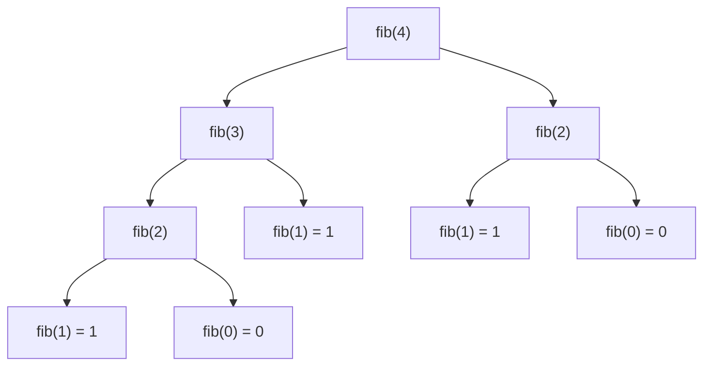
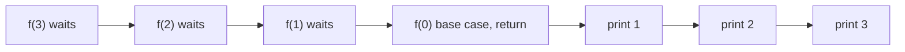

# Basic Recursion

## When to use / signals

- The problem is defined in terms of a smaller copy of itself: `f(n)` uses `f(n - 1)` or `f(n / 2)`.
- Structures that nest: trees, linked lists, nested lists, divide and conquer (merge sort, quick sort).
- "Do something for 1..N" without loops (classic practice), or "check from both ends" (palindrome, reverse).
- It is the foundation for backtracking (pick / not pick) and DP (memoise the recursion).

## Templates

### Anatomy of a recursive function

```java
ReturnType solve(State s) {
    if (isBaseCase(s)) return baseValue;     // 1. base case: smallest input, stops the recursion
    // 2. recursive case: trust that solve() works on a SMALLER input
    ReturnType sub = solve(smaller(s));
    return combine(s, sub);                  // 3. build this answer from the sub-answer
}
```

Checklist: (1) the base case exists and is reachable, (2) every call moves toward it, (3) you combine correctly.

### The call stack and the recursion tree

Every call pushes a stack frame (parameters + locals). Code **before** the recursive call runs on the way down, code **after** it runs on the way back up (backtracking). Max stack depth = space complexity.

Recursion tree for `fib(4)` (repeated subtrees are why naive fib is exponential):



Call stack for `print1ToN(3)` written as "recurse first, print after":



### Parameterised vs functional recursion

```java
// Parameterised: carry the partial answer DOWN as an argument, act at the base case
void sumParam(int i, int acc) {
    if (i < 1) { System.out.println(acc); return; }
    sumParam(i - 1, acc + i);
}

// Functional: RETURN the answer UP and combine on the way back
int sumFunc(int n) {
    if (n == 0) return 0;
    return n + sumFunc(n - 1);
}
```

Use parameterised when you just need to print / collect; use functional when the caller needs the value (the form DP memoises).

### Print N times, 1..N, N..1

```java
void printName(int i, int n) {
    if (i > n) return;
    System.out.println("Shubham");
    printName(i + 1, n);
}

void print1ToN(int i, int n) {        // call print1ToN(1, n)
    if (i > n) return;
    System.out.println(i);            // work before the call: runs top-down
    print1ToN(i + 1, n);
}

void print1ToNBacktrack(int n) {      // no extra parameter
    if (n == 0) return;
    print1ToNBacktrack(n - 1);
    System.out.println(n);            // work after the call: runs bottom-up
}

void printNTo1(int n) {
    if (n == 0) return;
    System.out.println(n);
    printNTo1(n - 1);
}
```

### Factorial

```java
long factorial(int n) {
    if (n <= 1) return 1;             // 0! = 1! = 1
    return n * factorial(n - 1);      // long holds up to 20!
}
```

### Reverse an array

```java
void reverse(int[] a, int l, int r) { // two pointers: call reverse(a, 0, a.length - 1)
    if (l >= r) return;
    int t = a[l]; a[l] = a[r]; a[r] = t;
    reverse(a, l + 1, r - 1);
}

void reverseOnePointer(int[] a, int i) {   // mirror index is n - 1 - i
    int n = a.length;
    if (i >= n / 2) return;
    int t = a[i]; a[i] = a[n - 1 - i]; a[n - 1 - i] = t;
    reverseOnePointer(a, i + 1);
}
```

### Palindrome string

```java
boolean isPalindrome(String s, int i) {    // call isPalindrome(s, 0)
    int n = s.length();
    if (i >= n / 2) return true;
    if (s.charAt(i) != s.charAt(n - 1 - i)) return false;
    return isPalindrome(s, i + 1);         // pass an index, not s.substring(...)
}
```

### Fibonacci (multiple recursive calls)

```java
int fib(int n) {                           // naive: O(2^n)
    if (n <= 1) return n;
    return fib(n - 1) + fib(n - 2);
}

int fibMemo(int n, int[] memo) {           // memo filled with -1: O(n), preview of DP
    if (n <= 1) return n;
    if (memo[n] != -1) return memo[n];
    return memo[n] = fibMemo(n - 1, memo) + fibMemo(n - 2, memo);
}
```

### Analysing time and space

- **Time** = (number of calls) × (work done inside one call, excluding the recursive calls).
- **Space** = maximum depth of the call stack × frame size (plus any extra data you allocate).
- One call per level, depth n: O(n) time, O(n) space. Two calls per level, depth n: up to O(2ⁿ) calls but still O(n) depth.

## Complexity

| Problem | Time | Stack space |
|---|---|---|
| Print N times / 1..N / N..1 | O(n) | O(n) |
| Sum of first N, factorial | O(n) | O(n) |
| Reverse array (two pointers) | O(n) | O(n / 2) |
| Palindrome string (index based) | O(n) | O(n / 2) |
| Palindrome with `substring` each call | O(n²) | O(n²) with copies |
| Fibonacci naive | O(2ⁿ) (tighter: O(1.618ⁿ)) | O(n) |
| Fibonacci memoised | O(n) | O(n) |
| Power `x^n` halving n | O(log n) | O(log n) |

## Pitfalls

- Missing or unreachable base case gives `StackOverflowError`.
- The recursive call must shrink the problem (`i + 1`, `n - 1`, `n / 2`), otherwise infinite recursion.
- Java's default stack handles roughly 1e4–1e5 frames; recursion depth of 1e6 will overflow. Convert to a loop if needed.
- `int` factorial overflows after 12!, `long` after 20!. Use `BigInteger` or a modulus beyond that.
- In a functional recursion, forgetting `return` before the recursive call silently drops the answer.
- `s.substring()` copies the string in every call; pass indices instead.
- Shared mutable state (a static list, a global counter) must be reset between test cases.

## Must-know problems

- Print Name N Times
- Print 1 to N
- Print N to 1
- Sum of First N Natural Numbers
- Factorial of N
- Reverse an Array
- Check if a String is a Palindrome
- Fibonacci Number
- Sum of Digits (recursive)
- Pow(x, n)
- Count Good Numbers
- Sort a Stack Using Recursion
- Reverse a Stack Using Recursion
