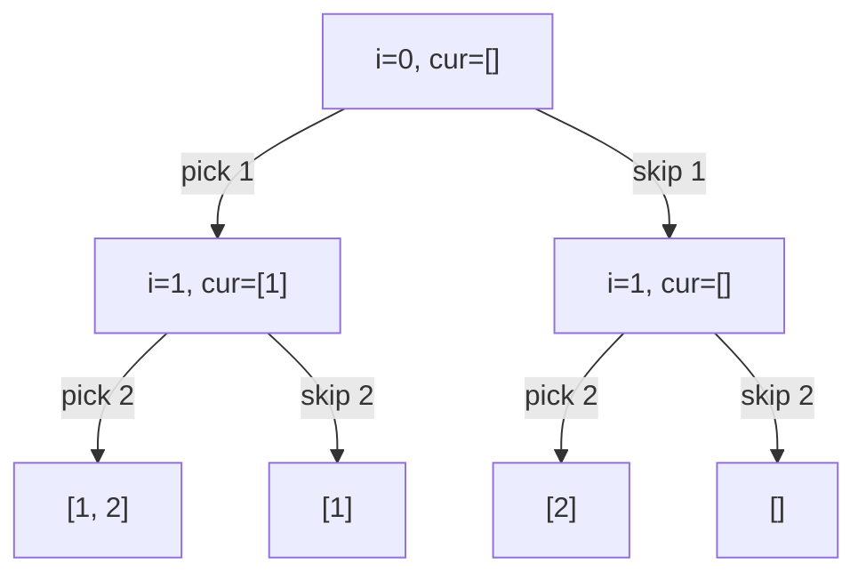

# Recursion & Backtracking

## When to use / signals

- "Generate / print / return **all**" subsets, subsequences, combinations, permutations, partitions, paths.
- "Count the ways" or "does any way exist" with small n (n ≤ 15–20): pick / not pick, often memoised into DP later.
- Constraint satisfaction: N-Queens, sudoku, graph colouring. Place, check, recurse, undo.
- Grid exploration where a path cannot reuse cells: word search, rat in a maze.
- Output size itself is exponential (2ⁿ subsets, n! permutations), so no polynomial algorithm exists.

## Templates

### The backtracking skeleton

```java
void backtrack(State state, List<Result> res) {
    if (isComplete(state)) { res.add(copyOf(state)); return; }   // record a COPY
    for (Choice c : choices(state)) {
        if (!isValid(state, c)) continue;                        // prune early
        apply(state, c);                                         // choose
        backtrack(state, res);                                   // explore
        undo(state, c);                                          // un-choose
    }
}
```

### Pick / not pick (subsequences, subsets)

At every index, branch twice: take `a[i]` or skip it. Depth n, 2ⁿ leaves.



```java
void subsequences(int i, int[] a, List<Integer> cur, List<List<Integer>> res) {
    if (i == a.length) { res.add(new ArrayList<>(cur)); return; }
    cur.add(a[i]);                                   // pick a[i]
    subsequences(i + 1, a, cur, res);
    cur.remove(cur.size() - 1);                      // undo the pick
    subsequences(i + 1, a, cur, res);                // not pick a[i]
}

int countWithSum(int i, int[] a, int remaining) {    // count subsequences with sum k
    if (i == a.length) return remaining == 0 ? 1 : 0;
    return countWithSum(i + 1, a, remaining - a[i]) + countWithSum(i + 1, a, remaining);
}

boolean existsWithSum(int i, int[] a, int remaining) {   // stop at the first hit
    if (i == a.length) return remaining == 0;
    return existsWithSum(i + 1, a, remaining - a[i]) || existsWithSum(i + 1, a, remaining);
}
```

### Loop-style subsets and handling duplicates (sort + skip)

```java
// Call after Arrays.sort(a). Every node of the tree is a subset.
void subsetsWithDup(int start, int[] a, List<Integer> cur, List<List<Integer>> res) {
    res.add(new ArrayList<>(cur));
    for (int i = start; i < a.length; i++) {
        if (i > start && a[i] == a[i - 1]) continue;   // same value at the same level = same subtree
        cur.add(a[i]);
        subsetsWithDup(i + 1, a, cur, res);
        cur.remove(cur.size() - 1);
    }
}
```

### Combination sum: reuse vs no reuse

```java
// I: unlimited reuse. Recurse with i (stay on the same element). Sort first so "break" prunes.
void combSum(int start, int[] c, int target, List<Integer> cur, List<List<Integer>> res) {
    if (target == 0) { res.add(new ArrayList<>(cur)); return; }
    for (int i = start; i < c.length; i++) {
        if (c[i] > target) break;
        cur.add(c[i]);
        combSum(i, c, target - c[i], cur, res);         // i: may pick c[i] again
        cur.remove(cur.size() - 1);
    }
}

// II: each element at most once, input has duplicates. Recurse with i + 1 and skip duplicates.
void combSum2(int start, int[] c, int target, List<Integer> cur, List<List<Integer>> res) {
    if (target == 0) { res.add(new ArrayList<>(cur)); return; }
    for (int i = start; i < c.length; i++) {
        if (i > start && c[i] == c[i - 1]) continue;
        if (c[i] > target) break;
        cur.add(c[i]);
        combSum2(i + 1, c, target - c[i], cur, res);    // i + 1: move past c[i]
        cur.remove(cur.size() - 1);
    }
}
```

### Permutations: visited[] vs swap

```java
void permute(int[] a, boolean[] used, List<Integer> cur, List<List<Integer>> res) {
    if (cur.size() == a.length) { res.add(new ArrayList<>(cur)); return; }
    for (int i = 0; i < a.length; i++) {
        if (used[i]) continue;
        // Duplicates (a sorted): if (i > 0 && a[i] == a[i - 1] && !used[i - 1]) continue;
        used[i] = true; cur.add(a[i]);
        permute(a, used, cur, res);
        cur.remove(cur.size() - 1); used[i] = false;
    }
}

void permuteSwap(int idx, int[] a, List<List<Integer>> res) {   // O(1) extra besides output
    if (idx == a.length) {
        List<Integer> p = new ArrayList<>();
        for (int x : a) p.add(x);
        res.add(p);
        return;
    }
    for (int i = idx; i < a.length; i++) {
        swap(a, idx, i);                                  // fix a[i] at position idx
        permuteSwap(idx + 1, a, res);
        swap(a, idx, i);                                  // restore the order
    }
}

static void swap(int[] a, int i, int j) { int t = a[i]; a[i] = a[j]; a[j] = t; }
```

### N-Queens (one queen per row, O(1) safety check)

```java
public List<List<String>> solveNQueens(int n) {
    char[][] b = new char[n][n];
    for (char[] row : b) Arrays.fill(row, '.');
    List<List<String>> res = new ArrayList<>();
    place(0, b, new boolean[n], new boolean[2 * n - 1], new boolean[2 * n - 1], res);
    return res;
}

private void place(int r, char[][] b, boolean[] col, boolean[] diag, boolean[] anti,
                   List<List<String>> res) {
    int n = b.length;
    if (r == n) {
        List<String> board = new ArrayList<>();
        for (char[] row : b) board.add(new String(row));
        res.add(board);
        return;
    }
    for (int c = 0; c < n; c++) {
        int d = r - c + n - 1, a = r + c;                 // ids of the "\" and "/" diagonals
        if (col[c] || diag[d] || anti[a]) continue;
        col[c] = diag[d] = anti[a] = true; b[r][c] = 'Q';
        place(r + 1, b, col, diag, anti, res);
        col[c] = diag[d] = anti[a] = false; b[r][c] = '.';
    }
}
```

### Sudoku solver (return boolean to stop at the first solution)

```java
public void solveSudoku(char[][] b) { solve(b); }

private boolean solve(char[][] b) {
    for (int r = 0; r < 9; r++)
        for (int c = 0; c < 9; c++) {
            if (b[r][c] != '.') continue;
            for (char d = '1'; d <= '9'; d++) {
                if (!canPlace(b, r, c, d)) continue;
                b[r][c] = d;
                if (solve(b)) return true;
                b[r][c] = '.';                            // undo, try the next digit
            }
            return false;                                 // nothing fits this empty cell
        }
    return true;                                          // no empty cells left
}

private boolean canPlace(char[][] b, int r, int c, char d) {
    for (int i = 0; i < 9; i++) {
        if (b[r][i] == d || b[i][c] == d) return false;                       // row, column
        if (b[3 * (r / 3) + i / 3][3 * (c / 3) + i % 3] == d) return false;   // 3 x 3 box
    }
    return true;
}
```

### Grid backtracking: word search and rat in a maze

```java
public boolean exist(char[][] g, String word) {
    for (int r = 0; r < g.length; r++)
        for (int c = 0; c < g[0].length; c++)
            if (dfs(g, word, 0, r, c)) return true;
    return false;
}

private boolean dfs(char[][] g, String w, int k, int r, int c) {
    if (k == w.length()) return true;                     // matched every character
    if (r < 0 || c < 0 || r >= g.length || c >= g[0].length || g[r][c] != w.charAt(k)) return false;
    char saved = g[r][c];
    g[r][c] = '#';                                        // mark visited in place
    boolean found = dfs(g, w, k + 1, r + 1, c) || dfs(g, w, k + 1, r - 1, c)
                 || dfs(g, w, k + 1, r, c + 1) || dfs(g, w, k + 1, r, c - 1);
    g[r][c] = saved;                                      // unmark
    return found;
}

// Rat in a maze: all paths from (0,0) to (n-1,n-1) through 1-cells, moves in order D L R U
private static final int[] DR = {1, 0, 0, -1}, DC = {0, -1, 1, 0};
private static final char[] DIR = {'D', 'L', 'R', 'U'};

void ratPaths(int[][] m, int r, int c, boolean[][] vis, StringBuilder path, List<String> res) {
    int n = m.length;
    if (r == n - 1 && c == n - 1) { res.add(path.toString()); return; }
    vis[r][c] = true;
    for (int k = 0; k < 4; k++) {
        int nr = r + DR[k], nc = c + DC[k];
        if (nr < 0 || nc < 0 || nr >= n || nc >= n || m[nr][nc] == 0 || vis[nr][nc]) continue;
        path.append(DIR[k]);
        ratPaths(m, nr, nc, vis, path, res);
        path.deleteCharAt(path.length() - 1);
    }
    vis[r][c] = false;                                    // other paths may use this cell
}
// Start only if m[0][0] == 1.
```

### Palindrome partitioning

```java
void partition(int start, String s, List<String> cur, List<List<String>> res) {
    if (start == s.length()) { res.add(new ArrayList<>(cur)); return; }
    for (int end = start; end < s.length(); end++) {
        if (!isPal(s, start, end)) continue;              // only cut after a palindromic prefix
        cur.add(s.substring(start, end + 1));
        partition(end + 1, s, cur, res);
        cur.remove(cur.size() - 1);
    }
}

private boolean isPal(String s, int l, int r) {
    while (l < r) if (s.charAt(l++) != s.charAt(r--)) return false;
    return true;
}
```

## Complexity

Rule: time ≈ (number of nodes in the recursion tree) × (work per node, including copying results). With branching factor b and depth d there are O(bᵈ) nodes. Space = recursion depth + the current path (output not counted).

| Problem | Time | Aux space |
|---|---|---|
| Subsequences / subsets (pick / not pick) | O(2ⁿ · n) | O(n) |
| Count / exists subsequence with sum k | O(2ⁿ) | O(n) |
| Subsets II (sorted, skip duplicates) | O(2ⁿ · n) | O(n) |
| Combination sum I (t = target / min value) | O(2ᵗ · k) roughly | O(t) |
| Combination sum II | O(2ⁿ · n) | O(n) |
| Permutations (visited or swap) | O(n! · n) | O(n) |
| N-Queens | O(n!) | O(n) |
| Sudoku (m empty cells) | O(9ᵐ) worst, heavily pruned | O(m) |
| Word search (R × C grid, word length L) | O(R · C · 3ᴸ) | O(L) |
| Rat in a maze | O(3^(n²)) loose bound | O(n²) |
| Palindrome partitioning | O(2ⁿ · n) | O(n) |

## Pitfalls

- `res.add(cur)` stores a reference that later becomes empty; always add `new ArrayList<>(cur)`.
- Every choice must be undone after the recursive call returns (remove from list, unmark visited, restore cell).
- `List<Integer>.remove(int)` removes by index. `cur.remove(cur.size() - 1)` is right; `cur.remove(x)` with an `int x` is a bug.
- Duplicate skipping needs a sorted input and `i > start` (same level), not `i > 0` (would also skip across levels).
- Permutations II: skip `a[i]` when `a[i] == a[i - 1] && !used[i - 1]`.
- `break` on `c[i] > target` is only valid after sorting.
- Word search: check `k == w.length()` before the bounds check, or a match ending at the border is missed.
- Rat in a maze: unmark `vis` on the way back, otherwise valid alternative paths are blocked.
- Return `boolean` and stop early when only one solution is needed (sudoku, exists-with-sum).
- Deep recursion over 1e4 levels risks `StackOverflowError` in Java.

## Must-know problems

- Generate Parentheses
- Generate Binary Strings Without Consecutive 1s
- Power Set / Print All Subsequences
- Subsets
- Subsets II
- Subset Sums
- Count Subsequences with Sum K
- Check if There Exists a Subsequence with Sum K
- Combination Sum
- Combination Sum II
- Combination Sum III
- Letter Combinations of a Phone Number
- Permutations
- Permutations II
- Permutation Sequence
- Palindrome Partitioning
- Word Search
- N-Queens
- Sudoku Solver
- Rat in a Maze
- M-Coloring Problem
- Word Break II
- Expression Add Operators
