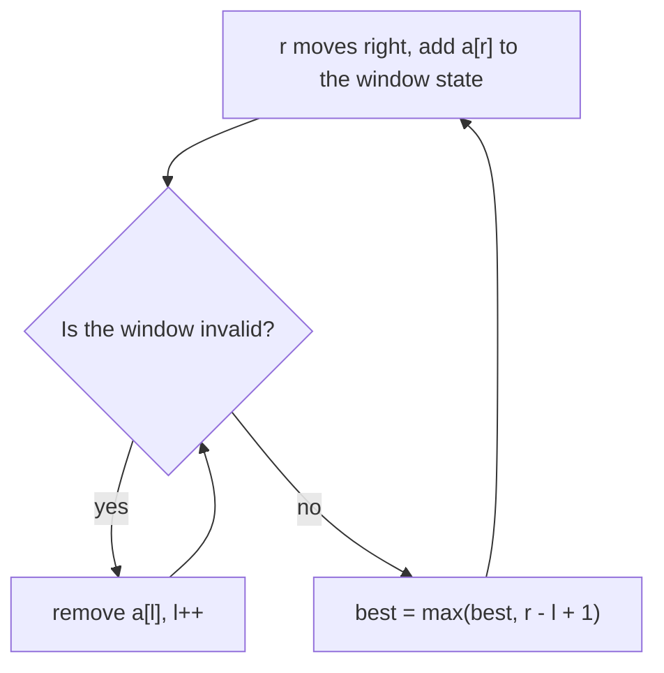

# Sliding Window

## When to use / signals

- The answer is about a **contiguous** subarray or substring.
- "Maximum / minimum / average of every window of size k": **fixed window**.
- "Longest / shortest subarray (substring) such that ...": **variable window**.
- "Count subarrays with exactly K ...": **atMost(K) - atMost(K - 1)**.
- The condition is monotonic: growing the window can only make it "more invalid", shrinking can only fix it. For sums this needs non-negative numbers; with negatives use prefix sum + hash map.
- Brute force is O(n²) over all (start, end) pairs; the window makes it O(n) because each pointer only moves forward.

## Templates

### Fixed-size window

```java
int maxSumOfK(int[] a, int k) {
    int sum = 0, best = Integer.MIN_VALUE;
    for (int r = 0; r < a.length; r++) {
        sum += a[r];                                  // element entering
        if (r >= k) sum -= a[r - k];                  // element leaving
        if (r >= k - 1) best = Math.max(best, sum);   // window [r - k + 1, r] is full
    }
    return best;
}
```

### Variable window: longest valid window



```java
int longestValid(int[] a) {
    int l = 0, best = 0;
    // window state: a sum, a count, a frequency array / map ...
    for (int r = 0; r < a.length; r++) {
        add(a[r]);                                    // 1. expand right
        while (invalid()) remove(a[l++]);             // 2. shrink left until valid again
        best = Math.max(best, r - l + 1);             // 3. window [l, r] is valid
    }
    return best;
}
```

### Variable window: shortest valid window

```java
int shortestValid(int[] a) {
    int l = 0, best = Integer.MAX_VALUE;
    for (int r = 0; r < a.length; r++) {
        add(a[r]);
        while (valid()) {                             // record BEFORE shrinking
            best = Math.min(best, r - l + 1);
            remove(a[l++]);
        }
    }
    return best == Integer.MAX_VALUE ? 0 : best;
}
```

Longest-window optimisation: replace `while (invalid())` with `if (invalid())`. The window never shrinks, it only slides, and its size is the best answer so far (useful in "Longest Repeating Character Replacement").

### The "at most K" trick (count exactly K)

Windows with "exactly K" are not monotonic, but "at most K" is. For every `r`, all windows `[l..r], [l+1..r], ..., [r..r]` are valid, so add `r - l + 1`.

```java
public int subarraysWithKDistinct(int[] a, int k) {
    return atMost(a, k) - atMost(a, k - 1);           // exactly K = atMost(K) - atMost(K - 1)
}

private int atMost(int[] a, int k) {
    if (k < 0) return 0;
    Map<Integer, Integer> freq = new HashMap<>();
    int l = 0, count = 0;
    for (int r = 0; r < a.length; r++) {
        freq.merge(a[r], 1, Integer::sum);
        while (freq.size() > k) {
            if (freq.merge(a[l], -1, Integer::sum) == 0) freq.remove(a[l]);
            l++;
        }
        count += r - l + 1;                           // subarrays ending at r
    }
    return count;
}
// Same trick: Binary Subarrays With Sum (goal), Count Number of Nice Subarrays (k odd numbers).
```

### Longest substring without repeating characters

```java
public int lengthOfLongestSubstring(String s) {
    int[] last = new int[256];                        // last index + 1 where each char was seen
    int l = 0, best = 0;
    for (int r = 0; r < s.length(); r++) {
        char c = s.charAt(r);
        l = Math.max(l, last[c]);                     // jump past the previous copy of c
        last[c] = r + 1;
        best = Math.max(best, r - l + 1);
    }
    return best;
}
```

### Max consecutive ones III (flip at most k zeros)

```java
public int longestOnes(int[] a, int k) {
    int l = 0, zeros = 0, best = 0;
    for (int r = 0; r < a.length; r++) {
        if (a[r] == 0) zeros++;
        while (zeros > k) if (a[l++] == 0) zeros--;   // invalid: too many zeros
        best = Math.max(best, r - l + 1);
    }
    return best;
}
```

### Fruit into baskets (longest window with at most 2 distinct)

```java
public int totalFruit(int[] fruits) {
    Map<Integer, Integer> freq = new HashMap<>();
    int l = 0, best = 0;
    for (int r = 0; r < fruits.length; r++) {
        freq.merge(fruits[r], 1, Integer::sum);
        while (freq.size() > 2) {
            if (freq.merge(fruits[l], -1, Integer::sum) == 0) freq.remove(fruits[l]);
            l++;
        }
        best = Math.max(best, r - l + 1);
    }
    return best;
}
```

### Minimum window substring

```java
public String minWindow(String s, String t) {
    int[] need = new int[128];
    for (char c : t.toCharArray()) need[c]++;
    int missing = t.length(), l = 0, bestL = 0, bestLen = Integer.MAX_VALUE;
    for (int r = 0; r < s.length(); r++) {
        if (need[s.charAt(r)]-- > 0) missing--;       // this char was still required
        while (missing == 0) {                        // window covers t: shrink it
            if (r - l + 1 < bestLen) { bestLen = r - l + 1; bestL = l; }
            if (++need[s.charAt(l++)] > 0) missing++; // dropped a required char
        }
    }
    return bestLen == Integer.MAX_VALUE ? "" : s.substring(bestL, bestL + bestLen);
}
```

`need[c]` goes negative for surplus characters (or characters not in `t`), so only real shortages bring `missing` back up.

## Complexity

| Problem | Time | Extra space |
|---|---|---|
| Fixed window of size k | O(n) | O(1) |
| Variable window (any) | O(n): each index enters and leaves once | O(window state) |
| Longest substring without repeats | O(n) | O(σ), σ = alphabet size |
| Max consecutive ones III | O(n) | O(1) |
| Fruit into baskets | O(n) | O(1), map holds at most 3 keys |
| Exactly K via atMost | O(n), two passes | O(k) |
| Minimum window substring | O(\|s\| + \|t\|) | O(σ) |

## Pitfalls

- Sums with negative numbers break the monotonic property; use prefix sum + hash map instead.
- "Exactly K" cannot be done with one window directly; use `atMost(K) - atMost(K - 1)`.
- Longest: update the answer after shrinking. Shortest: update inside the shrink loop, before removing.
- Remove keys whose count hits 0, otherwise `map.size()` over-counts distinct elements.
- `atMost(k - 1)` with `k = 0` must return 0 (guard `k < 0`).
- Window length is `r - l + 1`; for the fixed window, only start recording once `r >= k - 1`.
- In "Longest Substring Without Repeating Characters", `l` must never move backwards: take `Math.max`.
- Use `int[128]` / `int[256]` for character windows; it is much faster than a `HashMap<Character, Integer>`.

## Must-know problems

- Maximum Sum Subarray of Size K
- Maximum Average Subarray I
- Maximum Points You Can Obtain from Cards
- Longest Substring Without Repeating Characters
- Max Consecutive Ones III
- Fruit Into Baskets
- Longest Repeating Character Replacement
- Longest Substring with At Most K Distinct Characters
- Binary Subarrays With Sum
- Count Number of Nice Subarrays
- Number of Substrings Containing All Three Characters
- Subarrays with K Different Integers
- Minimum Size Subarray Sum
- Permutation in String
- Find All Anagrams in a String
- Minimum Window Substring
- Sliding Window Maximum (monotonic deque)
