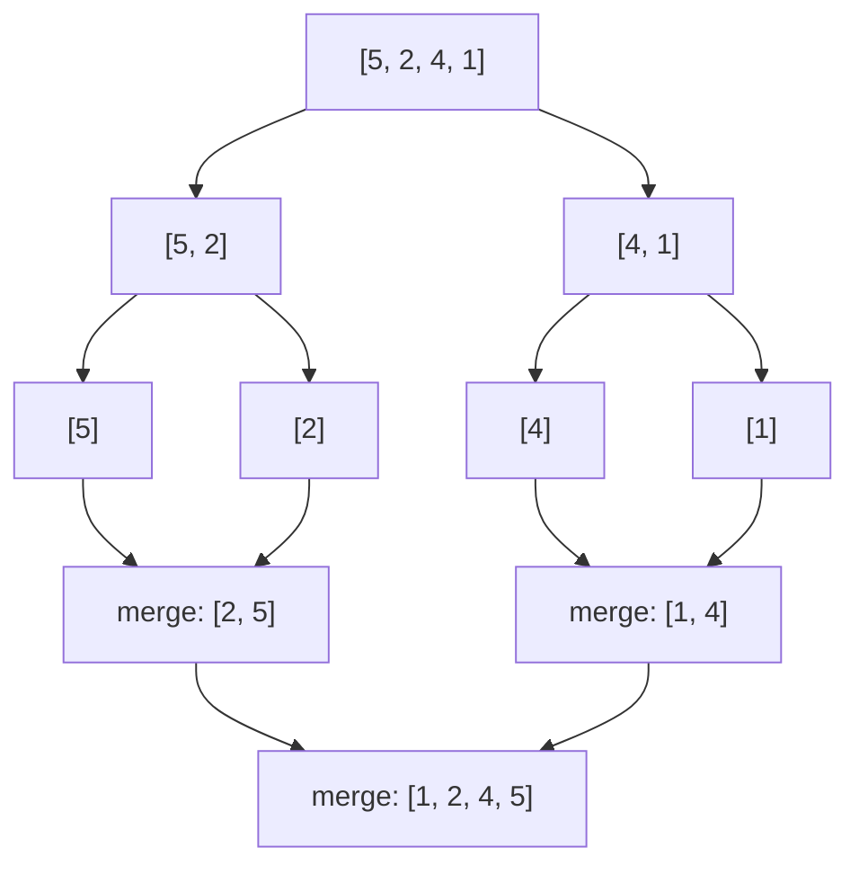

# Sorting Algorithms

## When to use / signals

- Sorting unlocks other patterns: two pointers, binary search, greedy, grouping equal values, merging intervals.
- The interviewer asks you to implement a sort (merge sort and quick sort are the usual ones).
- "Count inversions / reverse pairs": merge sort with counting during the merge step.
- "Kth largest / smallest": quickselect (quick sort's partition), average O(n).
- Only a few distinct values (0/1/2): counting sort or Dutch national flag, O(n).
- In real code and most problems: just call `Arrays.sort` / `Collections.sort`.

## Templates

```java
static void swap(int[] a, int i, int j) { int t = a[i]; a[i] = a[j]; a[j] = t; }
```

### Selection sort: pick the minimum, put it in front

```java
void selectionSort(int[] a) {
    int n = a.length;
    for (int i = 0; i < n - 1; i++) {
        int min = i;
        for (int j = i + 1; j < n; j++) if (a[j] < a[min]) min = j;
        swap(a, i, min);                    // a[0..i] is now sorted and final
    }
}
```

### Bubble sort: push the maximum to the end (with early exit)

```java
void bubbleSort(int[] a) {
    for (int end = a.length - 1; end > 0; end--) {
        boolean swapped = false;
        for (int j = 0; j < end; j++)
            if (a[j] > a[j + 1]) { swap(a, j, j + 1); swapped = true; }
        if (!swapped) break;                // no swaps => already sorted: best case O(n)
    }
}
```

### Insertion sort: insert each element into the sorted prefix

```java
void insertionSort(int[] a) {
    for (int i = 1; i < a.length; i++) {
        int key = a[i], j = i - 1;
        while (j >= 0 && a[j] > key) { a[j + 1] = a[j]; j--; }   // shift bigger ones right
        a[j + 1] = key;
    }
}
```

### Merge sort: divide in half, sort each half, merge



```java
void mergeSort(int[] a, int lo, int hi) {           // call mergeSort(a, 0, n - 1)
    if (lo >= hi) return;                           // 0 or 1 element: sorted
    int mid = lo + (hi - lo) / 2;
    mergeSort(a, lo, mid);
    mergeSort(a, mid + 1, hi);
    merge(a, lo, mid, hi);
}

void merge(int[] a, int lo, int mid, int hi) {
    int[] tmp = new int[hi - lo + 1];
    int i = lo, j = mid + 1, k = 0;
    while (i <= mid && j <= hi)
        tmp[k++] = (a[i] <= a[j]) ? a[i++] : a[j++]; // "<=" keeps equal elements in order (stable)
    while (i <= mid) tmp[k++] = a[i++];
    while (j <= hi)  tmp[k++] = a[j++];
    System.arraycopy(tmp, 0, a, lo, tmp.length);
}
// Count inversions: when a[j] is taken before a[i], add (mid - i + 1) to the count.
```

### Quick sort: partition around a pivot, recurse on both sides

```java
void quickSort(int[] a, int lo, int hi) {            // Lomuto version
    if (lo >= hi) return;
    int p = lomuto(a, lo, hi);                       // a[p] is in its final position
    quickSort(a, lo, p - 1);
    quickSort(a, p + 1, hi);
}

// Lomuto: pivot = a[hi]; a[lo..i-1] < pivot. Simple, but many swaps and O(n^2) on equal values.
int lomuto(int[] a, int lo, int hi) {
    int r = lo + (int) (Math.random() * (hi - lo + 1));
    swap(a, r, hi);                                  // random pivot defeats sorted input
    int pivot = a[hi], i = lo;
    for (int j = lo; j < hi; j++)
        if (a[j] < pivot) swap(a, i++, j);
    swap(a, i, hi);
    return i;
}

// Hoare: two pointers from both ends; fewer swaps, handles duplicates well.
void quickSortHoare(int[] a, int lo, int hi) {
    if (lo >= hi) return;
    int p = hoare(a, lo, hi);
    quickSortHoare(a, lo, p);                        // NOTE: p, not p - 1 (pivot not fixed)
    quickSortHoare(a, p + 1, hi);
}

int hoare(int[] a, int lo, int hi) {
    int pivot = a[lo + (hi - lo) / 2];
    int i = lo - 1, j = hi + 1;
    while (true) {
        do i++; while (a[i] < pivot);
        do j--; while (a[j] > pivot);
        if (i >= j) return j;                        // a[lo..j] <= pivot <= a[j+1..hi]
        swap(a, i, j);
    }
}
```

### Recursive bubble and insertion sort

```java
void bubbleRec(int[] a, int n) {                     // call bubbleRec(a, a.length)
    if (n <= 1) return;
    boolean swapped = false;
    for (int j = 0; j < n - 1; j++)
        if (a[j] > a[j + 1]) { swap(a, j, j + 1); swapped = true; }
    if (swapped) bubbleRec(a, n - 1);                // largest of a[0..n-1] is now at n-1
}

void insertionRec(int[] a, int i) {                  // call insertionRec(a, 1)
    if (i >= a.length) return;
    int key = a[i], j = i - 1;
    while (j >= 0 && a[j] > key) { a[j + 1] = a[j]; j--; }
    a[j + 1] = key;                                  // a[0..i] sorted
    insertionRec(a, i + 1);
}
```

### Library sorting in Java

```java
int[] arr = {5, 1, 4};
Arrays.sort(arr);                                    // primitives: dual-pivot quicksort
Arrays.sort(arr, 1, 3);                              // sort range [1, 3)

Integer[] boxed = {5, 1, 4};
Arrays.sort(boxed, Collections.reverseOrder());      // objects: TimSort, comparator allowed

int[][] intervals = {{3, 4}, {1, 2}};
Arrays.sort(intervals, (x, y) -> Integer.compare(x[0], y[0]));   // never x[0] - y[0] (overflow)

List<String> words = new ArrayList<>(List.of("bb", "a", "ccc"));
words.sort(Comparator.comparing(String::length).thenComparing(Comparator.naturalOrder()));
```

- **`Arrays.sort(int[] / long[] / double[] ...)`**: dual-pivot quicksort. O(n log n) average, in place, not stable (stability does not matter for primitives). Adversarial inputs could hit worst-case behaviour on old JDKs; recent JDKs add a heapsort fallback.
- **`Arrays.sort(Object[])`, `Collections.sort`, `List.sort`**: TimSort (merge + insertion hybrid). Stable, O(n log n) worst case, O(n) on nearly sorted data, O(n) extra memory.
- Need a comparator or descending order? You need objects (`Integer[]`, `int[][]`, a list). For an `int[]` descending, sort ascending and reverse.
- Need stability on objects (sort by key B, then by key A keeps B order)? TimSort guarantees it.

## Complexity

| Algorithm | Best | Average | Worst | Extra space | Stable | In-place |
|---|---|---|---|---|---|---|
| Selection | O(n²) | O(n²) | O(n²) | O(1) | No | Yes |
| Bubble (early exit) | O(n) | O(n²) | O(n²) | O(1) | Yes | Yes |
| Insertion | O(n) | O(n²) | O(n²) | O(1) | Yes | Yes |
| Recursive bubble / insertion | O(n) | O(n²) | O(n²) | O(n) stack | Yes | Yes |
| Merge sort | O(n log n) | O(n log n) | O(n log n) | O(n) | Yes | No |
| Quick sort | O(n log n) | O(n log n) | O(n²) | O(log n) stack avg | No | Yes |
| Heap sort | O(n log n) | O(n log n) | O(n log n) | O(1) | No | Yes |
| Counting sort (range k) | O(n + k) | O(n + k) | O(n + k) | O(k) | Yes | No |
| `Arrays.sort` primitives | O(n log n) | O(n log n) | O(n log n) typical | O(log n) | No | Yes |
| `Arrays.sort` objects (TimSort) | O(n) | O(n log n) | O(n log n) | O(n) | Yes | No |

Selection sort does at most n - 1 swaps (useful when writes are expensive). Insertion sort is the fastest for tiny or nearly sorted arrays, which is why TimSort uses it for short runs.

## Pitfalls

- Comparator `(a, b) -> a - b` overflows for large or negative values; use `Integer.compare(a, b)`.
- Quick sort with a fixed first/last pivot is O(n²) on sorted input; randomise the pivot.
- Hoare partition: recurse on `[lo, p]` and `[p + 1, hi]`; using `p - 1` breaks it. With Hoare, never take `a[hi]` as the pivot.
- Merge with `<` instead of `<=` makes merge sort unstable.
- Allocating a temp array in every `merge` is fine for interviews; allocate one buffer up front for speed.
- `Arrays.sort(int[], comparator)` does not exist; box to `Integer[]` or sort pairs of indices.
- Sorting loses original indices. If you need them, sort an array of indices or `int[]{value, index}` pairs.
- Bubble sort's inner bound shrinks each pass (`j < end`); forgetting that is still correct but wasteful.

## Must-know problems

- Selection Sort
- Bubble Sort
- Insertion Sort
- Merge Sort
- Quick Sort
- Recursive Bubble Sort
- Recursive Insertion Sort
- Sort an Array
- Sort Colors
- Merge Sorted Array
- Count Inversions
- Reverse Pairs
- Kth Largest Element in an Array (quickselect)
- Largest Number (custom comparator)
- Sort List (merge sort on a linked list)
- Wiggle Sort
