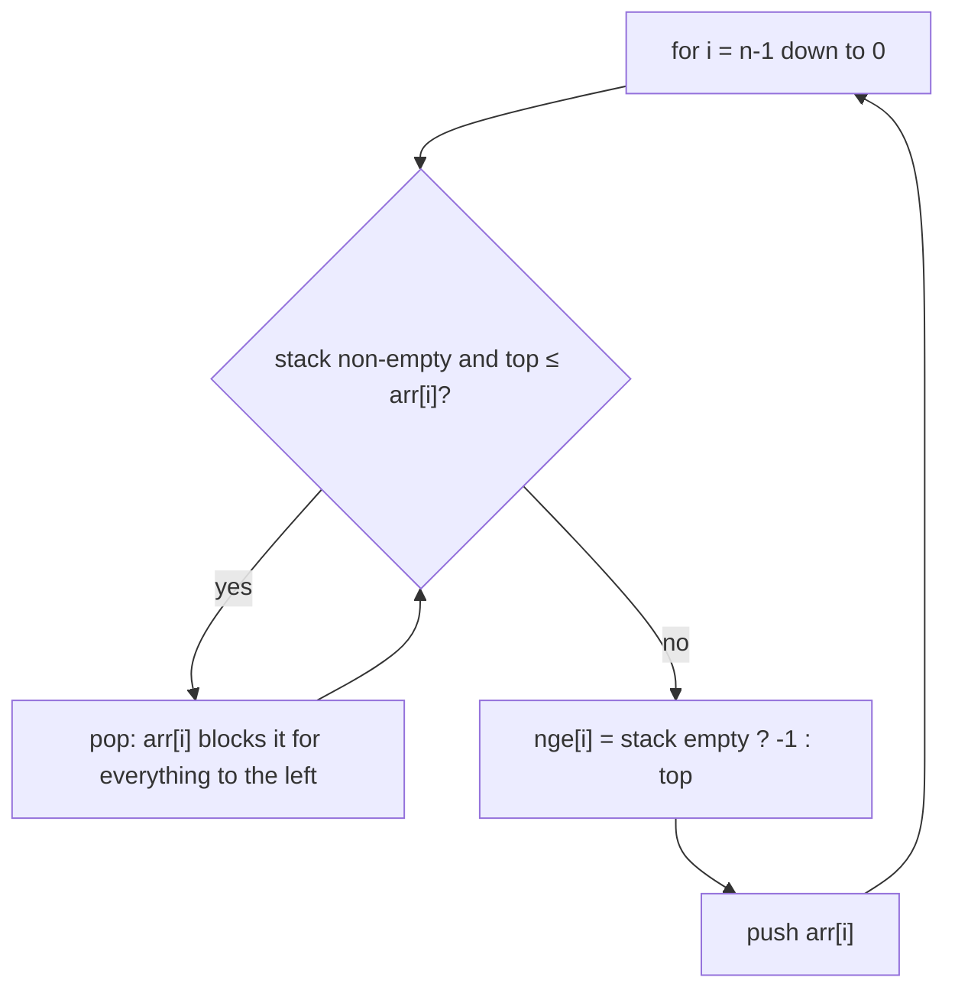
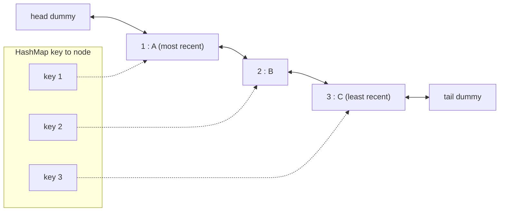

# Stack, Queue & Monotonic Stack

## When to use / signals

- Matching / nesting: brackets, tags, "undo", evaluating expressions, decoding `3[a2[c]]`.
- "Next / previous greater or smaller element", spans, "how far can I see": monotonic stack.
- "Largest rectangle", "sum over all subarrays of min/max": monotonic stack for boundaries.
- "Max / min of every window of size k": monotonic deque.
- Process in arrival order, level by level, or simulate a line: queue.
- Design questions: min stack, LRU / LFU cache, queue via stacks.

## Templates

### ArrayDeque cheat sheet (use it for both stacks and queues)

| Use as | Add | Remove | Look | Side |
|---|---|---|---|---|
| Stack | `push(x)` | `pop()` | `peek()` | head |
| Queue | `offer(x)` | `poll()` | `peek()` | add at tail, remove at head |
| Deque | `offerFirst` / `offerLast` | `pollFirst` / `pollLast` | `peekFirst` / `peekLast` | both |

`pop()` throws on empty, `poll()` returns `null`. `ArrayDeque` rejects `null` elements. Avoid `java.util.Stack` (synchronised, extends `Vector`).

### Stack and queue from scratch

```java
class ArrayStack {
    private int[] a = new int[16];
    private int top = -1;
    void push(int x) {
        if (top + 1 == a.length) a = Arrays.copyOf(a, a.length * 2);  // grow
        a[++top] = x;
    }
    int pop()  { if (top < 0) throw new RuntimeException("empty"); return a[top--]; }
    int peek() { return a[top]; }
    boolean isEmpty() { return top < 0; }
}

class CircularQueue {                         // fixed capacity ring buffer
    private final int[] a;
    private int head = 0, size = 0;
    CircularQueue(int cap) { a = new int[cap]; }
    boolean offer(int x) {
        if (size == a.length) return false;   // full
        a[(head + size++) % a.length] = x;
        return true;
    }
    int poll() { int x = a[head]; head = (head + 1) % a.length; size--; return x; }
    int peek() { return a[head]; }
    boolean isEmpty() { return size == 0; }
}

class Node { int val; Node next; Node(int v) { val = v; } }

class LinkedStack {                           // push/pop at the head
    private Node head;
    void push(int x) { Node n = new Node(x); n.next = head; head = n; }
    int pop() { int x = head.val; head = head.next; return x; }
}

class LinkedQueue {                           // offer at tail, poll at head
    private Node head, tail;
    void offer(int x) {
        Node n = new Node(x);
        if (tail == null) head = tail = n; else { tail.next = n; tail = n; }
    }
    int poll() { int x = head.val; head = head.next; if (head == null) tail = null; return x; }
}
```

### Queue using stacks / stack using a queue

```java
class MyQueue {                                          // amortised O(1) per op
    private final Deque<Integer> in = new ArrayDeque<>(), out = new ArrayDeque<>();
    public void push(int x) { in.push(x); }
    public int pop()  { peek(); return out.pop(); }
    public int peek() {
        if (out.isEmpty()) while (!in.isEmpty()) out.push(in.pop());  // reverse only when out is empty
        return out.peek();
    }
    public boolean empty() { return in.isEmpty() && out.isEmpty(); }
}

class MyStack {                                          // push O(n), pop O(1)
    private final Queue<Integer> q = new ArrayDeque<>();
    public void push(int x) {
        q.offer(x);
        for (int i = 1; i < q.size(); i++) q.offer(q.poll());   // rotate x to the front
    }
    public int pop() { return q.poll(); }
    public int top() { return q.peek(); }
    public boolean empty() { return q.isEmpty(); }
}
```

### Balanced parentheses

```java
boolean isValid(String s) {
    Deque<Character> st = new ArrayDeque<>();
    for (char c : s.toCharArray()) {
        if (c == '(') st.push(')');                      // push the expected closer
        else if (c == '[') st.push(']');
        else if (c == '{') st.push('}');
        else if (st.isEmpty() || st.pop() != c) return false;
    }
    return st.isEmpty();
}
```

### Infix, prefix and postfix

| Operator | Precedence | Associativity |
|---|---|---|
| `^` | 3 | right |
| `*` `/` `%` | 2 | left |
| `+` `-` | 1 | left |
| `(` | lowest (only ever sits on the stack) | n/a |

```java
int prec(char c) {
    switch (c) {
        case '^': return 3;
        case '*': case '/': case '%': return 2;
        case '+': case '-': return 1;
        default: return -1;                              // '(' is never popped by an operator
    }
}

String infixToPostfix(String s) {
    StringBuilder out = new StringBuilder();
    Deque<Character> st = new ArrayDeque<>();
    for (char c : s.toCharArray()) {
        if (Character.isLetterOrDigit(c)) out.append(c);
        else if (c == '(') st.push(c);
        else if (c == ')') {
            while (st.peek() != '(') out.append(st.pop());
            st.pop();                                    // discard '('
        } else {
            // pop higher precedence, or equal precedence when c is left-associative
            while (!st.isEmpty() && (prec(st.peek()) > prec(c) || (prec(st.peek()) == prec(c) && c != '^')))
                out.append(st.pop());
            st.push(c);
        }
    }
    while (!st.isEmpty()) out.append(st.pop());
    return out.toString();
}
// Infix -> prefix: reverse s, swap '(' and ')', run the same loop but on equal precedence pop only
// for '^' (associativity flips when reversed), then reverse the output.

int evalRPN(String[] tokens) {                           // evaluate postfix
    Deque<Integer> st = new ArrayDeque<>();
    for (String t : tokens) {
        if (t.length() == 1 && "+-*/".contains(t)) {
            int b = st.pop(), a = st.pop();              // pop order: right operand first
            switch (t.charAt(0)) {
                case '+': st.push(a + b); break;
                case '-': st.push(a - b); break;
                case '*': st.push(a * b); break;
                default:  st.push(a / b);
            }
        } else st.push(Integer.parseInt(t));
    }
    return st.pop();
}
```

| Conversion | Scan | On an operator (operands are just pushed) |
|---|---|---|
| Postfix to infix | left to right | `b = pop, a = pop, push "(" + a + op + b + ")"` |
| Prefix to infix | right to left | `a = pop, b = pop, push "(" + a + op + b + ")"` |
| Postfix to prefix | left to right | `b = pop, a = pop, push op + a + b` |
| Prefix to postfix | right to left | `a = pop, b = pop, push a + b + op` |

### Monotonic stack: next greater element

Keep the stack monotonic; anything that can never be an answer again is popped. Each index is pushed and popped at most once, so the whole pass is O(n).



Trace for `arr = [4, 5, 2, 10, 8]` (stack shown bottom to top):

| i | arr[i] | popped | nge[i] | stack after |
|---|---|---|---|---|
| 4 | 8 | none | -1 | [8] |
| 3 | 10 | 8 | -1 | [10] |
| 2 | 2 | none | 10 | [10, 2] |
| 1 | 5 | 2 | 10 | [10, 5] |
| 0 | 4 | none | 5 | [10, 5, 4] |

```java
int[] nextGreater(int[] a) {
    int n = a.length;
    int[] res = new int[n];
    Deque<Integer> st = new ArrayDeque<>();             // values, decreasing from bottom to top
    for (int i = n - 1; i >= 0; i--) {
        while (!st.isEmpty() && st.peek() <= a[i]) st.pop();
        res[i] = st.isEmpty() ? -1 : st.peek();
        st.push(a[i]);
    }
    return res;
}
// Circular array (NGE II): loop i from 2n-1 down to 0 using a[i % n], write res only when i < n.
```

| Want | Scan | Pop while |
|---|---|---|
| Next greater | right to left | `top <= a[i]` |
| Next smaller | right to left | `top >= a[i]` |
| Previous greater | left to right | `top <= a[i]` |
| Previous smaller | left to right | `top >= a[i]` |

Store indices instead of values whenever you need distances or widths.

### Stock span (previous greater, with counts)

```java
class StockSpanner {
    private final Deque<int[]> st = new ArrayDeque<>();   // {price, span}
    public int next(int price) {
        int span = 1;
        while (!st.isEmpty() && st.peek()[0] <= price) span += st.pop()[1];   // absorb smaller days
        st.push(new int[]{price, span});
        return span;
    }
}
```

### Largest rectangle in histogram and maximal rectangle

```java
int largestRectangleArea(int[] h) {
    int n = h.length, best = 0;
    Deque<Integer> st = new ArrayDeque<>();               // indices, increasing heights
    for (int i = 0; i <= n; i++) {
        int cur = (i == n) ? 0 : h[i];                    // sentinel 0 flushes the stack
        while (!st.isEmpty() && h[st.peek()] >= cur) {
            int height = h[st.pop()];                     // i is its next smaller index
            int left = st.isEmpty() ? -1 : st.peek();     // new top is its previous smaller index
            best = Math.max(best, height * (i - left - 1));
        }
        st.push(i);
    }
    return best;
}

int maximalRectangle(char[][] m) {                        // histogram per row
    if (m.length == 0) return 0;
    int[] h = new int[m[0].length];
    int best = 0;
    for (char[] row : m) {
        for (int j = 0; j < row.length; j++) h[j] = row[j] == '1' ? h[j] + 1 : 0;
        best = Math.max(best, largestRectangleArea(h));
    }
    return best;
}
```

### Sum of subarray minimums (contribution technique)

```java
int sumSubarrayMins(int[] a) {
    final int MOD = 1_000_000_007;
    int n = a.length;
    int[] left = new int[n], right = new int[n];  // how far a[i] stays the minimum on each side
    Deque<Integer> st = new ArrayDeque<>();
    for (int i = 0; i < n; i++) {                 // previous smaller-or-equal
        while (!st.isEmpty() && a[st.peek()] > a[i]) st.pop();
        left[i] = st.isEmpty() ? i + 1 : i - st.peek();
        st.push(i);
    }
    st.clear();
    for (int i = n - 1; i >= 0; i--) {            // next strictly smaller
        while (!st.isEmpty() && a[st.peek()] >= a[i]) st.pop();
        right[i] = st.isEmpty() ? n - i : st.peek() - i;
        st.push(i);
    }
    long sum = 0;
    for (int i = 0; i < n; i++) sum = (sum + (long) a[i] * left[i] % MOD * right[i]) % MOD;
    return (int) sum;
}
// Sum of subarray ranges = sum of maxes - sum of mins (same code with comparisons flipped).
```

### Asteroid collision

```java
int[] asteroidCollision(int[] asteroids) {
    Deque<Integer> st = new ArrayDeque<>();
    for (int a : asteroids) {
        boolean alive = true;
        while (alive && a < 0 && !st.isEmpty() && st.peek() > 0) {  // only right-mover vs left-mover
            if (st.peek() < -a) st.pop();                          // top explodes, keep going
            else {
                if (st.peek() == -a) st.pop();                     // both explode
                alive = false;                                     // current explodes
            }
        }
        if (alive) st.push(a);
    }
    int[] res = new int[st.size()];
    for (int i = res.length - 1; i >= 0; i--) res[i] = st.pop();
    return res;
}
```

### Remove K digits (monotonic increasing stack)

```java
String removeKdigits(String num, int k) {
    StringBuilder st = new StringBuilder();               // used as a stack of digits
    for (char c : num.toCharArray()) {
        while (k > 0 && st.length() > 0 && st.charAt(st.length() - 1) > c) {
            st.deleteCharAt(st.length() - 1);             // a bigger digit before a smaller one: drop it
            k--;
        }
        st.append(c);
    }
    st.setLength(st.length() - k);                        // leftover k: drop from the end
    int i = 0;
    while (i < st.length() - 1 && st.charAt(i) == '0') i++;   // strip leading zeros
    String res = st.substring(i);
    return res.isEmpty() ? "0" : res;
}
```

### Sliding window maximum (monotonic deque)

```java
int[] maxSlidingWindow(int[] nums, int k) {
    int n = nums.length;
    int[] res = new int[n - k + 1];
    Deque<Integer> dq = new ArrayDeque<>();               // indices, values decreasing front to back
    for (int i = 0; i < n; i++) {
        if (!dq.isEmpty() && dq.peekFirst() <= i - k) dq.pollFirst();          // left the window
        while (!dq.isEmpty() && nums[dq.peekLast()] <= nums[i]) dq.pollLast(); // can never be max
        dq.offerLast(i);
        if (i >= k - 1) res[i - k + 1] = nums[dq.peekFirst()];
    }
    return res;
}
```

### Min stack

```java
class MinStack {
    private final Deque<int[]> st = new ArrayDeque<>();   // {value, min at this depth}
    public void push(int x) { st.push(new int[]{x, st.isEmpty() ? x : Math.min(x, st.peek()[1])}); }
    public void pop()   { st.pop(); }
    public int top()    { return st.peek()[0]; }
    public int getMin() { return st.peek()[1]; }
}
// O(1) extra space variant: store 2*x - min (as long) when x < min, decode on pop.
```

### LRU cache (HashMap + doubly linked list)



```java
class LRUCache {
    private static class Node {
        int key, val;
        Node prev, next;
        Node(int k, int v) { key = k; val = v; }
    }
    private final int cap;
    private final Map<Integer, Node> map = new HashMap<>();
    private final Node head = new Node(0, 0), tail = new Node(0, 0);  // dummies: no null checks

    public LRUCache(int capacity) { cap = capacity; head.next = tail; tail.prev = head; }

    public int get(int key) {
        Node n = map.get(key);
        if (n == null) return -1;
        remove(n); addFront(n);                           // now most recently used
        return n.val;
    }
    public void put(int key, int value) {
        Node n = map.get(key);
        if (n != null) { n.val = value; remove(n); addFront(n); return; }
        if (map.size() == cap) {                          // evict the node before tail
            Node lru = tail.prev;
            remove(lru);
            map.remove(lru.key);                          // why the node stores its key
        }
        n = new Node(key, value);
        map.put(key, n);
        addFront(n);
    }
    private void remove(Node n) { n.prev.next = n.next; n.next.prev = n.prev; }
    private void addFront(Node n) {
        n.next = head.next; n.prev = head;
        head.next.prev = n; head.next = n;
    }
}
// Shortcut: new LinkedHashMap<>(cap, 0.75f, true) + override removeEldestEntry(e) -> size() > cap.
```

### LFU cache (frequency buckets)

```java
class LFUCache {
    private final int cap;
    private int minFreq = 0;
    private final Map<Integer, Integer> vals = new HashMap<>(), freq = new HashMap<>();
    private final Map<Integer, LinkedHashSet<Integer>> buckets = new HashMap<>(); // freq -> keys, LRU first

    public LFUCache(int capacity) { cap = capacity; }

    public int get(int key) {
        if (!vals.containsKey(key)) return -1;
        touch(key);
        return vals.get(key);
    }
    public void put(int key, int value) {
        if (cap == 0) return;
        if (vals.containsKey(key)) { vals.put(key, value); touch(key); return; }
        if (vals.size() == cap) {                         // evict LRU key among the least frequent
            Iterator<Integer> it = buckets.get(minFreq).iterator();
            int evict = it.next();
            it.remove();
            vals.remove(evict);
            freq.remove(evict);
        }
        vals.put(key, value);
        freq.put(key, 1);
        buckets.computeIfAbsent(1, f -> new LinkedHashSet<>()).add(key);
        minFreq = 1;                                      // a new key always has the lowest freq
    }
    private void touch(int key) {                         // move key from bucket f to f + 1
        int f = freq.get(key);
        freq.put(key, f + 1);
        buckets.get(f).remove(key);
        if (f == minFreq && buckets.get(f).isEmpty()) minFreq++;
        buckets.computeIfAbsent(f + 1, x -> new LinkedHashSet<>()).add(key);
    }
}
```

## Complexity

| Pattern | Time | Space |
|---|---|---|
| `ArrayDeque` push / pop / offer / poll / peek | O(1) amortised | O(n) |
| Queue via two stacks | O(1) amortised per op | O(n) |
| Stack via one queue | push O(n), pop O(1) | O(n) |
| Balanced brackets, infix to postfix, RPN | O(n) | O(n) |
| Monotonic stack (NGE, span, histogram, subarray mins) | O(n): each index pushed and popped once | O(n) |
| Maximal rectangle | O(R * C) | O(C) |
| Remove K digits | O(n) | O(n) |
| Sliding window maximum | O(n) | O(k) |
| Min stack (all ops) | O(1) | O(n) |
| LRU / LFU get and put | O(1) (LFU amortised) | O(capacity) |

## Pitfalls

- `Deque.push` / `pop` / `peek` work on the head; `offer` adds at the tail. Do not mix stack and queue calls on the same deque by accident.
- Comparing boxed values: `st.peek() == other.peek()` compares references outside -128..127. Use `equals` or unbox to `int` first.
- Duplicates in contribution problems: make one side strict (`>`) and the other non-strict (`>=`), or equal elements get counted twice or never.
- Histogram: forgetting the final sentinel leaves bars on the stack unprocessed.
- Sliding window: evict from the front by index (`<= i - k`), not by value.
- Remove K digits: handle leftover `k`, leading zeros and the empty result (`"0"`).
- RPN: pop the right operand first (`b`, then `a`); integer division truncates toward zero.
- LRU: the node must store its key so the map entry can be removed on eviction; dummy head and tail avoid null edge cases.
- LFU: on put of an existing key, update the value and the frequency; `minFreq` resets to 1 only for a brand new key.

## Must-know problems

- Implement Stack / Queue using arrays and linked lists
- Implement Queue using Stacks, Implement Stack using Queues
- Valid Parentheses
- Infix to Postfix, Prefix to Infix, Postfix to Prefix and the other conversions
- Evaluate Reverse Polish Notation
- Next Greater Element I, Next Greater Element II (circular)
- Next Smaller Element, Previous Smaller Element
- Number of NGEs to the right
- Daily Temperatures
- Online Stock Span
- Trapping Rain Water
- Sum of Subarray Minimums, Sum of Subarray Ranges
- Asteroid Collision
- Remove K Digits
- Largest Rectangle in Histogram
- Maximal Rectangle
- Sliding Window Maximum
- The Celebrity Problem
- Min Stack
- LRU Cache
- LFU Cache
