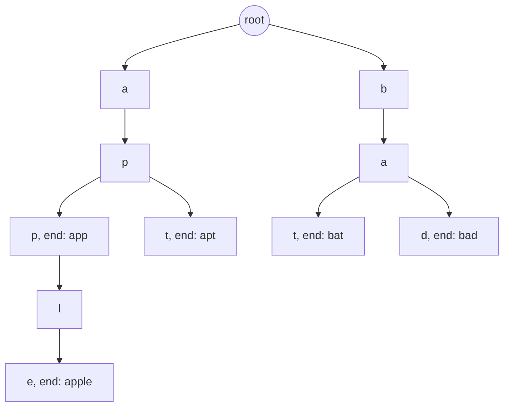

# Tries

## When to use / signals

- Many strings and queries about **prefixes**: autocomplete, "starts with", "count words with prefix", longest common prefix.
- Dictionary lookups while scanning (Word Search II, word break with a big dictionary, replace words).
- "Every prefix of the word must also be a word" (longest complete word).
- Counting distinct substrings of a small string (insert every suffix).
- "Maximum XOR of two numbers" / XOR queries: a binary trie over the bits, greedy from the top bit.

## Templates

### Node: array of 26 vs HashMap

| | `Node[] next = new Node[26]` | `Map<Character, Node> next` |
|---|---|---|
| Child lookup | O(1), direct index | O(1) average, hashing + boxing |
| Memory per node | 26 references even if unused | only existing children |
| Alphabet | fixed and small (`a`-`z`) | any characters (Unicode, mixed case) |
| Iterate children in order | natural (index 0..25) | needs `TreeMap` |

Default to the array for lowercase-only problems.

### Insert, search, startsWith

```java
class Trie {
    static class Node {
        Node[] next = new Node[26];
        boolean end;                              // a word ends at this node
    }
    final Node root = new Node();

    public void insert(String word) {
        Node cur = root;
        for (char ch : word.toCharArray()) {
            int i = ch - 'a';
            if (cur.next[i] == null) cur.next[i] = new Node();
            cur = cur.next[i];
        }
        cur.end = true;
    }
    public boolean search(String word) {          // whole word
        Node n = walk(word);
        return n != null && n.end;
    }
    public boolean startsWith(String prefix) { return walk(prefix) != null; }

    Node walk(String s) {                         // node reached by s, or null
        Node cur = root;
        for (char ch : s.toCharArray()) {
            cur = cur.next[ch - 'a'];
            if (cur == null) return null;
        }
        return cur;
    }
}

// HashMap node for arbitrary characters
class MapNode {
    Map<Character, MapNode> next = new HashMap<>();
    boolean end;
}
// insert step: cur = cur.next.computeIfAbsent(ch, k -> new MapNode());
```

Trie after inserting `app`, `apple`, `apt`, `bat`, `bad` (shared prefixes share nodes):



### Count words equal to / starting with, and erase (Trie II)

```java
class TrieII {
    static class Node {
        Node[] next = new Node[26];
        int endCount;                             // words ending exactly here
        int prefixCount;                          // words passing through here
    }
    private final Node root = new Node();

    public void insert(String w) {
        Node cur = root;
        for (char ch : w.toCharArray()) {
            int i = ch - 'a';
            if (cur.next[i] == null) cur.next[i] = new Node();
            cur = cur.next[i];
            cur.prefixCount++;
        }
        cur.endCount++;
    }
    public int countWordsEqualTo(String w) {
        Node n = walk(w);
        return n == null ? 0 : n.endCount;
    }
    public int countWordsStartingWith(String p) {
        Node n = walk(p);
        return n == null ? 0 : n.prefixCount;
    }
    public void erase(String w) {                 // caller guarantees w was inserted
        Node cur = root;
        for (char ch : w.toCharArray()) {
            cur = cur.next[ch - 'a'];
            cur.prefixCount--;
        }
        cur.endCount--;
    }
    private Node walk(String s) {
        Node cur = root;
        for (char ch : s.toCharArray()) {
            cur = cur.next[ch - 'a'];
            if (cur == null) return null;
        }
        return cur;
    }
}
```

### Longest word with all prefixes present (complete string)

```java
// Add to Trie: true if every prefix of word is itself an inserted word
boolean allPrefixesAreWords(Trie t, String word) {
    Trie.Node cur = t.root;
    for (char ch : word.toCharArray()) {
        cur = cur.next[ch - 'a'];
        if (cur == null || !cur.end) return false;
    }
    return true;
}

String longestCompleteWord(String[] words) {
    Trie t = new Trie();
    for (String w : words) t.insert(w);
    String best = "";
    for (String w : words)
        if (allPrefixesAreWords(t, w)
                && (w.length() > best.length() || (w.length() == best.length() && w.compareTo(best) < 0)))
            best = w;                             // longest, ties broken lexicographically
    return best;                                  // GfG "Complete String" wants "None" when empty
}
```

### Number of distinct substrings

```java
int countDistinctSubstrings(String s) {           // every new node = one new distinct substring
    Trie.Node root = new Trie.Node();
    int count = 0;
    for (int i = 0; i < s.length(); i++) {        // insert every suffix s[i..]
        Trie.Node cur = root;
        for (int j = i; j < s.length(); j++) {
            int c = s.charAt(j) - 'a';
            if (cur.next[c] == null) { cur.next[c] = new Trie.Node(); count++; }
            cur = cur.next[c];
        }
    }
    return count + 1;                             // + 1 for the empty string, if the problem counts it
}
// ponytail: O(n^2) nodes; fine for n up to ~2000, use a suffix automaton / suffix array beyond that.
```

### Bit trie: maximum XOR of two numbers

```java
class BitTrie {
    private static final int HIGH = 30;           // values fit in bits 30..0 (non-negative ints)
    private static class Node { Node[] child = new Node[2]; }
    private final Node root = new Node();

    void insert(int x) {
        Node cur = root;
        for (int b = HIGH; b >= 0; b--) {
            int bit = (x >> b) & 1;
            if (cur.child[bit] == null) cur.child[bit] = new Node();
            cur = cur.child[bit];
        }
    }
    int maxXor(int x) {                           // max of x ^ y over inserted y; trie must be non-empty
        Node cur = root;
        int res = 0;
        for (int b = HIGH; b >= 0; b--) {
            int bit = (x >> b) & 1;
            if (cur.child[1 - bit] != null) {     // greedy: an opposite bit at a high position wins
                res |= 1 << b;
                cur = cur.child[1 - bit];
            } else cur = cur.child[bit];
        }
        return res;
    }
}

int findMaximumXOR(int[] nums) {
    BitTrie t = new BitTrie();
    int best = 0;
    for (int x : nums) {
        t.insert(x);                              // insert first so the trie is never empty
        best = Math.max(best, t.maxXor(x));
    }
    return best;
}
```

### Maximum XOR with an element from the array (offline queries)

```java
// queries[i] = {x, m}: max of x ^ nums[j] over nums[j] <= m, or -1 if none
int[] maximizeXor(int[] nums, int[][] queries) {
    Arrays.sort(nums);
    Integer[] order = new Integer[queries.length];
    for (int i = 0; i < order.length; i++) order[i] = i;
    Arrays.sort(order, (a, b) -> Integer.compare(queries[a][1], queries[b][1]));   // by limit m
    BitTrie t = new BitTrie();
    int[] ans = new int[queries.length];
    int j = 0;
    for (int qi : order) {
        while (j < nums.length && nums[j] <= queries[qi][1]) t.insert(nums[j++]);  // only allowed nums
        ans[qi] = j == 0 ? -1 : t.maxXor(queries[qi][0]);
    }
    return ans;
}
```

## Complexity

| Operation | Time | Space |
|---|---|---|
| Insert / search / startsWith (length L) | O(L) | O(L) new nodes per insert worst case |
| Count words / prefixes, erase | O(L) | O(1) extra |
| Build a trie of N words, total length S | O(S) | O(S * 26) with arrays |
| Longest complete word | O(S) | O(S * 26) |
| Distinct substrings | O(n^2) | O(n^2) nodes |
| Bit trie insert / query | O(31) = O(1) per number | O(31 * n) nodes |
| Max XOR of two numbers | O(31 * n) | O(31 * n) |
| Max XOR with queries | O(n log n + q log q + 31 * (n + q)) | O(31 * n) |

## Pitfalls

- `ch - 'a'` assumes lowercase; uppercase, digits or spaces crash the array version (use a bigger array or a map).
- `search` must check the `end` flag; `startsWith` must not.
- Erase: decrement counts along the path, but only for a word that really exists, or counts go negative.
- The 26-array node is memory-heavy for millions of nodes; a map, or a flat `int[][]` pool, is lighter.
- Bit trie: always walk the same fixed number of bits (from bit 30 or 31 down), including leading zeros.
- Querying an empty bit trie dereferences a null child; insert first or handle the empty case (`-1`).
- Offline queries: remember to write answers back at the original query index.

## Must-know problems

- Implement Trie (Prefix Tree)
- Implement Trie II (count words equal to / starting with, erase)
- Longest Word in Dictionary / Longest String with All Prefixes (Complete String)
- Number of Distinct Substrings in a String
- Maximum XOR of Two Numbers in an Array
- Maximum XOR With an Element From Array
- Design Add and Search Words Data Structure (`.` wildcard)
- Word Search II
- Replace Words
- Search Suggestions System
- Longest Common Prefix
- Palindrome Pairs
